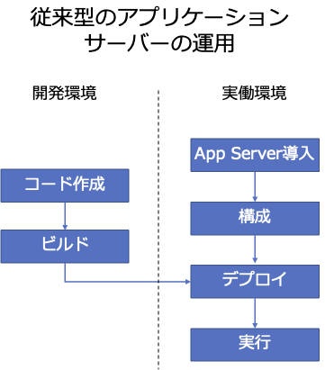
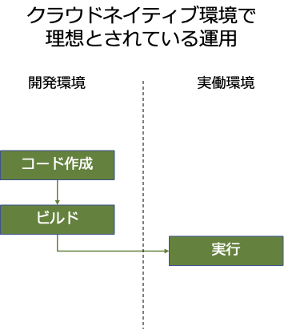

## Open Libertyとは

Open Liberty（ https://openliberty.io ）とは，IBMによって開発されているオープンソースのエンタープライズJavaランタイムです。軽量で高速に動作し，構成も容易で簡単に利用を開始することができます。

MicroProfile仕様に対応しており，高速かつ効率的なクラウドネイティブJavaマイクロサービスを構築することができます。また，Java EE，Jakarta EEにも対応しており，従来型のエンタープライズJavaアプリケーションをモダナイズするプラットフォームとしても利用できます。Spring Bootアプリケーションにも対応しており，高い負荷にも耐える高速なランタイムとして利用可能です。

Open Libertyが対応している主な仕様（2023年10月現在）
- Jakarta EE 9.1/10
- Java EE 7/8
- MicroProfile 1.0/1.2/1.3/1.4
- MicroProfile 2.0/2.1/2.2
- MicroProfile 3.0/3.2/3.3
- MicroProfile 4.0/4.1
- MicroProfile 5.0/6.0

EPL（Eclipse Public License）で公開されており，だれでも無料で自由に利用することが可能です。本番業務を実行する実働環境にも無償で利用できます。またOpen Libertyを実行環境として組み込んだ製品の販売も自由に行えます。

IBMでは，1998年からWebSphere Application Server（WAS）というJava EEに準拠したアプリケーションサーバーを提供してきました。従来型のWASはモノリシックな実装であったため，実装されている機能の全てが常に有効になっています。長年のバージョンアップによって多くの機能が追加されたため，非常に重いアプリケーションサーバーになってしまっていました。また，前クラウド時代の設計が各所に残っており，仮想化環境などで利用しやすいとは言えない性質もたくさん持っていました。

IBMは，クラウドネイティブ時代に対応するため，アプリケーションサーバーのカーネルから再設計し，2012年から新しいランタイムとしてWebSphere Libertyの提供を開始しました。WebSphere Libertyでは従来型のWASの欠点の大部分が改善されています。このカーネル上に，従来のWASで提供されてきた機能をモジュールとして移植し，また新しく登場した各種仕様やソフトウェアに対応したのがWebSphere Libertyです。

2017年にWebSphere Libertyはオープンソース化され，Open Libertyとして公開されました。

### Open LibertyとWebSphere Liberty

オープンソースとして公開されているのがOpen Libertyで，IBMから製品として販売されているのがWebSphere Libertyです。

現在は，基本的にOpen Libertyで新機能の開発が行われ，それを取り込む形で製品版のWebSphere Libertyが提供されています。製品版で見つかったバグの修正も，Open Libertyのソースが管理されているGitHub上でissueが作成されて行われます。

オープンソースをベースとしたソフトウェア製品は多数ありますが，Libertyの大きな特徴は，製品版のWebSphere LibertyとOSS版のOpen Libertyのバージョンが完全に同期されていることです。つまり，同じバージョン番号が同じタイミングで公開されます。Open Libertyで追加された新機能は，同じタイミングででた同バージョンのWebSphere Libertyでもすぐに利用できます。

原則としてOpen Libertyでのみ提供されている機能はないので，Open Libertyで実行していた構成やアプリケーションは，そのまま同じバージョンのWebSphere Libertyで同じように動作します。

製品版のWebSphere Libertyでのみ提供されている機能としては，例えば以下のようなものがあります。Java EE/Jakarta EEやMicroProfileなど，標準機能のAPIなどはほとんどOpen Libertyでもそのまま提供されています。

- OSS化されるまえに提供されていたJava EE 6 Web ProfileのAPI
- WebSphere LibertyのNetwork Deploymentエディションで提供されているクラスタリング・統合管理機能（Collective機能）
- WebSphere LibertyのzOS版で提供されている，zOSの機能と連携する機能
- 過去にIBMが独自に提供していたCommonJ互換のHeritage API
- WebRTCクライアントとの連携機能，JSR309 Media Server Control，API Discoveryなど安定化された機能

このガイドブックでは，Open LibertyとWebSphere Libertyに共通の内容は「Liberty」という表記で記載しています。どちらかに固有の内容については，「Open Liberty」もしくは「WebSphere Liberty」と明記しています。



Libertyのバージョンは4桁で表現されます。1桁目は西暦の下二桁，2/3桁目は0，4桁目はその年にでた通番です。Libertyは4週間ごとに新しいバージョンが出るので，年に12〜13のバージョンが公開されます。通番はおおよそ公開された月と同じになります。

たとえば，2023年9月に公開されたLibertyのバージョンは，23.0.0.9になります。

Libertyでは，一桁目のバージョンが上がっても「メジャーバージョンアップ」ではありません。単に公開された年が変わっただけです。後述しますが，Libertyでは破壊的な変更をともなうバージョンアップはほとんど行われません。



### Libertyの特徴：完全にモジュール化されたランタイム

Libertyは内部が完全にモジュール化されており，使用する機能だけを有効にすることができます。

アプリケーションから利用できるAPIや，サーバーが提供する機能は全てFeatureというモジュールで提供されています。APIは，Java EE/Jakarta EEというような大きなくくりではなく，Servlet/JSP/JAX-RS/JSON Binding/JSON Processingというような個々のAPIの粒度でモジュール化されています。

必要なFeatureだけを構成し，起動時にメモリに読み込み初期化することで，Libertyはランタイムの使用メモリや起動時間を最低限にすることができています。また，実際に利用するFeatureの実行に必要なファイルだけをディスク上に導入することもでき，ランタイムのサイズも最小限になります。

また，Featureによって新機能の追加もやりやすくなっています。Libertyにさまざまな機能，たとえば認証を提供する各種プロバイダーの対応機能などを実装しても，そのFeatureを有効にしなければ，既存の環境が重くなることもありません。Libertyでは既存環境へリスクをあたえることなく，自由に新機能の追加ができます。

Open Libertyでは，2023年10月現在，260ものFeatureが提供されています（version 23.0.0.10）。

### Libertyの特徴：ゼロマイグレーション・ポリシー

ソフトウェアは，バグの修正やセキュリティ脆弱性対応のため定期的なバージョンアップが必要です。しかし，一般にアプリケーションサーバーのバージョンを更新して新仕様に対応したランタイムに変更すると，アプリケーションの更新作業，マイグレーションが必要となってしまいます。これは大きな負担となります。ですが，Libertyにおいてはバージョンアップにともなうアプリケーションや構成のマイグレーションは，原則として必要なくなります。

Libertyが提供するFeatureは，APIの種類だけでなく，仕様のバージョンも含んだ名前になっています。そして，新しいバージョンのAPI仕様に対応したFeatureが公開された後も，既存のFeatureの提供は続きます。そのため，Libertyのバージョンが更新され，新しい仕様に対応しても，サーバーの構成を変更しなければ，既存のFeatureがそのまま利用でき，既存のアプリケーションは更新することなく，そのまま利用することができます。

たとえば，Open LibertyではServlet仕様のAPIを提供するFeatureとして，2023年10月時点で以下のものが提供されています（WebSphere Libertyではservlet-3.0も提供されています）。

- servlet-3.1
- servlet-4.0
- servlet-5.0
- servlet-6.0

構成ファイルでのservlet-3.1のFeatureを指定すれば，最新のバージョンでもServlet 3.1仕様に準拠して実装したアプリケーションがそのまま稼働します。

Java EE 7/8からJakarta EE 9.1/10に移行するには，アプリケーションが参照するAPIの名前空間（パッケージ名）を`javax`から`jakarta`に変更することが必要です。

``` java
// Java EE 7/8のAPIを利用したプログラムの例
import javax.annotation.Resource;
import javax.servlet.ServletException;
import javax.servlet.annotation.WebServlet;
import javax.servlet.http.HttpServlet;
import javax.servlet.http.HttpServletRequest;
import javax.servlet.http.HttpServletResponse;
import javax.sql.DataSource;
```

``` java
// Jakarta EE 9.1/10のAPIを利用したプログラムの例
import jakarta.annotation.Resource;
import jakarta.servlet.ServletException;
import jakarta.servlet.annotation.WebServlet;
import jakarta.servlet.http.HttpServlet;
import jakarta.servlet.http.HttpServletRequest;
import jakarta.servlet.http.HttpServletResponse;
import javax.sql.DataSource;
```

ほとんどのJavaソースコードは，冒頭でAPIのクラスをインポートしていますが，その部分について変更しなければいけません。アプリケーションによっては，利用しているライブラリの制限から容易に名前空間を変更することができないものもあるでしょう。

ですがLibertyであれば，当分の間Java EEで実装されたアプリケーションも利用し続けることができます。Libertyでは，サポートするJava SEの仕様と相互運用できなくなるまで，Java EEの仕様をサポートし続ける予定です。

ゼロマイグレーション・ポリシーの例外はJava SE仕様の更新です。Libertyでは新しいJava SE仕様への対応を行うと共に，古いJava SE仕様のサポートを終了することがあります。たとえば，Java 6対応は2017年のversion 17.0.0.3で，Java 7対応は2019年のversion 19.0.0.9で終了しています。Java 8対応の終了は，2026年を予定しています（2023年10月現在）。

使用するJDK/JREのバージョンを上げたときには，Java SE仕様の非互換性により，従来利用していたアプリケーションがそのままでは利用できない事があります。Java SE仕様の更新を含むバージョンアップでは，アプリケーションのマイグレーションが必要になる可能性があります。



Open LibertyがサポートするJava SEのバージョンと，サポートする期間についての最新情報は，以下のページを参照してください。

https://openliberty.io/docs/latest/java-se.html



また，バージョンアップによって仕様のバージョンは上がらなくても，バグは適宜修正されています。アプリケーションによっては，修正以前の誤った動作に依存してしまっているケースもしばしばあり，バージョンアップにあたって修正が必要となるケースも稀にあります。移行前のテストは必ず行ってください。

### Libertyの特徴：ビジネスにも使いやすいEPL

Open LibertyはEclipse Public License 2.0で提供されているオープンソースソフトウェアです。だれでも無償で利用でき，再配布も自由にできます。

開発者が自由にランタイムを利用できることから，Java EEやアプリケーションサーバーの学習にも適しています。



2022年まではEPL 1.0で提供されていましたが，2023年の最初のバージョンからEPL 2.0に更新されました。これは，Jakarta EE仕様のCompatible Implementationの条件として，EPL 2.0（もしくはEclipse Distribution LicenseかApache License 2）が必要条件となっていたためです。



EPLは商用利用がしやすいOSSライセンスと言われています。これは拡張部分についてのソースコードの公開義務がないからです。既存のOpen Libertyのコードについて修正を行って配布した場合は，その修正について公開の義務があります。ですが，独自に追加したコードについては公開の義務はありません。またEPLは他のOSSライセンスとの相互運用性も高いため，さまざまなライセンスを持つソフトウェアコンポーネントを組み合わせた複合的な製品開発が容易です。

そのため，Open Libertyを実行エンジンとした製品なども安全に販売することができます。

### Libertyの特徴：ツールとの親和性の高さ

Libertyの導入にあたっては，専用のインストーラーを使用する必要はありません。基本的にアーカイブファイル（ZIPやJARファイル）を展開するだけで導入できます。導入に使用するアーカイブファイルは，公式サイトからダウンロードしたものだけではなく，アプリや構成を含んだパッケージを作成して利用することもできます。

また構成にあたっても，専用のGUIツールなどを使用する必要はなく，XMLファイルやプロパティファイルを編集し，アプリのEAR/WARファイルを特定のディレクトリにおくだけで管理ができます。

Libertyの構成フィイルは可搬性を保つことが容易です。つまり，ある環境で動いていた構成をそのまま他の環境（異なるOS,異なるネットワーク環境，異なる導入ディレクトリ）にコピーしても動くようにできます。構成ファイルのマスターを外部のVCS（Version Control System）で履歴管理しておき，それを実働環境にコピーして運用することも容易です。

Libertyでは，JavaのビルドツールであるMavenやGradleにプラグインを提供しており，アプリケーションだけでなく，サーバーの構成情報もコードとして管理することができます。またMavenのセントラルリポジトリーには，Libertyの導入に必要なファイルが全バージョン保存されていて，ビルド過程でサーバー環境を自動的に作成することも可能です。また作成した環境を，導入に利用できるアーカイブファイルにパッケージすることもできます。

従来型のJava EEのアプリケーションサーバーは，開発者がJavaのコードを作成し，ビルドてアプリケーションを作成しただけではサーバーで実行することはできませんでした。あらかじめ実働環境（テスト環境や本番環境など）にアプリケーションサーバーを導入しておき，構成をし，その環境にビルドしたアプリケーションをデプロイして，はじめて実行することが可能でした。



ですが，このような運用はツールとの親和性が高くありません。

クラウドネイティブで理想とされるのは，開発者が作成したコードをコンパイルしたら，それがそのままサーバーで実行できるようになっていることです。



サーバーの構成も全てコードに含むことで，きちんとした履歴管理もできますし，あらかじめサーバーを導入しておく必要がないため，ツールによる自動化も容易になります。

Libertyでは，このようなクラウドネイティブに対応した運用が可能になります。既存のJava EEアプリケーションを効率的に運用するモダナイズに最適なランタイムです。

### Libertyの特徴：軽量，高速なランタイム

#### 最小限のフットプリント

モジュール化され，徹底的に軽量化が図られたLibertyのランタイムは非常に軽量です。

使用メモリは従来型のWASに比べて激減しており，Liberty自身はほとんどメモリを使用しなくなっています。Java EE 8 Web Profileの全Featureを有効にした状態でも36MバイトのJavaヒープメモリで十分に起動しますし，JAX-RSのみを有効にした状態なら20Mバイトでも正常に起動します。Libertyでは，大部分のJavaヒープをアプリケーション自身で利用することができます。

従来型のWASでは，サーバーで多くのアプリケーションサーバー・プロセスを起動することが現実的ではなかったため，一つのアプリケーションサーバーに複数のアプリケーションがデプロイされていることがほとんどでした。ですが，軽量なランタイムであるLibertyでは，1サーバーに1アプリケーションのデプロイが推奨されています。これによりサーバーの運用がシンプルになり管理の柔軟性が大きく向上します。

#### 短い起動時間

Libertyは短い時間で起動します。従来型のWASの起動時間には数分かかることも珍しくありませんでしたが，Libertyであれば1〜数秒で起動します。起動時間の短さは，開発中のターンアラウンドタイムを短縮し，効率的にテストを実行することが可能になります。

また，2023年6月に登場したLiberty InstantOnを使用すれば，数百ミリ秒まで起動時間を短縮することもできます。

Liberty InstantOnは，コンテナ環境でIBM Semeru Runtimeとの組み合わせで利用できます。LinuxのCRIU（Checkpoint Restore In Userspace）機能を利用し，サーバーが起動してアプリケーションの初期化が終わった状態のLibertyのJavaプロセスをCheckpointによりコンテナイメージ内のファイルに保存します。コンテナ起動時にファイルからプロセスをRestoreすることにより，瞬時にサービスを提供できる状態でLiberty起動します。

これにより，Libertyを利用したServerlessなどの利用用途が可能になります。

#### 高いパフォーマンス

Libertyのパフォーマンスは，他のOSSフレームワークに比べて優れています。

WASは00年代に当時のBEA Systems社のWebLogicとベンチマーク競争を繰り返しており，その過程で先進的な非同期I/O（チャネルフレームワーク）が実装されました。Libertyには，このチャネルフレームワークが移植されており，特に高負荷時のスループットで抜群の性能を発揮します。

