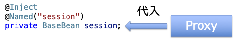
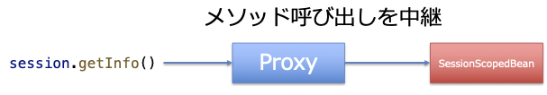
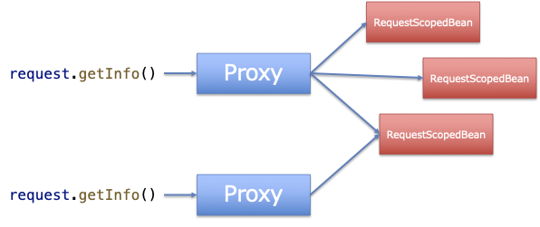

## Context and Dependency Injection (CDI)

### CDIとは

CDIとは，JavaでDI：Dependency Injection（依存性注入）を実現する仕様です。

DIは，ソフトウェアエンジニアリングにおける設計パターンの一つです。このパターンの目的は、コードの再利用性、テストの容易さ、およびモジュール間の結合度の低減を実現することにあります。

CDIでは，型や限定子の情報をもとに，`@Inject`のついたインスタンス変数や初期化メソッドの引数に，CDIコンテナがオブジェクトを取得し，注入してくれます。

インスタンスを作成あるいは取得し，代入するコードを自身で記述すると，どうしても対象の詳細な情報が必要となり，それにより依存関係が生じてしまいます。DIでは，インスタンスの取得と代入をDIコンテナに委譲することにより，依存関係を少なくし，結合度をさげることができます。

``` java
@Inject
@Named("request")
private BaseBean request; // 型BaseBeanと限定子@Named("request")の情報を元に注入
```

CDIの大きな役割は，注入するオブジェクトのライフサイクルを管理し，コンテキストに応じた適切なインスタンスを呼び出してくれることです。

これを実現するため，実際の注入の際には，変数に直接オブジェクトが代入されるのではなく，Proxyクラスが作成されて代入されます。



メソッド呼び出しは，Proxyが中継して実際のオブジェクトに転送されます。



これにより，同じ変数経由でも異なるコンテキストであれば別のインスタンスを呼び出したり，異なる変数経由でも同じコンテキストであれば同一のインスタンスを呼び出したり，という機能が実現できています。



### CDIを使ってみよう

この章では，CDIについて実際に開発を行いながら学習します。

Liberty Starterで新しく作成したプロジェクト`guide-cdi`でサンプルのコードを作成します。以下の条件でプロジェクトを作成しました。

- **Group** ：`com.demo`のまま
- **Artifact** ：`guide-cdi`
- **Build Tool** ：Maven
- **Java SE Version** ：17
- **Java EE/Jakarta EE Version** ：10.0
- **MicroProfile Version** ：None

使用するAPIは，CDIとServlet（およびHTTPSアクセス）だけですので，`src/main/liberty/config`フォルダーの`server.xml`を編集し，以下の３つのFeatureだけを有効にします。

``` xml
<!-- Enable features -->
<featureManager>
    <feature>cdi-4.0</feature>
    <feature>servlet-6.0</feature>
    <feature>transportSecurity-1.0</feature>
</featureManager>
```

CDIを使用する場合は，`beans.xml`というファイルをアプリケーションに同梱することが推奨されています。`src/main`フォルダーに`webapp`フォルダーを，そこに`WEB-INF`フォルダーを新規作成し，`src/main/webapp/WEB-INF`フォルダーに`beans.xml`というファイルを新規作成します。ファイルには，以下の内容をコピーします。

Beanとして注入する対象を探す`bean-discovery-mode`として，推奨される`annotated`を設定しています。

``` xml
<beans xmlns="https://jakarta.ee/xml/ns/jakartaee"
        xmlns:xsi="http://www.w3.org/2001/XMLSchema-instance"
        xsi:schemaLocation="https://jakarta.ee/xml/ns/jakartaee https://jakarta.ee/xml/ns/jakartaee/beans_4_0.xsd"
        version="4.0" bean-discovery-mode="annotated">
</beans>
```

注入するされる側から使用するabstractクラスであるBaseBeanを作成します。`src/main/java/com/demo`フォルダーに`bean`フォルダーを新規作成し，そこに`BaseBean.java`というファイルを新規作成し，以下の内容をコピーします。

インスタンスが作成された時刻を覚えておいて，自身のクラス名とオブジェクトのハッシュ，作成時刻をStringで提供します。また，直列化可能（Serializable）になっています。

``` java
package com.demo.bean;

import java.io.Serializable;
import java.time.LocalDateTime;

public abstract class BaseBean implements Serializable {
    private LocalDateTime created;
    protected BaseBean() {
        created = LocalDateTime.now();
    }
    abstract String getName();
    public String getInfo() {
        return getName() + "(id=" + System.identityHashCode(this) + ") created at " + created;
    }
}
```

実際に注入する3つのクラスを作成します。`src/main/java/com/demo/bean`フォルダーに`RequestScopedBean.java`，`SessionScopedBean.java`，`ApplicationScopedBean.java`というファイルを新規作成し，以下の内容をコピーします。

それぞれ，異なるスコープのBean定義アノテーションが付与され，`@Named`限定子で区別できるようになっています。

``` java
package com.demo.bean;

import jakarta.enterprise.context.RequestScoped;
import jakarta.inject.Named;

@RequestScoped
@Named("request")
public class RequestScopedBean extends BaseBean {
    @Override
    String getName() {
        return "RequestScopedBean";
    }
}
```

``` java
package com.demo.bean;

import jakarta.enterprise.context.SessionScoped;
import jakarta.inject.Named;

@SessionScoped
@Named("session")
public class SessionScopedBean extends BaseBean {
    @Override
    String getName() {
        return "SessionScopedBean";
    }
}
```

``` java
package com.demo.bean;

import jakarta.enterprise.context.ApplicationScoped;
import jakarta.inject.Named;

@ApplicationScoped
@Named("application")
public class ApplicationScopedBean extends BaseBean {
    @Override
    String getName() {
        return "ApplicationScopedBean";
    }
}
```

注入対象となる2つのServletを定義します。一つ目のServletがリクエストを受け，RequestDispacherで二つ目のServletに処理をfowardし，二つ目のServletが実際の画面表示を行います。

一つ目のサーブレットです。`src/main/java/com/demo`フォルダーに`FiestServlet.java`というファイルを新規作成し，以下の内容をコピーします。

``` java
package com.demo;

import java.io.IOException;

import com.demo.bean.BaseBean;

import jakarta.inject.Inject;
import jakarta.inject.Named;
import jakarta.servlet.ServletException;
import jakarta.servlet.annotation.WebServlet;
import jakarta.servlet.http.HttpServlet;
import jakarta.servlet.http.HttpServletRequest;
import jakarta.servlet.http.HttpServletResponse;

@WebServlet("/first")
public class FiestServlet extends HttpServlet {
    @Inject
    @Named("request")
    private BaseBean request;

    @Override
    protected void doGet(HttpServletRequest req, HttpServletResponse resp) throws ServletException, IOException {
        req.setAttribute("request.in.first", request.getInfo());
        req.getRequestDispatcher("/second").forward(req, resp);
    }
}
```

二つ目のサーブレットです。`src/main/java/com/demo`フォルダーに`FiestServlet.java`というファイルを新規作成し，以下の内容をコピーします。

``` java
package com.demo;

import java.io.IOException;
import java.io.PrintWriter;

import com.demo.bean.BaseBean;

import jakarta.inject.Inject;
import jakarta.inject.Named;
import jakarta.servlet.ServletException;
import jakarta.servlet.annotation.WebServlet;
import jakarta.servlet.http.HttpServlet;
import jakarta.servlet.http.HttpServletRequest;
import jakarta.servlet.http.HttpServletResponse;

@WebServlet("/second")
public class SecoundServlet extends HttpServlet {
    @Inject
    @Named("request")
    private BaseBean request;

    @Inject
    @Named("session")
    private BaseBean session;

    @Inject
    @Named("application")
    private BaseBean application;

    @Override
    protected void doGet(HttpServletRequest req, HttpServletResponse resp) throws ServletException, IOException {
        resp.setContentType("text/html; charset=UTF-8");
        PrintWriter writer = resp.getWriter();
        writer.print(
            """
            <!DOCTYPE html>
            <html>
            <head><title>SecoundServlet</title></head>
            <body>
            <h1>Injection Test</h1>
            <ol>
            """);
        writer.println("<dt>request in FirstServlet<dd>" + req.getAttribute("request.in.first"));
        writer.println("<dt>request in SecondServlet<dd>" + request.getInfo());
        writer.println("<dt>session in SecondServlet<dd>" + session.getInfo());
        writer.println("<dt>application in SecondServlet<dd>" + application.getInfo());
        writer.print(
            """
            </ol>
            </body>
            </html>
            """);
    }
}
```


ブラウザで[http://localhost:9080/guide-cdi/first](http://localhost:9080/guide-cdi/first)にアクセスしてみましょう。

「request in FirstServlet」と「request in SecondServlet」に全く同じ内容が表示されていることがわかるかと思います。

この2つは，異なるクラスのそれぞれの変数に注入されたものです。それでも，おなじリクエストを処理している間は，両者で全く同じインスタンスにアクセスできています。

`@Named("request")`の限定子によって，`@RequestScoped`のスコープを持つ`RequestScopedBean`のインスタンス（へのProxy）が注入されているためです。

``` java
public class FiestServlet extends HttpServlet {
    @Inject
    @Named("request")
    private BaseBean request;
```

``` java
public class SecoundServlet extends HttpServlet {
    @Inject
    @Named("request")
    private BaseBean request;
```

また，この画面をリロードすると，そのたびに「request in FirstServlet」などに，新しく作成されたインスタンスが使用されていること分かります。

Servletのインスタンス変数は，通常はサーバーが起動している間，全てのユーザーについて有効なはずです。ですが，注入されたProxyが，指定されたスコープに応じて毎回新しいインスタンスを作成し，アクセスできるようにしてくれています。

一方，リロードを繰り返しても「session in SecondServlet」に表示される内容は変わらず，オブジェクトは同じものが再使用されていることが分かります。同じクライアントからの一連のリクエストは，同一のセッションとみなされ，その間は同一のスコープとして扱われ，その間は同じオブジェクトが呼び出されています。

`@Named("session")`の限定子によって，`@SessionScoped`のスコープを持つ`SessionScopedBean`のインスタンスが注入されているためです。

``` java
@Inject
@Named("session")
private BaseBean session;
```

ブラウザのメニューから「新しいInPrivateウィンドウ」や「新しいシークレットウィンドウ」などを開いて，新しいセッションで同じURLにアクセスしてみましょう。異なるセッションでは，「session in SecondServlet」に別の情報が表示され，異なるインスタンスが呼び出されていることが分かります。

別のセッションの画面でも，「application in SecondServlet」には同一の情報が表示されていることが確認できるでしょう。アプリケーション全体で1つのオブジェクトが共有されていることが分かります。

`@Named("application")`の限定子によって，`@ApplicationScoped`のスコープを持つ`ApplicationScopedBean`のインスタンスが注入されているためです。

``` java
@Inject
@Named("application")
private BaseBean application;
```


### CDI管理Bean

CDIコンテナで管理され，必要な場所に注入されるオブジェクトをCDI管理Beanといいます。

CDI管理Beanになるための必要条件は以下の通りです。

- インターフェスやabstractクラスでない，コンクリートなJavaクラス（もしくは`@Decorator`アノテーションが付与されたabstract/非abstractクラス）
- パラメーターなしのコンストラクターを持つか，`@Inject`が付与されたコンストラクターを持つ
- インナー・クラス（内部クラス）ではない
- EJBとして定義されていない
- `javax.enterprise.inject.spi.Extension`を実装していない
- `@Vetoed`が付与されていない，また`@Vetoed`が付与されたパッケージ内に存在しない

なにがCDI管理Beanになるかは，アーカイブ（JARやWARファイルなど）ごとに設定されたBean Discovery Modeによって決まります。

Bean Discovery Modeが`all`の場合，そのアーカイブに含まれるクラスで，前掲の必要条件を満たすクラスは，全てCDI管理Beanとみなされ，注入される可能性があります。これは意図しないクラスも注入の対象となる場合があり，非常に危険なので，現在は使用は推奨されていません。

Bean Discovery Modeが`annotated`の場合，以下のいずれかのアノテーションが付与されたクラスだけが，注入の対象となるCDI管理Beanとみなされます。他のクラスが注入されることはないため，安全にCDIを使用できます。こちらの利用が推奨されています。

- スコープを指定するアノテーション（`@RequestScoped`，`@ConversationScoped`，`@SessionScoped`および`@ApplicationScoped`）
- `@Dependent`
- `@Interceptor`，`@Decorator`
- ユーザー定義のステレオタイプ

Bean Discovery Modeが`none`の場合，そのアーカイブファイルに含まれるクラスは，CDI管理Beanとなりません。注入されることもありません。

現在のCDI 4.0仕様では，アーカイブに`beans.xml`が存在していない場合のデフォルトは`annotated`，`beans.xml`が存在していれば，そこで指定されたBean Discovery Modeになります。

サンプルとして作成したアプリケーションでは，`beans.xml`で`bean-discovery-mode="annotated"`と指定していますので，スコープを指定するアノテーションのついた`RequestScopedBean`，`SessionScopedBean`，`ApplicationScopedBean`の3つのクラスだけがCDI管理Beanとなります。

また，直接注入の対象とならないCDI管理Beanとして，以下のものがあります。

- `@Produces`アノテーションがついたプロデューサー・メソッド，プロデューサー・フィールドを持つクラス
- `@Disposes`アノテーションがついたディスポーザー・メソッドを持つクラス
- `@Observes`アノテーションがついたオブサーバー・メソッドを持つクラス

>![NOTE]
>この他に，ビルトインされた管理Beanとして，Web Containerにおける`HttpServletRequest`，`HttpSession`，`ServletContext`，およびEJB Containerにおける`UserTransaction`，`java.security.Principal`があります。これらも`@Inject`で注入可能です。

### プロデューサー・メソッドとプロデューサー・フィールド

コンストラクターで生成できないオブジェクトなどをCDIで注入したいときに利用できる方法として，プロデューサー・メソッドとプロデューサー・フィールドがあります。

プロデューサー・メソッドは，`@Produces`アノテーションが付与されたメソッドです。

``` java
public class BusinessFactory {
	@Produces @ApplicationScoped 
	public BookShop createShopBook() { 
		・・・・・・ 
	} 
```

`BookShop`の型をもつオブジェクトの注入が必要になったときに，`BusinessFactory`のインスタンスがCDIコンテナにより生成され，`createShopBook()`メソッドが実行されます。その戻り値が，CDIコンテナの管理下に入り，必要な場所に注入されます。

プロデューサー・メソッドは，注入される場所の情報を，`InjectionPoint`型の引数[^1]で受け取ることができます。これにより，注入先に応じたオブジェクトを生成することが可能です。

``` java
public class LoggerFactory {
    @Produces 
    Logger createLogger(InjectionPoint injectionPoint) {
        return Logger.getLogger(
            injectionPoint.getMember().getDeclaringClass().getName()); 
    } 
```

プロデューサー・フィールドは，`@Produces`アノテーションが付与されたクラスのインスタンス変数です。

``` java
public class AppResources {
	@Produces @Resource(lookup="jdbc/CustomerDatasource")
    @Name("customer")
    DataSource customerDatabase;
```

`DataSource`型で`@Name("customer")`の限定子のついたオブジェクトの注入が必要になったときに，`AppResources`のインスタンスがCDIコンテナにより生成されます。このとき，`@Resource(lookup="jdbc/CustomerDatasource")`のアノテーションにより，定義された`DataSource`リソースが`customerDatabase`に代入されます。このフィールドに代入されたリソースが，CDIの管理下で注入されます。

プロデューサー・フィールドは，このようにJava EE/Jakarta EEのオブジェクトやリソースを注入するときによく利用されます。

[^1]:`InjectionPoint`から取得できる情報の詳細については，Javadocを参照してください。
[https://jakarta.ee/specifications/cdi/4.0/apidocs/jakarta.cdi/jakarta/enterprise/inject/spi/injectionpoint](https://jakarta.ee/specifications/cdi/4.0/apidocs/jakarta.cdi/jakarta/enterprise/inject/spi/injectionpoint)

### CDI管理Beanが注入される場所

CDIでは，`@Inject`のアノテーションが付与されたフィールドやメソッドに対して注入が行われます。

ただ，どのようなクラスであっても注入の対象となるわけではありません。CDIの注入が行われるのは，各種仕様の実行環境が以下に示したインスタンスを生成するときです[^2]。

- CDI仕様
    - CDI管理Bean
    - デコレーター
- Servlet仕様
    - Servlet，Servletフィルター，イベントリスナー
    - HTTPアップグレードハンドラー
- JSP仕様[^3]
    - Tagハンドラー，Tag Libraryイベントリスナー
- JSF仕様
    - Managedクラス
- Jakarta XML Web Services/JAX-WS仕様
    - サービス・エンドポイント
    - ハンドラー
- Jakarta RESTful Web Services/JAX-RS仕様
    - JAX-RSコンポーネント
- WebSocket仕様
    - エンドポイント
- Jakarta Enterprise Beans/EJB仕様
    - 各種Bean
- Java Persistence/JPA仕様
    - Entityリスナー

CDI管理Bean自身が注入対象となっていることに注意してください。ServletにBeanを注入し，そのBeanにさらに他のBeanを注入する，という連鎖が可能になっています。

[^2]:ほとんど使用されないInterceptor仕様，Managed Beans仕様，login callback handlerは省略しています。

[^3]:JSPは内部でServletに変換して実行されるため`<%!`〜`%>`で定義されたフィールドやメソッドに`@Inject`をつければ，注入対象となります。

### 型の一致と限定子

CDIによって注入するBeanの発見（Bean Discovery）では，最初に型の一致が利用されます。

以下のようにメソッドに`@Inject`が付与されている場合は，その引数の型，ここでは`ShoppingCartService`が発見に使用されます。

``` java
@Inject
public void setService(ShoppingCartService service) {
```

フィールドに`@Inject`が付与されている場合は，その型，ここでは`BaseBean`が発見に使用されます。

``` java
@Inject
@Named("request")
private BaseBean request;
```

CDIは，その方に一致するBean，その型を継承（extends），実装（implements）したBeanを検索し，注入の対象とします。

サンプルとして作成したアプリケーションでは，`BaseBean`を継承した3つのクラス（`RequestScopedBean`，`SessionScopedBean`，`ApplicationScopedBean`）が注入の対象となります。`BaseBean`自身はabstractクラスですので，管理Beanの条件に当てはまらないので注入対象にはなりません。

>![NOTE]
>管理Beanは，デフォルトで以下のBean Typeを持ちます。
>
>- 自身の型
>- 親クラスの型
>- 実装したインターフェースの型
>- Object型
>
>特定の型だけで注入を行いたい場合は`@Typed`アノテーションでBean Typeを限定できます。たとえば，以下のような管理Beanは，デフォルトでは自身の型`BookShopImpl`，親クラスの型`Business`にも注入が可能ですが，`@Typed`で限定されているため`BookShop`の型にしか注入できません。
>
>``` java
>@Dependent
>@Typed(BookShop.class)
>public class BookShopImpl extends Business implements BookShop {
>   ...
>}
>```

型が一致するBeanの候補が複数ある場合は，限定子が使用されます。

限定子は`@Qualifier`のついた独自アノテーションとして定義します。

``` java
import javax.inject.Qualifier;
import java.lang.annotation.Retention;
import java.lang.annotation.Target;
import java.lang.annotation.Documented;
import static java.lang.annotation.ElementType.*;
import static java.lang.annotation.RetentionPolicy.RUNTIME;

@Qualifier
@Retention(RUNTIME)
@Target({TYPE, METHOD, FIELD, PARAMETER})
@Documented
public @interface Premium {
}
```

CDI管理Beanに作成した限定子`@Premium`を付けて定義します。

``` java
import javax.enterprise.context.ApplicationScoped;

@ApplicationScoped
@Premium
public class PremiumService implements ServiceInterface {
    public String getServiceType() {
        return "Premium Service";
    }
}
```

CDI管理Beanと，注入先のフィールドやメソッドは，同じ限定子が付与されていないと注入が行われません。

``` java
import javax.inject.Inject;

public class MyBean {

    @Inject
    @Premium
    private ServiceInterface premiumService;

    public void performService() {
        System.out.println(premiumService.getServiceType());
    }
}
```

パラメーターをもつ限定子も定義できます。まず，パラメーターとなるenumを定義します。

``` java
public enum ConfigurationType {
    STANDARD,
    ADVANCED,
    CUSTOM
}
```

このenumをパラメーターとする限定子を定義します。

``` java
import javax.inject.Qualifier;
import java.lang.annotation.Retention;
import java.lang.annotation.Target;
import java.lang.annotation.Documented;
import static java.lang.annotation.ElementType.*;
import static java.lang.annotation.RetentionPolicy.RUNTIME;

@Qualifier
@Retention(RUNTIME)
@Target({TYPE, METHOD, FIELD, PARAMETER})
@Documented
public @interface Configuration {
    ConfigurationType value();
}
```

これにより，`@Configuration(ConfigurationType.STANDARD)`や`@Configuration(ConfigurationType.ADVANCED)`が限定子として使用できるようになります。パラメーターも一致しないと，同じ限定子とみなされません。

組み込みの限定子として，`@Named`があります。これは文字列をパラメーターとしてとる限定子です。パラメーターの文字列が一致しないと，注入が行われません。

``` java
@Inject
@Named("request")
private BaseBean request;
```

自身で限定子を定義しなくても使えるため，サンプルのアプリケーションでは簡便さのために使用しています。が，文字列のタイプミスがコンパイル時に検出されないため，予期せぬ問題が起こりがちです。実働環境で利用するアプリケーションでは，可能な限り必要な限定子は定義して使用するようにしましょう。


### 管理Beanのライフサイクル

