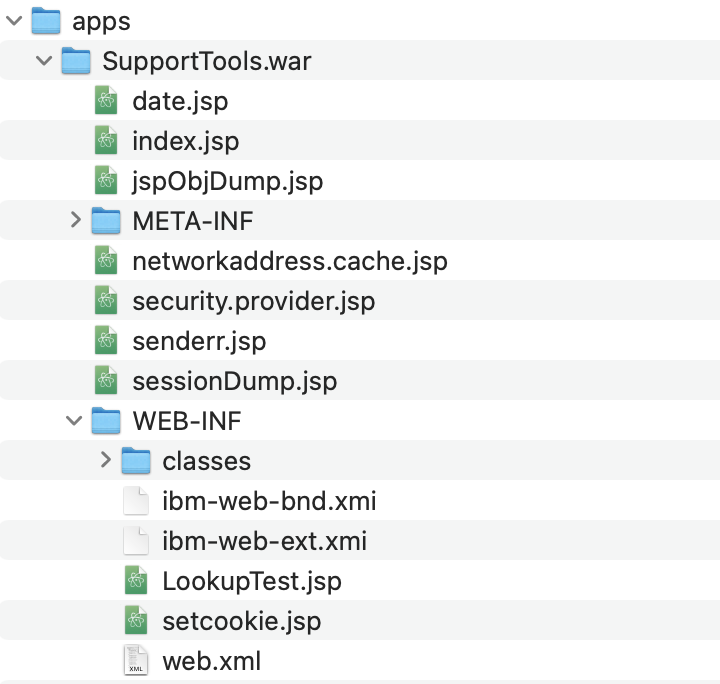

## Open Libertyの構成ファイル 


### server.xmlの基本

Libertyの構成を行う際の中心となるファイルで，XML形式で記述します。`server.xml`は`${server.config.dir}`ディレクトリにあるファイルが使用されます。

#### デフォルトベースの構成

`server.xml`に記述する構成要素には，基本的に全てデフォルトの値が決まっています。ファイルにはデフォルトから変更するものだけを記述します。これにより非構成ファイルを常に簡潔に記述することができます。

このデフォルト値はバージョンが上がっても変更されないようになっていますので，記述をしなくても安全です。構成する内容を最小限に保つためにも，また環境に合わせてどのように構成を変えたかを明確に管理するためにも，利用するデフォルト値をあえて構成に記述する，というのは避けましょう。

デフォルトの値は，Web上のWebSphere Liberty，Open Libertyのオンラインマニュアルでも確認できますが，Liberty Developer Toolsなどの開発ツールでも参照することが可能です。

>[!TIP]
>`server.xml`の構成項目やその説明，デフォルトの値が記載されたXSDファイル(XML Schema)を動的に生成することができます。Libertyの構成ファイルを操作するツールを自作する際などに，利用します。生成にはLibertyの`schemaGen`コマンドを利用します。
>
>```
>schemaGen /path/to/schema.xsd
>```
>
>以下のようにオプションでロケールを指定すると，日本語で説明が記述されたXSDファイルが生成されます。
>
>```
>schemaGen  --locale=ja_JP /path/to/schema.xsd
>```


#### 変数の使用

`server.xml`およびそこから読み込まれるXMLファイルでは，`${変数名}`で変数の値を参照することができます。変数としては以下のものが利用可能です。下のものほど優先され，同じ変数名で定義された値を上書きできます。

- 構成ファイルの`<variable>`要素の`defaultValue`属性で定義された値
- 環境変数
- `bootstrap.properties`ファイルで定義された値
- Javaシステムプロパティ（`server.config.dir`などのLibertyのディレクトリをしめす変数もシステムプロパティとして定義されています）
- `${server.config.dir}/variables`ディレクトリ，もしくは環境変数`VARIABLE_SOURCE_DIRS`で指定されたディレクトリにおかれたファイルで定義された値
- 構成ファイルの`<variable>`要素の`value`属性で定義された値
- Libertyの起動コマンドラインで指定された値

##### 環境変数

環境変数を参照する際には，指定された名前の環境変数だけでなく，英数字以外をアンダースコア`_`に変換した文字列，さらに英字を大文字に変換した文字列も参照されます。つまり`${my.env.var1}`という変数を参照する場合，以下の環境変数が順に検索され，最初に見つかったものが利用されます。

- `my.env.var1`
- `my_env_var1`
- `MY_ENV_VAR1`

##### variablesディレクトリ

環境変数`VARIABLE_SOURCE_DIRS`は変数を定義するファイルを格納するディレクトリを指定します。複数のディレクトリを指定するときには，Windows環境では`;`で，そのほかの環境では`:`で区切って指定します。この環境変数が設定されていなかった場合には，デフォルトで`${server.config.dir}/variables`ディレクトリが使用されます。

これらのディレクトリにファイルを置いた場合，ファイル名が変数名として利用されます。値はファイルに記述された内容です。たとえば`httpPort`というファイルに`8080`という内容が保存されていた場合，`${httpPort}`という変数は`8080`になります。

ファイル名が`.properties`の拡張子を持っている場合には，一つのファイルに複数の変数定義を記述することができます。例えば以下のように記述します。

``` properties
httpPort=9080
httpsPort=9443
```

##### Libertyの起動コマンドライン

Libertyの起動時のコマンドラインでも`--`につづけて変数を指定することができます。たとえば`start`アクションでサーバーを起動する際に，以下のように変数を指定したとします。

```
server start myserver -- --httpPort=10080
```

この場合，`${httpPort}`という変数は`10080`になります。

##### デフォルト値の設定と上書き

独自の変数を使用する場合は，構成ファイル内に`defaultValue`属性でデフォルトの値を定義し，環境変数や起動パラメーターで値を上書きするようにして使用するといいでしょう。

たとえばテスト環境と本番環境で接続するデータベースのIPアドレスが異なる場合，テスト環境のアドレスを以下のように`<variable>`要素の`defaultValue`属性に指定するといいでしょう。

``` xml
<variable name="db.server.address" defaultValue="192.168.1.101" />
<dataSource jndiName="jdbc/db2DataSource" id="db2DataSource">
    <jdbcDriver libraryRef="db2jdbc_jar" />
    <properties.db2.jcc databaseName="appdatabase" portNumber="8200"
        serverName="${db.server.address}" />
</dataSource>
```

本番環境で実行する際には，環境変数`DB_SERVER_ADDRESS`に`192.168.2.201`のようなアドレスを記入してLibertyを起動すれば，`defaultValue`属性に記述された内容を上書きすることができます。これにより，何もしなければ安全にテスト用のデータベースが使用され，追加の設定をしたときだけ本番のデータベースを使用する，というような構成ができます。。

その環境で固有に使用する環境変数は，後述するように，`${wlp.install.dir}/etc`ディレクトリの`server.env`に記入しておくといいでしょう。

##### 変数の演算

数値が定義された変数は，`+`や`-`，`*`などを使用した計算が可能です。

``` xml
<variable name="one" value="1" />
<variable name="two" value="${one+1}" />
<variable name="three" value="${one+two}" />
<variable name="six" value="${two*three}" />
<variable name="five" value="${six-one}" />
```

たとえば，以下のような構成ができます。

``` xml
<variable name="port.offset" defaultValue="9000" />
<httpEndpoint id="defaultHttpEndpoint" host="*"
    httpPort="${port.offset+80}" httpsPort="${port.offset+443}" />
``` 

この例では，このまま起動すれば9080/9443番ポートがLISTENされ，`PORT_OFFSET=0`のような環境変数を設定して起動すれば80/443番ポートがLISTENされます。

#### 時刻の記述方法

時間を設定する属性には，単位をつけて記載します。

- `d` 日
- `h` 時間
- `m` 分
- `s` 秒
- `ms` ミリ秒

単位は複数を併記することができます。たとえば`1m30s`は1分30秒，つまり90秒を意味します。

#### 構成ファイル中でのパスワードの記述

Libertyの構成ファイルにパスワードを記述する際には，いくつかの方法で難読化が可能です。デフォルトではXORによる難読化が利用され，秘密鍵を使ったAES暗号化もサポートされています。ただ，AESを使った暗号化でも完全な安全性は得られません。Liberty自身がパスワードを使用するために，必要な情報を組み合わせてパスワードを復元する必要があるためです。Libertyの全ての構成ファイルにアクセスができる場合，原理的には記述されたパスワードを解読することが可能です。

難読化にはLibertyの`securityUtility`コマンドを利用します。

```
securityUtility encode パスワード文字列
```

生成された`{xor}EgYADx4MDAgQDRs=`のような文字列をパスワードに指定します。

``` xml
<containerAuthData user="db2inst1" password="{xor}EgYADx4MDAgQDRs=" />
```

難読化されたパスワードは，変数経由で提供することも可能です。

``` xml
<variable name="db2password" defaultValue="{xor}EgYADx4MDAgQDRs=" />
   ...
   <containerAuthData user="db2inst1" password="${db2password}" />
```

>[!TIP]
>難読化のアルゴリズムにAESを指定することもできます。
>
>```
>securityUtility encode --encoding=aes パスワード文字列
>```
>
>AESの変換の際の鍵をデフォルトから変更する場合は，以下のように鍵になる文字列を指定して難読化します。
>
>```
>securityUtility encode --encoding=aes --key=鍵文字列 パスワード文字列
>```
>
>鍵をデフォルトから変更した場合は，Libertyがパスワードを解読できるように変数`wlp.password.encryption.key`で鍵を指定します。
>
>``` xml
><variable name="wlp.password.encryption.key" value="鍵文字列" />
>```
>
>このファイルはアクセスを制限できる場所に配置し，後述する`<include>`で構成ファイルに取り込むようにします。
>
>また，Libertyの起動時に引数でわたすこともできます。
>
>```
>server start サーバー名 -- --wlp.password.encryption.key=鍵文字列
>```


#### 他のファイルの読み込み

`<include>`要素で`server.xml`から他のファイルを読み込むことができます。読み込み先のファイルの内容が`<include>`の場所に展開されます。

`location`属性に読み込みファイルを相対パスで記述すると，元のファイルからの相対パス，`${server.config.dir}`からの相対パスが検索されます。

``` xml
<include location="sessiondb.xml" />
```

Libertyの導入ディレクトリ内のファイルを読み込む場合は，変数などを使用した絶対パスでの記述がおすすめです。構成ファイルの可搬性を保つことができます。

``` xml
<include location="${shared.config.dir}/sessiondb.xml" />
```

読み込むファイルが存在しないとエラーとなります。存在するときにだけ読み込む場合には`optional`属性を設定します。

``` xml
<include location="${shared.config.dir}/sessiondb.xml" optional="true" />
```

`location`属性にディレクトリを指定すると，そのディレクトリにある全てのXMLファイルが読み込まれます。サブレディレクトリにあるXMLファイルは読み込まれません。

``` xml
<include location="/work/wlp/config/" optional="true" />
```

`location`属性にはURLも指定することができます。

``` xml
<include location="https://server.example.com/config/sessiondb.xml" />
```

以下のディレクトリにXMLファイルが存在していると，自動的に読み込まれて`server.xml`の構成に追加されます。

- `${server.config.dir}/configDropins/defaults/` にあるXMLファイル
  - server.xmlより先に読み込まれる
  - 同じ設定項目がある場合には，`server.xml`が優先される
- `${server.config.dir}/configDropins/overrides/` にあるXMLファイル
  - server.xmlより後に読み込まれる
  - 同じ設定項目がある場合には，構成は上書きされる

#### 構成のマージ

構成ファイルは`<include>`や`configDropins`などにより複数のファイルに分けて構成できるため，同じ構成が複数のファイルに記述されることがあります。このような状況では，構成は一定のルールに従ってマージされます。

Libertyの構成には，何らかの管理オブジェクトを生成するFactory構成と，サーバー上の唯一の管理オブジェクトを設定するSingleton構成があります。`<webApplication>`や`<httpEndpoint>`，`<keyStore>`，`<dataSource>`，`<library>`などがFactory構成です。`<logging>`や`<quickStartSecurity>`，`<applicationManager>`などがSingleton構成です。

Factory構成は，複数回記述された場合もそれぞれが有効になります。下記の例ではWebアプリケーションは二つ，Liberty上に定義されることになります。

``` xml
<webApplication location="myapp.war" />
<webApplication location="myapp2.war" />
```

既存のFactory構成を上書きするには，`id`属性を指定して同一のオブジェクトである事を明示化します。

``` xml
<webApplication id="myapp" location="myapp.war" contextRoot="/myawesomeapp" />
<webApplication id="myapp" location="myapp2.war" />
```

同じIDをもつFactory構成はマージされ，上記の例は以下の構成と同じ意味になります。属性はマージされ，同じ属性である`location`はあとから記述されたものが有効になります。

``` xml
<webApplication id="myapp" location="myapp2.war" contextRoot="/myawesomeapp" />
```

Singleton構成は，`id`属性の記述がなくても自動的にマージされます。

``` xml
<logging traceSpecification="*=debug" messageFormat="ENHANCED" />
<logging traceSpecification="openjpa.jdbc.SQL=all" />
```

上記の例は以下の構成と同じ意味になります。

``` xml
<logging traceSpecification="openjpa.jdbc.SQL=all" messageFormat="ENHANCED" />
```

Singleton構成が子要素を持つ場合，それらはマージされます。

``` xml
<featureManager>
    <feature>servlet-4.0</feature>
</featureManager>
<featureManager>
    <feature>restConnector-2.0</feature>
</featureManager>
```

上記の例は以下の構成と同じ意味になります。

``` xml
<featureManager>
    <feature>servlet-4.0</feature>
    <feature>restConnector-2.0</feature>
</featureManager>
```

#### 構成のネストとIDによる参照

構成ファイルに設定する要素の中には，他の要素の設定を参照するものがあります。たとえば，DataSourceの構成にはJDBC Driverの構成が必要ですし，JDBC Driverの構成には実装を提供するライブラリの構成が必要です。

これらの前提となる要素は，IDを付加して，そのIDを使って参照することができます。

``` xml
<dataSource jndiName="jdbc/myDS" 
    jdbcDriverRef="derbyDriver" />

<jdbcDriver id="derbyDriver"
    libraryRef="derbyLib" />

<library id="derbyLib"
    filesetRef="derbyFile" />

<fileset id="derbyFile"
    dir="${shared.resource.dir}/derby"
    includes="derby.jar" />
```

また，要素をネストして定義することも可能です。

``` xml
<dataSource jndiName="jdbc/myDS">
    <jdbcDriver>
        <library>
            <fileset
                dir="${shared.resource.dir}/derby"
                includes="derby.jar" />
        </library>
    </jdbcDriver>
</dataSource>
```

基本的に，一カ所でしか利用しないものについてはネストで定義し，複数の場所から利用されるものは個別に定義してIDで参照するようにするとよいでしょう。

#### server.xmlの動的更新

Libertyの起動中に構成ファイルを変更して保存した場合，変更は即座に反映されます。`server.xml`だけでなく，そこから`<include>`されているファイルや`configDropins`にあるファイルも，変更は検知され動的に反映されます。

この挙動は開発時には非常に便利なのですが，本番環境で変更を動的に反映させたくない場合は，以下の構成を追加します。これによりMBean経由でトリガーされない限り（もしくはLibertyを再起動しない限り）変更は自動で反映されなくなります。

``` xml
<config updateTrigger="mbean"/>
```

またアプリケーションの変更も動的に反映されます。これを抑止するには以下の構成を追加します。

``` xml
<applicationMonitor updateTrigger="mbean" />
```

### server.xmlの構成例

`server.xml`ファイルの全体像は，たとえば以下のようになります。`<server>`要素の子要素として，各種の設定が記述されています。

``` xml
<?xml version="1.0" encoding="UTF-8"?>
<server description="new server">
    <featureManager>
        <feature>jsp-2.3</feature>
        <feature>jaxrs-2.1</feature>
        <feature>cdi-2.0</feature>
        <feature>jdbc-4.2</feature>
    </featureManager>

    <httpEndpoint id="defaultHttpEndpoint" host="*"
        httpPort="9080" httpsPort="9443" />

    <webApplication location="sample-app.war" contextRoot="/sample-app" />
    <applicationManager autoExpand="true" />

    <library id="derby_lib">
        <fileset dir="${shared.resource.dir}/derby" includes="*.jar" />
    </library>
    <dataSource jndiName="jdbc/derbyDS" id="derbyDS">
    	<jdbcDriver libraryRef="derby_lib" />
        <properties.derby.embedded createDatabase="create"
            databaseName="${server.output.dir}/logs/DERBY_DB" />
    </dataSource>
</server>
```

#### Featureの構成

Libertyで提供されているサーバー機能やアプリケーションから利用できるAPIは，Feature（フィーチャー）というモジュールで提供されています。`server.xml`では利用するFeatureを`<featureManager>`で構成します。デフォルトで有効になるFeatureは「なし」なので，必ず何らかのFeatureを設定する必要があります。

``` xml
<featureManager>
    <feature>jsp-2.3</feature>
    <feature>jaxrs-2.1</feature>
    <feature>cdi-2.0</feature>
    <feature>jdbc-4.2</feature>
</featureManager>
```

Featureには依存関係が定義されており，前提として必要なFeatureがあると自動的に有効になります。たとえば`jaxrs-2.1` Featureを有効にすると，依存関係にある'jaxrsClient-2.1'，'jsonp-1.1'，'servlet-4.0'も暗黙的に有効になります。

``` xml
<featureManager>
    <feature>jaxrs-2.1</feature>
</featureManager>
```

この設定で起動したときのメッセージは以下のようになります。

```
[監査      ] CWWKF0012I: サーバーは次のフィーチャーをインストールしました。[jaxrs-2.1, jaxrsClient-2.1, jsonp-1.1, servlet-4.0]。
```

この依存関係を利用してConvenience Featureという，特定の仕様群をまとめて有効にするFeatureが定義されています。これらのFeature自身には機能は実装されていませんが，依存関係として関連のFeatureが有効になります。ただし，これらのConvenience Featureを利用するより，アプリケーションで必要なFeatureを個別に指定した方が，サーバーのランタイムを軽く保つことができますので，なるべくなら利用しないようにしましょう。

- Java EE/Jakarta EE仕様をまとめて有効にするもの
    - `javaee-8.0`，`jakartaee-8.0`，`jakartaee-9.1`，`jakartaee-10.0`など
- Java EE/Jakarta EEのサブセットであるWeb Profile仕様を有効にするもの
    - `webProfile-8.0`，`webProfile-9.1`，`webProfile-10.0`など
- Java EE/Jakarta EEのアプリケーションクライアントをまとめて有効にするもの
    - `javaeeClient-8.0`，`jakartaeeClient-9.1`，`jakartaeeClient-10.0`など
- MicroProfile仕様をまとめて有効にするもの
    - `microProfile-4.0`，`microProfile-4.1`，`microProfile-5.0`，`microProfile-6.0`など
- EJB（Enterprise JavaBeans）/Jakarta Enterprise Beansを有効にするもの
    - `ejb-3.2`，`enterpriseBeans-4.0`など

Featureの中には，共存ができず，一つのサーバー構成で同時に有効にできない組み合わせがあります。原則的に，異なるJava EE/Jakarta EEのバージョンに含まれるFeatureどうしは共存できません（例外として，複数のJava EE/Jakarta EEバージョンに含まれるFeatureがあり，それらはどちらのバージョンのFeatureとも共存できます）。また，MicroProfile仕様についても，対応するJava EE/Jakarta EEのバージョンが定義されており，異なるバージョンのFeatureとは共存できないことがあります。

導入されていないFeatureについては，`featureUtility`コマンドで追加導入することができます。たとえば，Jakarta EE 10のFeatureを全て追加導入する場合は以下のように実行します。依存関係にあるFeatureもあわせて導入されるため，これで全ての必要なFeatureが導入できます。

```
featureUtility installFeature jakartaee-10.0
```

また，`installServerFeatures`アクションを指定すると，Feature名のかわりにサーバー名を指定して，そのサーバーの`server.xml`で定義されている全てのFeatureを（足りなければ）導入することができます。

```
featureUtility installServerFeatures defaultServer
```

`featureUtility`コマンドはインターネット上のレポジトリからファイルをダウンロードするので，外部のネットワーク接続が必要です。外部接続にProxyの構成などが必要な場合は，以下のコマンドを実行して画面の指示に従ってください。

```
featureUtility viewSettings
```

#### Java EE/Jakarta EEアプリケーションの構成

Libertyでアプリケーションが配置されるディレクトリは，主に以下の二カ所になります。

- ${server.config.dir}/dropins
    - server.xmlなどに定義しなくても，アプリケーションとして実行される
    - クラスローダーやセキュリティなど，追加の構成はできない
- ${server.config.dir}/apps
    — server.xmlなどに定義すると，アプリケーションとして実行される
    - クラスローダーやセキュリティなど，追加の構成ができる

アプリケーションは，WAR/EARなどのアーカイブファイルを上記のディレクトリに直接おいてもいいですし，`.war`や`.ear`の拡張子を持ったディレクトリを作成して中身を展開して配置することもできます。


図：アーカイブを直接おいた例



図：展開して配置した例

`<applicationManager>`要素の`autoExpand`属性に`true`が設定されていると，アーカイブでデプロイされたアプリケーションは`${server.output.dir}/workarea`以下に自動的に展開されて利用されます。アプリケーションが利用するAPIのなかに，一部アーカイブのままでは正常に動作しないものがあるため，テンプレートで作成される構成ファイルにはこの設定が最初から記述されています。

EARファイルは`server.xml`に`<enterpriseApplication>`要素で定義します。`location`属性で相対パスでファイルを指定した場合は`${server.config.dir}/apps`からファイルが検索されます。

``` xml
<enterpriseApplication location="INVENTRY.ear" />
```

WARファイルは`server.xml`に`<webApplication>`要素で定義します。`location`属性にくわえ，どのようなURLで呼び出されたときに実行されるのかを`contextRoot`属性で指定します。

``` xml
<webApplication location="SupportTools.war" contextRoot="/support" />
```

>[!NOTE]
>`contextRoot`属性が指定されたなった場合やdropinsにファイルが置かれたとき，コンテキストルートのデフォルト値は，以下の項目のうち上のものほど優先して利用されます。
>
>- EARファイルの`application.xml`で指定された値
>- WARファイルがibm-web-ext.xmlを含んでいた場合，その`web-ext`要素の`context-root`属性の値
>- `<webApplication>`要素の`name`属性の値
>- WARファイルのファイル名から`.war`を取り除いたもの
>
>ですが，できるだけ`contextRoot`属性で明示的に指定するようにしましょう。

`<enterpriseApplication>`や`<webApplication>`には，ネストした子要素として（あるいはIDで参照して）以下のようなものが構成できます。

- `<appProperties>`：アプリケーションから参照できるプロパティを指定
- `<classloader>`：アプリケーションから参照する外部ライブラリを指定
- `<application-bnd>`：アプリケーション中の各種参照のバインド先を指定
    - `<resource-ref>`：アプリケーション中のリソース参照のバインド先を指定
    - `<security-role>`：アプリケーション中で定義されたセキュリティ・ロールを実際のユーザーやグループにバインド
- `<web-ext>`：IBM独自のWebアプリケーション拡張を構成する

#### HTTPエンドポイントの構成

LibertyがHTTPリクエストを処理するためにLISTENするエンドポイントの設定を，構成ファイルの`<httpEndpoint>`要素で構成します。

``` xml
<httpEndpoint host="*" httpPort="9080" httpsPort="9443" id="defaultHttpEndpoint" />
```

`host`属性が，LibertyがポートをLISTENするさいにバインドするアドレスですが，デフォルトは`localhost`になっています。つまりリモートからの接続はできません。`server create`コマンドで作成したテンプレートの`server.xml`では，基本的に`host`属性は構成されておらず，同じPC内のローカルからしか接続できないようになっています。リモートからも接続できるようにするには`host="*"`を設定します。この部分は実働環境でLibertyを使用する場合に，必ず書き換えないといけない部分なので注意してください。

>[!NOTE]
>`<httpEndpoint>`の`host`属性のデフォルトが`localhost`になっているのは二つの理由があります。
>
>一つめはセキュリティの観点からです。Libertyでは，セキュリティに関わる設定は安全な方をデフォルトにする，という原則があります。開発時には，安全なセキュリティ構成を取れているとは限りません。不用意に立ち上げたサーバーが外部から攻撃されて，被害を被ることを防いでいます。
>
>二つめはライセンスの観点からです。Open Libertyはオープンソース化される前はWebSphere Libertyという商用ランタイムとして開発されていました。WebSphere Libertyは開発者用途，つまり開発者が専有利用するPC上で，リモートから接続せずローカルでテスト実行する用途であれば無償で利用できます。`host="*"`が設定されていない状態であれば，ライセンスに違反することなく安全にWebSphere Libertyを使用することができます。

ネストした子要素として（あるいはIDで参照して）以下のようなものが構成できます。

- `<tcpOptions>`：TCPレベルの各種設定
    - ソケットオプションや接続制限など。
- `<httpOptions>`：HTTPレベルの各種設定
    - ヘッダの数やサイズの制限，各種タイムアウトや，HTTP/2の設定など。
- `<accessLogging>`：アクセスログを取得する構成
    - 設定すると，Libertyでアクセスログを取得できる
    - ログのフォーマットやサイズによりローテーションなどを構成
- `<compression>`：レスポンスを自動的に圧縮するための構成
- `<headers>`：特定のHTTPヘッダーを追加・削除する

##### アクセスログの取得

子要素として`<accessLogging>`を使用すると，Libertyでアクセスログを取得することができます。

``` xml
<httpEndpoint id="defaultHttpEndpoint" host="*" httpPort="9080" httpsPort="9443">
    <accessLogging filepath="${server.output.dir}/logs/http_defaultEndpoint_access.log"
        logFormat='%h %i %u %t "%r" %s %b %D %{R}W'
        maxFiles="0" rolloverInterval="1d" rolloverStartTime="00:00" />
</httpEndpoint>
```

`logFormat`属性は，Apache HTTP ServerのCustomLogと同じ書式で記録する内容を記述することができます。詳細はOpenLiberty.ioの「HTTP access logging」のページ[^1]を参照してください。

`rolloverInterval`を指定すると，一定時間ごとにアクセスログを別のファイルにロールオーバーすることができます。切り替えの基準となる時刻を`rolloverStartTime`で24時間制の時:分で記入します。`rolloverInterval`で指定した期間が1日未満の端数を持っているときに，どのようなタイミングで切り替わるかについては，ややこしいルールがあるのですが，本当にややこしくて分かりにくいので，`rolloverInterval`に指定する期間は日単位で記入するようにしてください。

`maxFiles`は，ロールオーバーした際に，履歴ファイルをいくつ保持するかを指定します。`0`は，履歴を削除せずに全て残すことを意味します。

[^1]: https://openliberty.io/docs/latest/access-logging.html


##### レスポンスの圧縮

子要素として`<compression>`を使用すると，Libertyからのレスポンスを可能ならば圧縮して返すようになります。

``` xml
<httpEndpoint id="defaultHttpEndpoint" host="*" httpPort="9080" httpsPort="9443">
    <compression serverPreferredAlgorithm="gzip|x-gzip|deflate">
          <types>+application/xml</types>
          <types>+application/json</types>
    </compression>
</httpEndpoint>
```

CPU負荷に余裕がある環境では，指定するだけでネットワーク転送量を減らし，レスポンスタイムを短くする効果があります。

`serverPreferredAlgorithm`属性は圧縮に使用するアルゴリズムです。通信相手が`Accept-encoding`で指定してきた利用可能なアルゴリズムのなかから，この順で選ばれます。圧縮率の高い`gzip`やその旧エイリアスである`x-gzip`，普及率の高い`deflate`を指定しておけばいいでしょう。

圧縮対象となる`Content-type`を`<types>`で指定します。デフォルトは`text/*`が指定されていますので，HTMLやPlain Text，CSSやJavaScriptが圧縮対象となります。MIME型の前に，圧縮対象に追加するならば`+`を，圧縮対象から外すのであれば`-`をつけて設定します。上記の例では，XMLとJSONを圧縮対象に加えています。


#### データベースの構成

アプリケーションから利用する`javax.sql.DataSource`の設定を，構成ファイルの`<dataSource>`要素で構成します。

DataSourceを使用するには，いずれかのバージョンのJDBCのFeatureを有効にする必要があります（JPAのFeatureなどの依存関係として間接的に有効にされることもあります）。

``` xml
<featureManager>
    <feature>jdbc-4.2</feature>
</featureManager>
```

`<dataSource>`の定義には，JDBC Driverの構成と，データベースのプロパティの構成が必須です。また，`<connectionManager>`要素を追加してコネクションプールの設定を行うことも可能です。

``` xml
<library id="jdbcLib">
    <fileset dir="${shared.resource.dir}/jdbc" includes="*.jar"/>
</library>

<dataSource jndiName="jdbc/myDB">
    <jdbcDriver libraryRef="jdbcLib"/>
    <properties serverName="localhost" portNumber="5432"
                databaseName="myDB"
                user="exampleUser" password="{xor}Oic+Mi8zOg8+LCwoMC07" />
    <connectionManager maxPoolSize="30" />
</dataSource>
```

JDBC Driverの実装を提供するライブラリを指定して`<jdbcDriver>`を定義します。Libertyから利用するJDBC Driverでは，以下の何れかのインターフェースを実装したクラスを提供し，`ServiceLoader`経由でインスタンスを取得できる必要があります。

- javax.sql.DataSource
- javax.sql.ConnectionPoolDataSource
- javax.sql.XADataSource

JDBC 4.3以降を有効にしたときには，以下の順でインスタンスが検索されます。

- javax.sql.XADataSource
- javax.sql.ConnectionPoolDataSource
- javax.sql.DataSource

JDBC 4.2以前を有効にしたときには，以下の順でインスタンスが検索されます。

- javax.sql.ConnectionPoolDataSource
- javax.sql.DataSource
- javax.sql.XADataSource

2-Phase Commitを使用したいなどの目的で，特定のインターフェースのDataSourceが必要な場合は，`<dataSource>`要素の`type`属性で明示的に指定します。また，必要に応じてインターフェースを実装しているクラス名を`<jdbcDriver>`要素の`javax.sql.XADataSource`属性などで指定します。

``` xml
<dataSource id="myDB" jndiName="jdbc/myDB" type="javax.sql.XADataSource">
    <jdbcDriver libraryRef="jdbcLib"
                javax.sql.XADataSource="com.example.jdbc.SampleXADataSource"/>
    <properties serverName="localhost" portNumber="1234"
                databaseName="myDB"
                user="exampleUser" password="{xor}Oic+Mi8zOg8+LCwoMC07"/>
</dataSource>
```

Libertyが対応している以下のDBMSについては，汎用のプロパティとは別に専用のプロパティが提供されており，いくつかのデフォルト値も適切にセットされるようになっています。

- IBM Db2
    - `<properties.db2.jcc>`
    - `<properties.db2.i.native>`
    - `<properties.db2.i.toolbox>`
- Informix
    - `<properties.informix>`
    - `<properties.informix.jcc>`
- Apache Derby
    - `<properties.derby.client>`
    - `<properties.derby.embedded>`
- Microsoft SQL Server
    - `<properties.microsoft.sqlserver>`
    - `<properties.datadirect.sqlserver>`
- Oracle / Oracle UCP / Oracle RAC
    - `<properties.oracle>`
    - `<properties.oracle.ucp>`
- PostgreSQL
    - `<properties.postgresql>`
- Sybase
    - `<properties.sybase>`

たとえば，IBM Db2については，`<properties.db2.jcc>`で以下のようなプロパティが利用できます。

``` xml
<properties.db2.jcc serverName="localhost" portNumber="50000" 
        databaseName="test" user="db2inst1" password="{xor}OTAwPT4tbm1saw=="
        currentSchema="WRKSCHM" currentLockTimeout="30s" />
```

また，追加で設定された属性については，パラメーターとしてJDBC Driverに渡されるので，DBMS固有の構成を追加で行うことも可能です。

``` xml
<dataSource jndiName="jdbc/myDB" jdbcDriverRef="myDriver"/>
    <properties someProperty="someValue" anotherProperty="5" />
</dataSource>
```

##### データベースのパフォーマンス設定

パフォーマンスに大きな影響をあたえるデータベース設定がいつかあります。

``` xml
<dataSource jndiName="jdbc/myDB" isolationLevel="TRANSACTION_READ_COMMITTED" 
    statementCacheSize="60" >
    <jdbcDriver libraryRef="jdbcLib"/>
    <properties serverName="localhost" portNumber="5432"
                databaseName="myDB"
                user="exampleUser" password="{xor}Oic+Mi8zOg8+LCwoMC07" />
    <connectionManager maxPoolSize="30" purgePolicy="FailingConnectionOnly" />
</dataSource>
```

`<dataSource>`要素の`isolationLevel`属性は，DBコネクションのデフォルトの分離レベルを設定します。以下のものが利用可能です。上のものほど分離レベルが高く安全にDBを利用できますが，パフォーマンスは悪くなります。

- `TRANSACTION_SNAPSHOT`
    - Microsoft SQL Server JDBC DriverおよびDataDirect Connect for JDBCで利用できるスナップショット分離。
- `TRANSACTION_SERIALIZABLE`
    - ダーティー読み取り，反復不能読み取り，および幻像読み取りは防止されます。
- `TRANSACTION_REPEATABLE_READ`
    - ダーティー読み取りと反復不能読み取りは防止されます。幻像読み取りは発生する可能性があります。
- `TRANSACTION_READ_COMMITTED`
    - ダーティー読み取りは防止されます。反復不能読み取りと幻像読み取りは発生する可能性があります。
- `TRANSACTION_READ_UNCOMMITTED`
    - ダーティー読み取り，反復不能読み取り，および幻像読み取りが発生する可能性があります。
- `TRANSACTION_NONE`
    - JDBCドライバーがトランザクションをサポートしていないことをしめしています。

RDBMSが，Db2，Informix，Apache Derby，Microsoft SQL ServerもしくはSybaseと識別された場合，デフォルトは`TRANSACTION_REPEATABLE_READ`になります。その他のDBでは，デフォルトは`TRANSACTION_READ_COMMITTED`になります。アプリケーションの特性に応じて分離レベルを下げるとパフォーマンスが改善します。

`<dataSource>`要素の`statementCacheSize`属性は，DBコネクションあたり保持する`PreparedStatement`キャッシュの数を設定します。デフォルトは10です。

アプリケーション内で，常時使用されている`PreparedStatement`のSQL文の種類を調べ（めったに使用されないものは除いてください），その数よりも多い値を設定します。

`<connectionManager>`要素の`maxPoolSize`属性は，コネクションプールが保持する最大のDBコネクション数です。デフォルトは50になります。

`maxPoolSize`の最適値は，使用しているアプリケーションの性質，RDBMSの種類と性能に依存します。少なすぎると，アプリケーションでDBコネクションの取得待ちが発生し，レスポンスが遅延する可能性があります。多すぎると，実行しているSQLやRDBMSの並行実行性能の限界を超え，パフォーマンスがかえって悪化します。テストで最適な値を決定してください。

`<connectionManager>`要素の`purgePolicy`属性は，コネクションプール中のDBコネクションが接続が切れて使用できなくなっていたとき，どの範囲で破棄と再接続を行うかの設定です。

デフォルトの`EntirePool`は，プール内にある全てのDBコネクションを無効とみなして破棄します。安全ですが，利用可能なコネクションも破棄してしまうリスクがあります。ネットワーク通信のTCPのkeepaliveなどによって，長期間通信のないコネクションがOSで切断されるような環境では，`FailingConnectionOnly`や`ValidateAllConnections`に設定した方が，パフォーマンスがよくなることがあります。`FailingConnectionOnly`は，接続に問題があったコネクションのみを破棄します。`ValidateAllConnections`は，接続の問題が発見るとプール中の全てのコネクションの接続を確認します。

##### DataSourceの利用

こうして構成したDataSourceは，Javaアプリケーションからアノテーションなどで指定して利用できます。

``` java
@Resource(lookup = "jdbc/myDB")
DataSource myDB;
```

または，`jndi-1.0` Featureを有効にして，JNDI経由でlookupすることも可能です。

``` java
DataSource myDB = InitialContext.doLookup("jdbc/myDB");
```

`server.xml`内の他の構成要素から，IDを`dataSourceRef`で指定して利用されることもあります。

`HttpSession`をDBで永続化する`<httpSessionDatabase>`やOAuthやJavaバッチで使用される`<dataStore>`などは，構成にDataSourceを必要とします。


### server.xml以外の構成ファイル

Libertyは，XML形式以外の構成ファイルもいくつか使用します。

#### server.env

LibertyのJavaプロセスで使用される環境変数を定義します。

各行に`環境変数名=値`を記述します。イコールの両側に空白を置いてはいけません。`#`で始まる行はコメントとして無視されます。

``` properties
# change log output dir
LOG_DIR=/logs/wlp/server1
```

ファイル内での環境変数の展開はできません。展開が必要な場合は一行目に`# enable_variable_expansion`というコメントを記述してください。ただ，Windows環境とそれ以外で展開の記述方法が異なるため，この機能を使用すると構成ファイルの可搬性が失われます。

``` properties
# enable_variable_expansion
# Windows環境
LIBPATH=C:\WORK\LIB;%LIBPATH%
```

``` properties
# enable_variable_expansion
# Windows以外
LIBPATH=/work/lib:${LIBPATH}
```

`server.env`は以下の場所から検索されます。見つかった全ての内容がマージされてJavaプロセスが起動します。同じものが構成されている場合は，下のものほど優先されます。

- `${wlp.install.dir}/etc/server.env`
    - デフォルト：`wlp/etc/server.env`
- `${wlp.user.dir}/shared/server.env`
    - デフォルト：`wlp/usr/shared/server.env`
- `${server.config.dir}/server.env`
    - デフォルト：`wlp/usr/servers/サーバー名/server.env`

Libertyの動作を調整する環境変数としては，たとえば以下のようなものがあります。

- `JAVA_HOME`
    - Libertyを起動するために使用するJava実行環境の場所を設定する
- `JVM_ARGS`
    - Libertyを起動するJVMのコマンドライン引数にオプションとして追加する内容を設定
- `WLP_USER_DIR`
    - ユーザー構成のディレクトリをデフォルトの`${wlp.user.dir}`から変更する
    - `server.env`で設定する場合，必ず`${wlp.install.dir}/etc/server.env`で設定しないといけない
- `VARIABLE_SOURCE_DIRS`
    - 構成で使用する変数を設定するファイルの場所を指定する
    - デフォルトは`${server.config.dir}/variables`
- `WLP_OUTPUT_DIR`
    - サーバーの出力先をデフォルトの`${server.output.dir}`から変更する
    - 新しいサーバーの出力先は「`${WLP_OUTPUT_DIR}/サーバー名`」になる
- `LOG_DIR`
    - ログの出力先を，デフォルトの`${server.output.dir}/logs`から変更する
- `SERVER_WORKING_DIR`
    - 実行中のサーバーのカレントディレクトリをデフォルトの`${server.output.dir}`から変更する

#### jvm.options

Libertyを起動するJVMのコマンドライン引数にオプションとして追加する内容を設定します。

Javaヒープサイズの設定や，Verbose GCの設定などをおこないます。一行にオプションを一つずつ記述します。

```
-Xmx1600m
-verbose:gc
-Xverbosegclog:logs/verbosegc.%Y%m%d.%H%M%S.%pid.log
```

`jvm.options`は以下の場所から検索されます。見つかった全ての内容が順番にマージされてJavaプロセスが起動します。

- `${wlp.user.dir}/shared/jvm.options`
- `${server.config.dir}/configDropins/defaults/jvm.options`
- `${server.config.dir}/jvm.options`
- `${server.config.dir}/configDropins/overrides/jvm.options`

上記のファイルがいずれも見つからなかった場合には，以下のファイルがあれば使用されます。

- `${wlp.user.dir}/etc/jvm.options`

ログの出力などを記述する場合は，カレントディレクトリからの相対パスで記述するようにします。カレントディレクトリのデフォルトは`${server.output.dir}`ですが，前述の環境変数`SERVER_WORKING_DIR`などで変更することができます。


#### bootstrap.propreties

server.xmlで使用する変数を定義します。現在は環境変数を構成ファイルで参照できるようになったので，以前ほどは利用する機会が少なくなっています。

通常のJavaのプロパティファイルの書式にしたがって記述します。各行に「変数名=値」を記述します。イコールの両側に空白を置いてはいけません。`#`で始まる行はコメントとして無視されます。

``` properties
com.ibm.ws.logging.trace.specification=*=audit:com.myco.mypackage.*=finest
```

`bootstrap.propreties`は，`${server.config.dir}/bootstrap.propreties`に配置されます。

`bootstrap.propreties`は`server.xml`が読み込まれるよりも先に，サーバープロセスの起動処理の最初期に読み込まれるため，ログやトレースの構成をするために使用されます。


##### ログの構成

Libertyがデフォルトで出力するログは以下の3種類です。

- メッセージログ：`messages.log`
- コンソール出力（Libertyがバッググランドで起動されたときには`console.log`）
- `${server.output.dir}/logs/ffdc`に記録される保守ログ

また，

- トレース：`trace.log`

これらのうち，保守ログは基本的にIBMのサポート部門で利用されます。またトレースも，サポート部門からの依頼で指定された値を設定して，再現実験を行いながら取得するものとなります。

ユーザーが利用するのはメッセージログおよびコンソール出力です。

>[!NOTE]
>ログは基本的にテキストフォーマットで出力されます。構成によって，バイナリーファイル，もしくはJSONとして記録することも可能ですが，あまりメリットはありませんので，このガイドでは説明は割愛します。

ログの構成は，`server.xml`および`bootstrap.propreties`の両方でおこなうことができます。`server.xml`で構成する場合は，`<logging>`要素の属性で記述します。`bootstrap.propreties`で構成する場合は，`属性名=値`を記述します。`server.xml`と`bootstrap.propreties`の対応関係は以下のようになります。

|`server.xml`の属性|`bootstrap.propreties`の属性名|デフォルト値|説明|
|----|----|----|----|
|`logDirectory`|`com.ibm.ws.logging.log.directory`|`${server.output.dir}/logs`|ログを出力するディレクトリ|
|`messageFileName`|`com.ibm.ws.logging.message.file.name`|`messages.log`|メッセージログのファイル名|
|`messageFormat`|`com.ibm.ws.logging.message.format`|`SIMPLE`|メッセージログのフォーマット。メッセージを出力したクラス名を短縮して出力する`TBASIC`を設定可能|
|`rolloverInterval`|`com.ibm.ws.logging.rollover.interval`|-1|メッセージログを時間単位でロールオーバーする場合の期間。|
|`rolloverStartTime`|`com.ibm.ws.logging.rollover.start.time`|`00:00`|メッセージログを時間単位でロールオーバーする場合の切り替え時刻。|
|`maxFileSize`|`com.ibm.ws.logging.max.file.size`|20|メッセージログをサイズでロールーバーする場合のサイズ（Mバイト）。|
|`maxFiles`|`com.ibm.ws.logging.max.files`|2|メッセージログをロールオーバーした際に残す履歴の数。|
|`consoleFormat`|`com.ibm.ws.logging.console.format`|`DEV`|コンソール出力のフォーマット。メッセージログと同じ形式の`SIMPLE`，クラス名を短縮して出力する`TBASIC`を設定可能|
|`consoleLogLevel`|`com.ibm.ws.logging.console.log.level`|`AUDIT`|コンソールに出力するレベル。`OFF`で出力なし。`ERROR`，`WARNING`，`AUDIT`，`INFO`の順で出力が多くなる。|
|`copySystemStreams`|`com.ibm.ws.logging.copy.system.streams`|`true`|アプリケーションが`System.out`および`System.err`に出力した内容をコンソール出力にコピーするか。|
|`traceFileName`|`com.ibm.ws.logging.trace.file.name`|`trace.log`|トレースを取得する場合のファイル。`traceSpecification`で，いずれかのコンポーネントでinfoより高いレベルが指定されると，トレースの記録が開始される。|
|`traceFormat`|`com.ibm.ws.logging.trace.format`|`ENHANCED`|トレースを記録するフォーマット。|
|`traceSpecification`|`com.ibm.ws.logging.trace.specification`|`*=info`|どのコンポーネントでトレースを有効にするかの指定。|
|`suppressSensitiveTrace`|`com.ibm.ws.logging.suppress.sensitive.trace`|`false`|トレースから，パスワードなどセンシティブな情報をマスクするかの設定。|
|`maxFfdcAge`|`com.ibm.ws.logging.max.ffdc.age`|-1|保守ログを，保存する期間。|

ログについては，サーバー起動の最初期，`server.xml`が料理されるよりも前に読み込まれる`bootstrap.propreties`で構成する方が適切な場合があります。

実働環境では，必要に応じてログの保存サイズや保存数を増やしてください。また，コンテナ環境などでは，コンソール出力をツールを使って集約していることも多いかと思います。その場合，メッセージにタイムスタンプがついていないと困ることも多いので，

``` properties
com.ibm.ws.logging.console.format=SIMPLE
```
