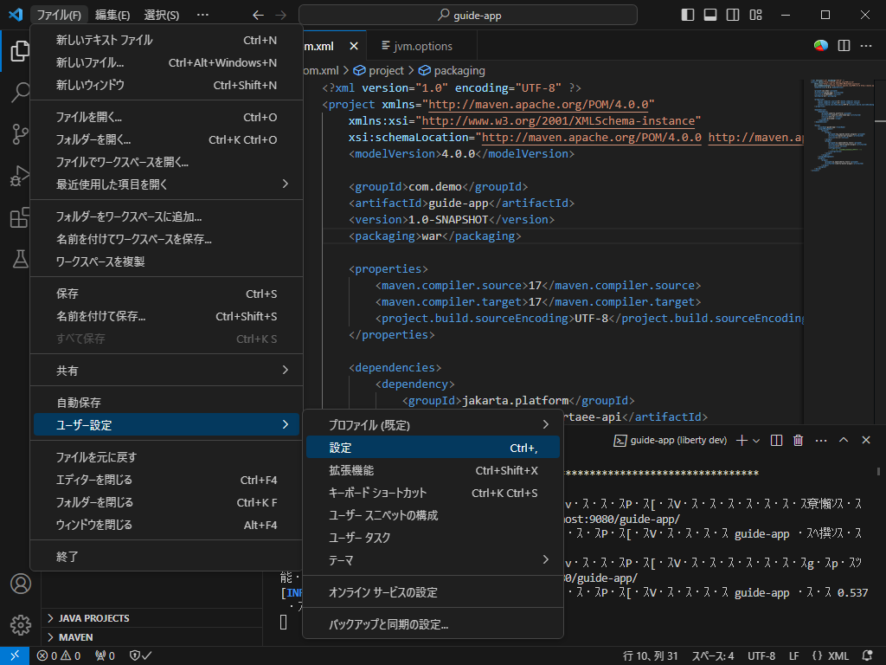

## Hello, Open Liberty: 最初のプログラム

### Starterによるプロジェクトの作成

Libertyのアプリケーション開発は，基本的にLibertyのプラグインを組み込んだMavenプロジェクトでおこないます。

開発のためのMavenプロジェクトの作成は，OpenLiberty.ioにあるStarterを利用するのが便利です。「Get started with Open Liberty」（[https://openliberty.io/start/](https://openliberty.io/start/)）をひらきます。


「Group」と「Artifact」にプロジェクトの情報を入力します。このガイドブックの例では，「Group」はデフォルトの`com.demo`のまま，「Artifact」は`guide-app`を使用します。

「Build Tool」はMavenを使用しますが，Gradleを選択することもできます。MavenではなくGradleの方が使い慣れている場合は，こちらを選択するとGradleのプロジェクトが作成できます。このガイドブックでは，Mavenを利用します。

つづいてアプリケーションで使用する各種仕様のバージョンを指定できます。このガイドブックでは，「Java SE」が17，「Java EE/Jakarta EE」が10，「MicroProfile」は使用しないのでNoneを選択します。

「Generate Project」をおして，プロジェクトの雛形ファイルが格納されたZIPファイルをダウンロードします。

ダウンロードしたZIPファイルを適当なフォルダーに展開します。ここでは，自身のホームディレクトリに`src`というフォルダーを作成し，その中の`guide-app`にファイルを展開しています


### VS Codeによるプロジェクトの確認

このフォルダーをVS Codeで開きます。「ファイル」「フォルダーを開く...」で上記のファイルを選択して開きます。

最初に開いたときには，フォルダーのファイルを信頼するかのダイアログボックスが表示されます。信頼できない場所から入手したプログラムのコードは，実行するとPCに害を与える可能性があるために警告が出ています。ここでは「はい、作成者を信頼します」をクリックします。


左のアクティビティ・バーで「エクスプローラー」をナビゲートしてプロジェクト内のファイルを確認します。

> [!TIPS]
>`pom.xml`を開いたときに，追加で「Dependency Analytics」拡張を導入するかたずねる通知がでることがあります。
>
>システムにMavenが導入済みであれば，プロジェクトを扱う上で有益な拡張なので「Install」をおして導入しておきましょう。時間がたって通知が消えてしまったら，右下の🔔のボタンをクリックすると再度参照できます。
>
>
>
>Mavenが導入されていなければDependency Analyticsは正常に動作しませんので入れなくてもかまいません。

「エクスプローラー」のカラムを開くと，以下のようなフォルダー構成がみえます。


簡単にプロジェクトの内容を説明します。

- `.mvn`：Maven Wrapperの実行に必要なファイルが格納されています
- `src`
    - `main`：プロジェクトのソースで，実際のアプリケーション作成するためのソース
        - `java`：Javaのソースコード
        - `liberty`：Libertyの構成ファイル
        - `webapp`：**デフォルトでは存在しない** Webコンテンツのソースコード
    - `test`：**デフォルトでは存在しない** テストに使われるソースで，アプリケーションにはパッケージされない
- `target`：ビルドによって生成されたファイルが置かれるフォルダー
- `.docerignore`：Dockerイメージをビルドする際に，特定のファイルやディレクトリを無視するよう指示するファイル
- `.gitignore`：Gitに対して特定のファイルやディレクトリを追跡しないように指示するファイル
- `Dockerfile`：Dockerイメージをビルドするための構成ファイル
- `mvnw`：Maven Wrapperの実行ファイル
- `mvnw.cmd`：Maven Wrapperの実行ファイル（Windows用）
- `pom.xml`：Mavenプロジェクトの構成ファイル
- `README.txt`：プロジェクトの説明ファイル

Maven Wrapperは，最小限のファイルだけをプロジェクトに含み，Maven本体に必要なファイルをMavenセントラルレポジトリからダウンロードして実行するためのコマンドです。`pom.xml`をみて，必要なバージョンのMavenが自動的に選択されます。

プロジェクトの構成ファイル`pom.xml`をみるとLibertyのプラグイン`liberty-maven-plugin`が組み込まれていることが分かります。

``` xml
<build>
    <finalName>guide-app</finalName>
    <pluginManagement>
        <plugins>
            <plugin>
                <groupId>org.apache.maven.plugins</groupId>
                <artifactId>maven-war-plugin</artifactId>
                <version>3.3.2</version>
            </plugin>
            <plugin>
                <groupId>io.openliberty.tools</groupId>
                <artifactId>liberty-maven-plugin</artifactId>
                <version>3.9</version>
            </plugin>
        </plugins>
    </pluginManagement>
    <plugins>
        <plugin>
            <groupId>io.openliberty.tools</groupId>
            <artifactId>liberty-maven-plugin</artifactId>
        </plugin>
    </plugins>
</build>
```

`<pluginManagement>`でプラグインの定義を行い，その下の`<plugins>`で実際のプラグインの組み込みを行っています。プラグインに追加の構成を行う場合には，プラグインの定義をしている`<pluginManagement>`の方に記述します。

``` xml
<build>
    <finalName>guide-app</finalName>
    <pluginManagement>
        <plugins>
            <plugin>
                <groupId>org.apache.maven.plugins</groupId>
                <artifactId>maven-war-plugin</artifactId>
                <version>3.3.2</version>
            </plugin>
            <plugin>
                <groupId>io.openliberty.tools</groupId>
                <artifactId>liberty-maven-plugin</artifactId>
                <version>3.9</version>
                <configuration>
                    <!-- 追加の構成はここに記述する -->
                </configuration>
            </plugin>
        </plugins>
    </pluginManagement>
    <plugins>
        <plugin>
            <groupId>io.openliberty.tools</groupId>
            <artifactId>liberty-maven-plugin</artifactId>
        </plugin>
    </plugins>
</build>
```

### Open Libertyを実行してみる

左のアクティビティ・バーで「エクスプローラー」を選んだ画面で，画面右下に「LIBERTY DASHBOARD」というカラムが追加されています。このカラムの＞をクリックして∨の状態にすると「guide-app」というアプリケーションが認識されています。

この「guide-app」で右クリックして「Start」を選びます。


MavenがWrapper経由で起動されてビルドが行われます。最初に実行したときには，大量のファイルがセントラルレポジトリーからダウンロードされます（2回目以降はキャッシュした内容を使用するので，すぐに開発が開始できます）。Mavenのビルド過程で，Libertyの導入に必要なファイルも全てダウンロードされ，`terget/liberty`ディレクトリの下に環境が構築され，構成ファイルやアプリケーションの導入も行われます。

Libertyのサーバーが構成されて起動すると，初回はファイアウォールの警告が出ることがあります。「アクセスを許可する」を選択してください。



> [!CAUTION]
>Windows環境でJDK 18以降を使用している場合は，ターミナルの出力が文字化けしていて読めないことがあります。
>
>
>
>これはJDK 18以降で，さまざまな箇所の文字エンコーディングのデフォルトがUTF-8に変更されたためです。ターミナルで実行されているPowerShellなどは，通常はUTF-8ではなくMS932（Shift-JIS）で実行されているため文字化けします。ターミナルをUTF-8に変更する必要があります。
>
>まず，実行中のLibertyを止めます。
>
>「LIBERTY DASHBOARD」の「guide-app」で右クリックして「Stop」を選びます。
>
>
>
>メニューの「ファイル」「ユーザー設定」「設定」を開きます。
>
>
>
>設定画面の右上の「設定(JSON)を開く」ボタンをおします。
>
>
>
>開いた`settings.json`を編集していきます。
>
>
>
>既存の内容が空であったら，以下のように記入します。
>
>``` json
>{
>    // PowerShellを規定で使用
>    "terminal.integrated.defaultProfile.windows": "PowerShell",
>    // PowerShellをUTF-8（Code Page 65001）で起動
>    "terminal.integrated.profiles.windows": {
>        "PowerShell": {
>            "source": "PowerShell",
>            "args": [
>                "-NoExit",
>                "-Command",
>                "chcp 65001"
>            ],
>        }
>    }
>}
>```
>
>すでにいくつかの設定があった場合は，
>
>``` json
>{
>    "redhat.telemetry.enabled": true,
>    "terminal.integrated.defaultProfile.windows": "PowerShell"
>}
>```
>
>末尾に`,`を追加して設定を追加します。上記のように，既に`terminal.integrated.defaultProfile.windows`に`"PowerShell"`が指定されていた場合は，その部分は追加で設定する必要がありません。
>
>``` json
>{
>    "redhat.telemetry.enabled": true,
>    "terminal.integrated.defaultProfile.windows": "PowerShell",
>    // PowerShellをUTF-8（Code Page 65001）で起動
>    "terminal.integrated.profiles.windows": {
>        "PowerShell": {
>            "source": "PowerShell",
>            "args": [
>                "-NoExit",
>                "-Command",
>                "chcp 65001"
>            ],
>        }
>    }
>}
>```
>
>設定を保存したら，VS Codeを終了して再起動してください。
>
>この段階でMavenからのUTF-8の出力は正常に表示されるようになりましたが，まだLibertyからの出力がMS932のままなので，その部分が文字化けします。
>
>Mavenから起動するLibertyの出力をUTF-8にするには，`pom.xml`をひらき，`<properties>`の部分に以下の2行を追加します。
>
>``` xml
><properties>
>    <maven.compiler.source>17</maven.compiler.source>
>    <maven.compiler.target>17</maven.compiler.target>
>    <project.build.sourceEncoding>UTF-8</project.build.sourceEncoding>
>    <!-- 以下の2行を追加 -->
>    <liberty.jvm.arg1>-Dstdout.encoding=UTF-8</liberty.jvm.arg1>
>    <liberty.jvm.arg2>-Dstderr.encoding=UTF-8</liberty.jvm.arg2>
></properties>
>```

ターミナルに以下のようなメッセージが出力されたら，Libertyの起動は成功です。

``` terminal
[INFO] ************************************************************************
[INFO] *    Liberty is running in dev mode.
[INFO] *        Automatic generation of features: [ Off ]
[INFO] *        h - see the help menu for available actions, type 'h' and press Enter.
[INFO] *        q - stop the server and quit dev mode, press Ctrl-C or type 'q' and press Enter. 
[INFO] *
[INFO] *    Liberty server port information:
[INFO] *        Liberty server HTTP port: [ 9080 ]
[INFO] *        Liberty server HTTPS port: [ 9443 ]
[INFO] *        Liberty debug port: [ 7777 ]
[INFO] ************************************************************************
[INFO] Source compilation was successful.
[INFO] [監査      ] CWWKT0017I: Web アプリケーションが削除されました (default_host): http://localhost:9080/guide-app/
[INFO] [監査      ] CWWKZ0009I: アプリケーション guide-app は正常に停止しました。
[INFO] [監査      ] CWWKT0016I: Web アプリケーションが使用可能です (default_host): http://localhost:9080/guide-app/
[INFO] [監査      ] CWWKZ0003I: アプリケーション guide-app が 0.491 秒で更新されました。
```

ブラウザで，[http://localhost:9080/](http://localhost:9080/)にアクセスしてみましょう。以下のような画面が出れば，手元の環境でLibertyが正常に稼働しています。


> [!NOTE]
>Libertyでは，アプリケーションサーバーのルートディレクトリ（`/`）をコンテキスト・ルートとしたアプリケーションをデプロイしていない場合，サーバーのトップページにアクセスすると，上記のようなWelcome Pageが表示されます。
>
>このページを無効化するには，サーバーの構成ファイル`server.xml`に以下の設定を追加します。
>
>``` xml
><httpDispatcher enableWelcomePage="false" />
>```

Libertyを停止するには，「LIBERTY DASHBOARD」の「guide-app」で右クリックして「Stop」を選びます。


### 最初のアプリケーション

現在時刻を表示する簡単なWebアプリケーションを作成してみましょう。JSPを使用します。

JSPなどのWebコンテンツを置くフォルダーとして`src/main`の下に`webapp`というフォルダーを新規に作成し，`index.jsp`というファイルを作成します。`webapp`フォルダーの直下におかれた`index.jsp`もしくは`index.html`は，アプリケーションのURLが呼び出されたときに，その内容が表示されます。

エクスプローラーの`src/main`の`main`の部分で右クリックして「新しいフォルダー...」を選択します。`src`の部分で右クリックすると別の場所にできてしまうので注意してください。


入力欄ができるので`webapp`と入力し，`Enter`キーをおします。


さらに`webapp`で右クリックして「新しいファイル...」を選択します。ファイル名として`index.jsp`を入力します。


JSPファイルを編集して，以下の内容を入力して保存します。ファイルの変更内容を保存するには，Windows環境では`Ctrl`+`S`を，macOS環境では`⌘`+`S`をキーボードから入力します。

``` jsp
<!DOCTYPE html>
<html>
<head><title>First Page</title></head>
<body>
It is <%= java.time.LocalTime.now() %>, now.
</body>
</html>
```

JSPは基本的にHTMLの書式で内容を記述しますが，JavaのコードやJSP固有のタグを含むことができます。JSPでは`<%=  %>`のなかにJavaの式を書くことができます。式の結果がその場所にHTMLの一部として組み込まれます。`LocalTime`クラスを利用して現在時刻を取得しています。

「LIBERTY DASHBOARD」から「Stert」でLibertyを起動し，正常に起動したら，ブラウザで[http://localhost:9080/guide-app/](http://localhost:9080/guide-app)にアクセスしてみましょう。


現在時刻が表示されれば成功です。何回かリロードを繰り返して，表示される時刻が変わることを確認してください。

最後に「LIBERTY DASHBOARD」の「guide-app」で右クリックして「Stop」を選び，Libertyを停止します。

