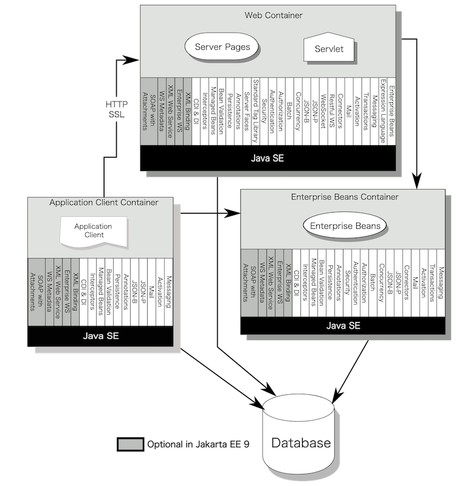

## Java EE/Jakarta EEとその重要性

### Java EE/Jakarta EEとは

Java EE（Java Platform, Enterprise Edition）およびその後継であるJakarta EEは，Java言語で企業の業務システムの開発をサポートするために設計された，包括的なプラットフォームとAPI仕様の集合体です。

小規模なWebアプリケーションから，クラスタリング環境で実行される大規模なWebサイト，厳密なトランザクション管理が必要なミッションクリティカルなシステムまで，幅広いシステムの実装に利用することができます。

Java EE/Jakarta EEは，分散アプリケーションと多層アプリケーションの実装を容易にするために多くのAPIを提供します。これには，Servlet，Jakarta Server Pages（JSP），Contexts and Dependency Injection（CDI）などが含まれます。システム間連携，外部APIの公開と利用についても，RESTful Web Service（JAX-RS）やXML Web Services（JAX-WS）などで豊富な機能が提供されています。また，Java EE/Jakarta EEはセキュリティ，トランザクション管理，リソース管理などの面で企業レベルの要件に対応する機能を提供します。

Java EE/Jakarta EEのもっとも大きな特徴は，それが特定の実装をさすのではなく，標準仕様であるということです。

Java EE/Jakarta EEの実装はOpen Liberty/WebSphere Libertyだけでなく，他にも多くのベンダーの製品やOSSのアプリケーションサーバーが存在しています。仕様に準拠して実装したアプリケーションは，原則的にどこのアプリケーションサーバーでも同じように動作します。開発者は，特定のベンダーの実装に縛られることなく，自由に実行環境を選択してアプリケーションを構築することができます。

また，Jakarta EEは特定の企業ではなくコミュニティによってその仕様が策定されています。

従来のJava EEでも，仕様策定の場であるJCP（Java Community Process）ではOracle社が指導的な立場で主導していましたが，それでも多くのベンダーや団体の意見を元に仕様策定が行われていました。さらに現在のJakarta EEは，Eclipse Foundationのしたでコミュニティによって仕様策定が行われています。特定のベンダーの戦略や経営状況などには左右されない，安定した仕様となっています。

Java EEは長い歴史で膨大なエコシステムを抱えています。

アプリケーションサーバーの種類がいくつもあるだけではありません。Java EEのアプリケーションから利用できるライブラリーや，その機能を補い拡張するフレームワークは，非常に多くのものが販売や公開されています。それらは標準仕様という共通化のもと，多様な組み合わせが可能になっています。

### Webアプリケーションを実装するためのフレームワーク

Java EE/Jakarta EEは，HTTP通信でクライアントとやりとりをするサーバーアプリケーション，Webアプリケーションを実装するフレームワークという側面も持っています。

Webアプリケーションを実装するフレームワークとしては，その他にも以下のようなものがよく使われています。

- **Spring Framework（特にSpring Boot）**
    - 現代のJava開発で最も人気があり，エンタープライズレベルの開発に広く使われています。
    - 依存性注入，AOP（Aspect Oriented Programming），セキュリティ，データアクセスなど多様な機能を提供します。
    - Spring Frameworkは，Pivotal社によって開発されていました。Pivotal社はVMware社に買収され，VMware社はBroadcom社に買収されました。
- **Apache Struts**
    - 以前は非常に人気がありましたが，現在は少々古いと見なされることがあります。
    - MVC（Model-View-Controller）アーキテクチャに基づいたWebアプリケーションを開発するためのフレームワークです。
    - Apache Strutsは，OSSコミュニティであるApacheソフトウェア財団によって開発されています。
- **Play Framework**
    - Ruby on Rails・Djangoに強い影響を受けており，シンプルで迅速な開発が可能です。
    - 使用するCPUリソースやメモリ使用量が少なく，高性能を求めるアプリケーションに適しています。
    - Java言語だけでなくScala言語もサポートしています。
    - Lightbend社が主体で開発していましたが，現在は撤退しコミュニティにより開発が行われています。
- **Quarkus**
    - マイクロサービスやクラウドネイティブアプリケーションの開発に特化した比較的新しいフレームワークです。
    - Graal VMによるネイティブコンパイルに対応しており，メモリ使用量の削減や起動時間の短縮が可能です。
    - Quarkusは，Red Hat社によって開発されています。Red Hat社はIBM社に買収され，その子会社となっています。

じつは，これらの中でもJava EE/Jakarta EEは多用されています。

- Spring Bootは，内部でJava EEのServletやJPA，JTAなどが使用されています。Spring Bootの成果物のJARファイルには，TomcatやJettyなどのServletエンジンが含まれていて，アプリケーションはWeb Containerの上で稼働しています。また，RESTfulなWebサービスの実装にはJAX-RSが，SOAPによるWebサービスの実装にはJAX-WSの技術が使用されています。
- Apache StrutsはJava EEのServletとJSP仕様に強く依存しており，その機能を多用してアプリケーションを実装します。
- Quarkusは，Java EEのJAX-RS，JSONB，JSONP仕様を使ってアプリケーションを実装します。

Java EE/Jakarta EEは，単なるフレームワークではなく，標準仕様の一種です。Java EE/Jakarta EEを学ぶことは，それ自体でアプリケーションを実装する際はもちろん，他のフレームワークを使ってアプリケーションを実装する際にも，その内部の動作を深く知るために役に立ちます。

また，Java EE/Jakarta EEを直接使用する，その理由の一つは長期的な安定性です。Java SEの仕様策定もそうですが，Javaコミュニティはバージョンアップによってアプリケーションが動かなくなる破壊的な変更に強い抵抗をしめします。Java EEにもこの文化は引き継がれています。Servletで実装されたアプリケーションの中には，20年前に実装されたアプリケーションが昨今の実行環境で稼働していることもあります。

この安定性はJava EEからJakarta EEへの移行でいったん途切れてしまいましたが（詳しくは後の章で記述します），今後はJakarta EEも長期にわたって安定した仕様として提供されていくでしょう。10年以上の寿命が想定されるアプリケーションを実装するプラットフォームとしては，いまでもJakarta EEが最も有力な選択肢となると考えられます。

> [!NOTE]
>ライブラリ（Library）とフレームワーク（Framework）は，どちらもソフトウェア部品を裁量するための仕組みです。
>
>
>
>ライブラリは特定の機能を提供するコードの集まりで，開発者が自分のアプリケーションに組み込むことができます。開発者はアプリケーションのコード内でライブラリを呼び出して必要な機能を利用します。ライブラリは「呼び出されるもの」であり，プログラムの流れに対して受動的な役割を持ちます。
>
>フレームワークはコードを書くための枠組み，ルールやヘルパーを提供し，開発者はこれらのルールに従いながらアプリケーションを構築します。フレームワークは「呼び出すもの」であり，アプリケーションの流れを制御します。これは「Inversion of Control（制御の反転）」とも呼ばれ，アプリケーションのコードはフレームワークによって呼び出されます。
>
>これらは混在して使用されます。たとえば，多くのフレームワークでは，枠組みだけではなく，アプリケーションから呼び出すことができるライブラリ的な機能も提供しています。

### Java EE/Jakarta EEの歴史

1999年に，最初のJ2EE（Java 2 Enterprise Edition）仕様がSun Microsystems社によって発表されました。

J2EEの主な目的は、開発者が再利用可能なビジネスコンポーネントを作成し、それらを組み合わせて大規模な企業アプリケーションを構築できるようにすることでした。それまで，単独のAPI仕様として提供されていたServletやJSP，EJBなどの仕様を，J2EEという仕様群にまとめあげ，分散アプリケーションと多層アーキテクチャを実装するための標準的な方法を提供しました。さらにアプリケーションのパッケージ方法やそのデプロイやライフサイクルなどについても仕様化され，多くのアプリケーションサーバーが誕生しています。J2EEは，Webアプリケーション開発のスタンダードとして広く受け入れられました。

2006年，Sun Microsystems社はJ2EEをJava EE（Java Platform, Enterprise Edition）に改名し，Java EE 5仕様を発表しました。

Java EEは，その前身であるJ2EEの基盤を継承しつつ，J2EE対抗として登場したSpring FrameworkやHibernateなどの機能や思想を積極的に取り入れました。新しいWebサービス，コンポーネントモデル，管理およびセキュリティAPIを導入し，エンタープライズアプリケーション開発の標準としてさらに強固な地位を築いていきます。

2010年，Oracle社がSun Microsystems社を買収し，Java EEを含むすべてのJavaプラットフォームの管理権を獲得しました。

OracleはJava EEの開発とサポートを継続し，2013年には大幅に機能が拡張された新たなバージョン，Java EE 7のリリースを行いました。しかし2016年以降，Oracle社のJava EEの仕様策定における活動量が著しく低下してしまいます。このままではJava EEのエコシステムが失われると危ぶんだユーザーグループがJava EE Guardiansという活動をたちあげ，仕様策定をコミュニティに移行するようにOracleへの呼びかけを行いました。

2017年，Oracle社はエンタープライズJava仕様の開発プロセスをEclipse Foundationに移管すると発表しました。

以降はJava EEはEclipse FoundationのJakarta EE Working Groupの管理下に置かれ，オープンソースとコミュニティ主導の開発により，より迅速で透明性の高い進化を続けることになります。移行作業のためのバージョンとして，2019年にJakarta EE 8.0，2020年にJakarta EE 9.0が公開されました。そして，2022年に新しい機能を追加したJakarta EE 10が公開されています。

Java EEからJakarta EEへの移行で，大きな変更が一つあります。名称の変更です。

コミュニティがJava EEの名称を使用するには，商標のライセンスに関する制限が存在したため，新しいプロジェクト名として「Jakarta EE」が採用されました。これにともなって，APIが提供されるクラスのパッケージ名も，`javax`の名前空間から`jakarta`の名前空間に変更になっています。既存のJava EEアプリケーションをJakarta EEに移行するには，この名前空間への移行が必要です。

ただ前章にあるように，Libertyであれば，Java EEアプリケーションとJakarta EEアプリケーションの共存が可能ですので，段階的な移行が可能です。

Libertyが対応しているJava EE/Jakarta EEのバージョンと，それぞれのバージョンの主な新機能は以下の通りです。

- Java EE 7
    - 2013年にOracle社より公開されました。
    - JAX-RSが2.0にバージョンアップし，クライアントAPIや非同期処理のサポートが強化されました
    - Java API for JSON Processing（JSON-P）が新規に追加され，JSONデータの生成，解析，変換を容易に行えるようになりました。
    - JSFが2.2にバージョンアップし，CDIに対応したほか，HTML5対応も行われました。
    - WebSocketが新規に追加され，リアルタイムWebアプリケーションの開発を容易にしました。
    - Java Batchが新規に追加され，大規模データ処理のためのバッチ処理が可能になりました。
    - Concurrency Utility for Java EEが新規に追加され，アプリケーションサーバー上でのマルチスレッド処理をサポートしました。
    - CDI（Contexts and Dependency Injection）が1.1にバージョンアップし，より細かい制御と構成が可能になりました。
- Java EE 8
    - 2017年に公開されました。Oracle社より公開された，最後のJava EEです。
    - Servletが4.0にバージョンアップし，HTTP/2に対応しました。
    - Java API for JSON Binding（JSON-B） が新規に追加され，JSONデータとJavaオブジェクト間のマッピングが簡単になりました。
    - Bean Validationが2.0にバージョンアップし，Java 8の機能（Optionalクラス，日付/時刻APIなど）のサポートが追加されました。
- Jakarta EE 8
    - 2019年にEclipse Foundationのワーキンググループによって公開されました。
    - コミュニティによる仕様策定作業を試行するためのバージョンで，仕様の名称変更などが行われましたが，技術的にはJava EE 8と同一のものが提供されています。
- Jakarta EE 9
    - 2020年に公開されました。
    - `javax.*`名前空間から`jakarta.*`名前空間への全面的な移行が行われました。
    - JAX-RPCやJAXR，Java EE Management APIなど，非推奨となっていたAPIの削除が行われました。
    - 2021年に9.1に更新され，バグの修正やJava 11との互換性向上がはかられました。
- Jakarta EE 10
    - 2022年に公開されました。
    - 従来から提供されていたサブセット，Web Profileに加え，Core Profileが追加されました。MicroProfile対応のフレームワークでの利用が想定されています。
    - CDIで，コンパイル時にのみ依存性の注入を行うサブセット，CDI Liteが追加されました。
    - 多くの仕様がバージョンアップし，機能の改善が行われています。

### Java EE/Jakarta EEを構成する仕様群

Java EE/Jakarta EEは，単一の仕様ではありません。多くの仕様群から構成される，仕様のパッケージです。

以下は，Jakarta EE 10.0の仕様書から抜粋したJakarta EEの全体像です。

実行環境として，Web Container，Enterprise Beans Container，Application Client Containerの三種類が定義されています（このContainerは，Dockerなど仮想化技術のコンテナとは異なります）。それぞれのコンテナは，仕様にしたがって実装されたアプリケーションを実行するフレームワークの側面を持っています。そしてその上で動くアプリケーションから利用できる各種のサービス（ライブラリや，一部は追加のフレームワーク）が仕様として策定されています。

含まれる仕様について簡単に解説します。
**太字** でJakarata EE仕様での名称を記載し，（括弧）でJava EE仕様での名称を記載します。

#### Web Containerで実行されるアプリケーションの仕様

**Jakarta Servlet**（Java Servlet）は，Webアプリケーションを実装し，パッケージするための仕様です。HTTPメッセージの送受信を制御する多くの機能を提供するほか，セッション情報の追跡と保持，認証機構との連携やアクセス制御などをおこないます。

**JSP：Jakarta Server Pages**（Java Server Pages）は，テンプレートベースの動的HTML生成をおこなう仕様です。HTML形式のファイルの中に，コードを埋めこんで，動的にページを作成します。Servlet仕様に依存し，密接に関連しています。

JSPから使用できる補助仕様がいくつかあります。
**Jakarta Expression Language** （EL：Expression Language）は，EL式という書式でJSPに値を埋めこむための仕組みです。
**JSTL：Jakarta Standard Tag Library** （JSP Standard Tag Library）は，JSPで利用できる標準タグ・ライブラリです。

#### Enterprise Beans Containerで実行されるアプリケーションの仕様

**Jakarta Enterprise Beans** （EJB：Enterprise Java Beans）は，ビジネスロジックをパッケージし，呼び出しやトランザクション，セキュリティの制御を自動化するフレームワークです。以下のような仕組みが提供されています。

- Stateless Session Bean
    - ステート（状態）を保持しない
    - 主に短期間のサービス（例えば、計算やデータベースクエリ）に使用される
- Stateful Session Bean
    - クライアント固有のステートを保持する
    - 複数のリクエストから構成される一連の処理を実行する
- Singleton Session Bean
    - アプリケーションのクライアント全体で共有される単一のインスタンスで実行される
    - アプリケーション全体で共有するステートや設定情報などを管理する
- Message Driven Bean
    - JMS（Java Message Service）によりメッセージを受信し，それをトリガーに処理を起動する
    - 非同期メッセージングアプリケーション（例えば、イベント駆動型アプリケーション）に使用される

リクエストやメッセージをトリガーとした処理だけでなく，タイマーサービスによりスケジュールされた処理を実装できるのも特徴です。

**Jakarta Enterprise Beans lite** （EJB lite）は，RMI/IIOPによるリモート呼出しを省いたEJBの簡易版です。同じサーバープロセス内で実行されているアプリケーションからのみ呼び出せます。

#### 外部連携に使用される仕様

**Jakarta Persistence** （JPA：Java Persistence API）は，JavaのオブジェクトとRDBMS（Relational Database Management System）上のレコードをマッピングするORマッピング機能を提供します。DBのレコードをJavaのオブジェクトとして呼び出したり，作成・変更したJavaのオブジェクトをDBのレコードとして永続化できます。

JDBC（Java Database Connectivity）は，RDBMSへ接続しSQL実行を行う仕様です。かつては，Java EE仕様の一部で策定が行われていましたが，現在はJava SE仕様に含まれるようになりました。現在でも，Java EE/Jakarta EEから多用されています。

**Jakarta Messaging** （JMS：Java Message Service）は，IBM MQなどのMOM（Message Oriented Middleware）に接続しメッセージの送受信を行う仕様です。

**Jakarta Connector** （JCA：Java Connector Architecture）は，IBM CICS Transaction GatewayやSAPなどのEIS（Enterprise Information System）に接続し処理を実行するための仕様です。

**Jakarta Transaction** （JTA：Java Transaction API）は，DBやMOM，EISなどの外部リソースのトランザクションをコーディネートします。2PC（Two Phase Commit）などによるグローバル・トランザクションの制御も可能です。

**Jakarta Mail** （Java Mail）は，メールを送受信します。内部で **Jakarta Activation** （JAF：JavaBeans Activation Framework）という仕様を使用しています。

#### Contexts and Dependency Injection

**CDI：Contexts and Dependency Injection** は，実行時に依存性を注入（Dependency Injection）する機能を提供します。また，注入するBeanのライフサイクルを管理し，リクエスト・セッション・アプリケーションなどのスコープ（コンテキスト）に応じたインスタンスの提供を行います。

**CDI-Lite** は，注入を実行時ではなくコンパイル時にのみ行うCDI仕様のサブセットです。GraalVMによるネイティブコンパイルなど，実行時の注入に必要なJavaのリフレクションの使用が限定される環境で利用されます。

#### RESTfulなWebサービスを実装する仕様

**Jakarta RESTful Web Services** （JAX-RS：Java API for RESTful Web Services）は，RESTfulな呼び出しを介したシステム間連携の機能を提供するフレームワークです。

**Jakarta JSON Binding** （JSON-B）および **Jakarta JSON Processing** （JSON-P）は，RESTfulなサービスで多用されるJSON形式の情報を扱うための手段を提供します。

#### SOAP通信によるWebサービスを実装する仕様

**Jakarta XML Web Services** （JAX-WS：Java API for XML-based Web Services）は，XMLベースのプロトコル（SOAP）を介したシステム間連携の機能を提供するフレームワークです。

**Jakarta XML Binding** （JAXB：Java Architecture for XML Binding）およびJAXP：Java Architecture for XML Processingは，XML形式の情報を扱うための手段を提供します。JAXPは，現在はJava SE仕様に含まれるようになっています。

**Jakarta Enterprise Web Services** （Enterprise Web Service）は，アプリケーションサーバーでWebサービスをデプロイし実行するパッケージングを定義し相互運用性を保証する仕様です。

**Jakarta Web Services Metadata** （JWS：Java Web Services Metadata）は，WebサービスをWSDL形式で記述し生成する手段を提供します。

**Jakarta SOAP with Attachments** （SAAJ：SOAP with Attachments API for Java）は，SOAPにデータを添付するための仕様です。

これらのSOAP通信のための仕様は，全てJakarta EE仕様ではOptional扱いになっていて，アプリケーションサーバーによっては利用できない可能性があります。Libertyでは，全ての仕様が利用できます。

#### セキュリティに関する仕様

**Jakarta Security** （Java EE Security API），  
**Jakarta Authentication** （JASPIC：Java Authentication Service Provider Interface for Containers），および  
**Jakarta Authorization** （JACC：Java Authorization Contract for Containers）は，Java EE/Jakarta EEアプリケーションの認証・認可およびアクセス制御の仕組みを提供します。

#### その他の仕様

**Jakarta Faces** （JSF：Java Server Faces）は，Java EE/Jakarta EE環境で利用できるWebアプリケーションのフレームワークです。ページで扱う情報をバッキングビーンとして定義するなど，様々なスコープでデータを扱う手段を提供します。

**Jakarta Bean Validation** （Bean Validation）は，入力するデータの形式を定義し，妥当性検査をおこないます。JSFなど，各所で利用できます。

**Jakarta Concurrency** （Concurrency Utility for Java EE）は，新規のスレッド作成が制限されているWeb ContainerやEnterprise Beans Container上で，安全にスレッドを利用し，非同期処理を実現する仕組みを提供します。

**Jakarta Batch** （Java Batch）は，バッチ系の処理を実行する基盤を提供するフレームワークです。

**Jakarta WebSocket** （WebSocket）は，ブラウザなどとのWebSocketをつかった双方向通信を提供します。

### MicroProfileとは

MicroProfileは，クラウドネイティブなマイクロサービス・アプリケーションの開発を容易にするためのテクノロジーを開発することを目的とした，Eclipse Foundationのオープンなプロジェクトです。

MicroProfileは，Java EEやその後継のJakarta EEと密接に関係しています。2013年にJava EE 7が公開されて以降，Oracle社による仕様策定は停滞が続いていました。しかし，クラウドの利用やKubernetesなどのコンテナ環境の整備がすすみ，マイクロサービスのための技術の必要性はますます高まっていました。

そこで2016年に有志によってEclipse Foundation内で立ち上げられたプロジェクトがMicroProfileです。初期のメンバーは，Red Hat，IBM，Payara，Tomitribeや，London Java Communityです。MicroProfileプロジェクトは，Java EEの仕様の一部を活用しながら，追加で多くの仕様を開発していきます。

- Config：外部化された構成データの管理を容易にします。
- Fault Tolerance：サービスが障害に対して回復力を持つように設計された機能を提供します。
- Rest Client：RESTクライアントAPIを提供し、マイクロサービス間の通信をサポートします。
- Metrics，Health：アプリケーションのパフォーマンスと健全性を監視するためのAPIを提供します。
- Telemetry：OpenTelemetry仕様に準拠し，Java以外のアプリを含めた分散トレースやメトリクス収集，ログ管理を実現します。
- OpenAPI：OpenAPI仕様に準拠し，RESTアプリケーションのAPIの構造を記述するための標準的な方法を提供します。
- JWT Authentication：JSON Web Tokenによる認証を提供します。

MicroProfile 4.1以前の仕様は`javax.*`名前空間のAPIをサポートしており，Java EE 7/8と互換性があります。

MicroProfile 5.0以降の仕様は`jakarta.*`名前空間のAPIをサポートしており，Jakarta EE 9.1/10と互換性があります。

Java EE/Jakarta EEと同様に，MicroProfileについても，多くのベンダーやOSSから実装が提供されています。Libertyも，もちろんMicroProfileをサポートしており，その機能を活用したアプリケーションを実行することができます。
