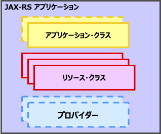
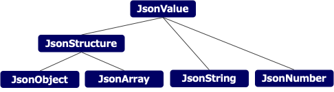
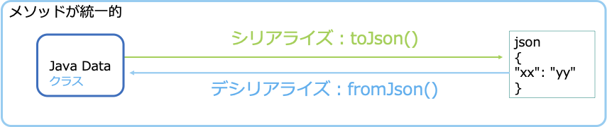

## RESTful Webサービス: Jakarta RESTful Web Services/JAX-RS

### RESTful Webサービスとは

REST（Representational State Transfer）やRESTfulなWebサービスとは，インターネット上でのデータ交換や相互作用を行うためのアーキテクチャスタイルの一つです。

RESTはリソース指向である，といわれています。

従来のWebサービスは，特定の操作や関数を呼び出すことに重点を置いており，呼び出すエンドポイント（WebサービスならばURL）は操作（たとえば「在庫照会」）を表現しており，操作対象のリソースはパラメーターなどの引数で与えられていました。それにたいしてRESTではエンドポイントのURLは操作対象のリソースを表現しており，HTTPのメソッド（POST/GET/PUT/DELETE）でCRUD操作（Create/Read/Update/Delete）を表現します。

また，通常のRESTはステートレスな通信として実装されます。

クライアントとサーバー間の複数回のリクエスト・レスポンスの組合わせは，それぞれで独立しており，以前のリクエストからの情報を保存しません。これにより，システムはより単純かつスケーラブルになります。HTTPの持つ冪等性など性質を活用することにより，HTTPのキャッシュの仕組みを活用したり，障害時のリトライなどもやりやすくなります。

RESTでは，データ型としてJSONが多用されます。

RESTでは，サーバーはJSONやXMLなどの様々なフォーマットでクライアントにリソースのデータを提供します。また，クライアントからもJSONなどでリソースの更新などを行います。RESTにおいてのデータの表現には，特にJSONが多用されます。RESTの主なクライアントであるブラウザ上では，JavaScriptでアプリケーションが実装されます。JSONは，特別なライブラリなどを利用しなくても，JavaScriptでそのまま解釈できるからです。

Java EE/Jakarta EEでは，RESTfulなWebサービスを構築するためのAPIをJAX-RS（Java API for RESTful Web Services）仕様で提供しています。また，JSONを扱うためのAPIを，JSON-P/JSON Processing仕様や，JSON-B/JSON Binding仕様で提供しています。

>[!NOTE]
>JAX-RSという名称は，Java EE仕様で使用されていた古い名前です。Jakarta EEでの正式な仕様名は「Jakarta RESTful Web Services」となっています。この仕様名に対するアクロニム（頭文字を取った略語）は提供されていません。というか，Jakarta RESTful Web Servicesの仕様書の中でも「JAX-RS application」という用語が多用されています。なので，このガイドの中でも，仕様名の略称として旧仕様名である「JAX-RS」を使用します。

JAX-RSでは，リソース・クラスやメソッドにアノテーションを付けることで，Webサービスのエンドポイントを定義します。`@GET`，`@POST`，`@PUT`，`@DELETE`などのアノテーションによって，HTTPのメソッドに応じた処理を柔軟に記述できます。また，`@Path`や`@PathParam`などのアノテーションによって，URLのパスとして表現されたリソースを容易に識別できます。

また，JAX-RSでは，さまざまリソースの表現型に容易に対応できる仕組みが提供されています。


### JAX-RSを使ってみよう

この章では，JAX-RSについて実際に開発を行いながら学習します。

Liberty Starterで新しく作成したプロジェクト`guide-rest`でサンプルのコードを作成します。以下の条件でプロジェクトを作成しました。

- **Group** ：`com.demo`のまま
- **Artifact** ：`guide-rest`
- **Build Tool** ：Maven
- **Java SE Version** ：17
- **Java EE/Jakarta EE Version** ：10.0
- **MicroProfile Version** ：None

`src/main/liberty/config`フォルダーの`server.xml`を編集し，使用するFeatureだけを有効にします。

使用するAPIは，RESTful Web Services`restfulWS-3.1`とJSON Binding`jsonb-3.0`，章の後半で使用するのでCDI`cdi-4.0`も有効にします。JSON Processing`jsonp-2.1`も使用しますが，`restfulWS-3.1`の依存関係で自動的に有効になります。あと，HTTPS通信のために`transportSecurity-1.0`を有効にします。

``` xml
<!-- Enable features -->
<featureManager>
    <feature>restfulWS-3.1</feature>
    <feature>jsonb-3.0</feature>
    <feature>cdi-4.0</feature>
    <feature>transportSecurity-1.0</feature>
</featureManager>
```

Liberty Starterで作成したアプリケーションには，`@ApplicationPath("/api")`をもつ`RestApplication`というJAX-RSのアプリケーション・クラスが既に定義されていますので，リソース・クラスだけ作成します。

`src/main/java/com/demo/rest`フォルダーに，`SysPropResource.java`というファイルを新規作成し，以下の内容を保存します。

``` java
package com.demo.rest;

import java.util.Properties;

import jakarta.ws.rs.GET;
import jakarta.ws.rs.Path;
import jakarta.ws.rs.PathParam;
import jakarta.ws.rs.Produces;
import jakarta.ws.rs.core.MediaType;
import jakarta.ws.rs.core.Response;
import jakarta.ws.rs.core.Response.Status;

@Path("/system")
public class SysPropResource {
    @GET
    @Produces(MediaType.APPLICATION_JSON)
    public Properties getAllSysProps() {
        // 全てのシステムプロパティを結果として返す
        return System.getProperties();
    }
    @GET
    @Path("/{prop}")
    @Produces(MediaType.APPLICATION_JSON)
    public Response getSysProp(@PathParam("prop") String prop) {
        Properties result = new Properties();
        if (prop.endsWith("*")) {
            // Pathが*で終わっていたら前方一致で検索し，見つかったら結果に追加する
            String prefix = prop.substring(0, prop.length()-1);
            for (String name : System.getProperties().stringPropertyNames()) {
                if (name.startsWith(prefix)) {
                    result.setProperty(name, System.getProperty(name));
                }
            }
        } else {
            // それ以外は，完全一致で存在したら結果に追加する
            if (System.getProperties().containsKey(prop))
                result.setProperty(prop, System.getProperty(prop));
        }
        return (result.size() > 0)? 
            Response.ok(result).build() 
            : Response.status(Status.NOT_FOUND).build();
    }
}
```

「LIBERTY DASHBOARD」から「guide-rest」の右クリックから「Stert」でLibertyを起動し，正常に起動したら，ブラウザで[http://localhost:9080/guide-rest/api/system](http://localhost:9080/guide-rest/api/system)にアクセスしてみましょう。

JSON形式で，全てのシステムプロパティが表示されていることを確認できるかと思います。

>[!TIP]
>JSON形式のアプリケーションを開発している場合，結果をブラウザで確認していると，内容が整形されておらず，目でみて理解することが困難です。JSONの結果確認には，jqコマンドを入手して導入しておくと便利です。curlコマンドのレスポンスでJSON出力をだし，パイプ`|`でjqコマンドに送ると，人間が読みやすい形式に整形してくれます。
>
>``` terminal
>$ curl "http://localhost:9080/guide-rest/api/system" | jq
>  % Total    % Received % Xferd  Average Speed   Time    Time     Time  Current
>                                 Dload  Upload   Total   Spent    Left  Speed
>100  5240  100  5240    0     0   448k      0 --:--:-- --:--:-- --:--:--  852k
>{
>  "awt.toolkit": "sun.lwawt.macosx.LWCToolkit",
>  "java.specification.version": "17",
>  "com.ibm.ws.beta.edition": "false",
>  "sun.jnu.encoding": "UTF-8",
>  "wlp.install.dir": "/Users/takakiyo/src/guide-rest/target/liberty/wlp/",
>  "wlp.workarea.dir": "workarea/",
>    ...
>```

curlコマンドを使用して，コマンドプロンプトやターミナルからも結果を確認してみましょう。

```
curl "http://localhost:9080/guide-rest/api/system"
```

```
curl "http://localhost:9080/guide-rest/api/system/java.home"
```

```
curl "http://localhost:9080/guide-rest/api/system/wlp.*"
```

### JAX-RSアプリケーションの構造

Libertyでは，JAX-RSのアプリケーションは，Servletなどと同じWebアプリケーションとしてWARファイルにパッケージされます。Mavenのソースツリー`src/main/webapp`におかれたHTMLやJavaScript，CSSや画像ファイルなどは，WARファイルにそのまま組み込まれ，クライアントからのリクエストで提供されます。Webアプリケーションは，コンテキスト・ルートを指定して，Liberty上にデプロイされます。

``` xml
<webApplication contextRoot="/guide-rest" location="guide-rest.war" />
```

JAX-RSアプリケーションには，Javaのクラスとして，アプリケーション・クラスとリソース・クラスが含まれます。必要に応じてプロバイダーが追加されます。



枠が破線のクラスはオプションです。

### アプリケーション・クラス

アプリケーション・クラスは，`jakarta.ws.rs.core.Application`を継承（extends）し，アノテーション`@ApplicationPath`が付与されたクラスです。通常は，アプリケーションに一つ存在します。

``` java
package com.demo.rest;

import jakarta.ws.rs.ApplicationPath;
import jakarta.ws.rs.core.Application;

@ApplicationPath("/api")
public class RestApplication extends Application {
}
```

Webアプリケーションのコンテキスト・ルートに，`@ApplicationPath`で指定されたパスを追加したものが，JAX-RSのサービスが提供されるURLになります。たとえば，サンプルのアプリケーションでは`/guide-rest`というコンテキストルートを持つWebアプリケーションに`/api`という`@ApplicationPath`が指定されていますので，`/guide-rest/api`で始まるパスがJAX-RSアプリケーションへのリクエストとして処理されます。

`@ApplicationPath("/")`を指定すると，Webアプリケーションへのリクエストは全てJAX-RSでハンドリングされるようになります。

Webアプリケーションに，二つ以上のアプリケーション・クラスを含めることもできます。その場合は，Webアプリケーションに含まれるリソース・クラス（やプロバイダー）がどちらのJAX-RSアプリケーションに含まれるのか，一覧を返すメソッドを実装する必要があります。

``` java
@ApplicationPath("/common")
public class CommonRestApplication extends Application {
    @Override
    public Set<Class<?>> getClasses() {
        Set<Class<?>> classes = new HashSet<>();
        // アプリケーションに属するリソース・クラスを登録
        classes.add(CommonUserResource.class);
        classes.add(CommonItemResource.class);
        // プロバイダーの登録
        classes.add(MyCustomExceptionMapper.class);
        return classes;
    }
}
```

``` java
@ApplicationPath("/admin")
public class AdminRestApplication extends Application {
    @Override
    public Set<Class<?>> getClasses() {
        Set<Class<?>> classes = new HashSet<>();
        // アプリケーションに属するリソース・クラスを登録
        classes.add(AdminAuditResource.class); 
        classes.add(AdminControlResource.class);
        return classes;
    }
}
```

Webアプリケーション中に，JAX-RSのアプリケーション・クラスが一つだけの場合，メソッドのオーバーライドは必要ありません。Webアプリケーション中に含まれるリソース・クラスなどは，全てそのJAX-RSアプリケーションに属するとみなされます。

>[!NOTE]
>JAX-RSの仕様では，アプリケーション・クラスを作成せず，代わりに`web.xml`ファイルというWebアプリケーションの構成ファイルでJAX-RSアプリケーションを定義する代替方法も提供されています。ですが，ポータビリティや管理の観点から，アプリケーション・クラスを作成する方法をおすすめします。ここでも，あえて構成方法は記述しません。

### リソース・クラス

リソース・クラスとは，Webリソースを表し、クライアントからのHTTPリクエストを処理するクラスです。

`@Path`アノテーションがついたクラスで，HTTPのメソッドを表す`@GET`，`@POST`，`@PUT`，`@DELETE`などのアノテーションがついたpublicなメソッドを持つクラスとして実装します。

>[!NOTE]
>HTTPのメソッドを表すアノテーションとしては，他に`@PATCH`，`@HEAD`，`@OPTION`がありますが，これらはほとんど使用されません。

デフォルトでは，リソース・クラスのインスタンスはリクエストごとに作成されます。インスタンス変数に保存した値などは，リクエストが完了すると失われます。

インスタンス変数には，CDIによりインジェクション，およびJAX-RSランタイムによる各種パラメーターのインジェクションが利用可能です。たとえば，以下のようなインスタンス変数を定義すれば，リクエストのUser-Agentヘッダーを参照することができます。

``` java
@HeaderParam("User-Agent")
private String agent;
```

ただ，これらについては，後述するリソース・メソッドの引数でも同様のものが利用できますので，あまり利用する機会はないかと思います。

### リソース・メソッド

リソース・クラスに実装され，リクエストを処理するのがリソース・メソッドです。

リソース・メソッドは`@GET`などのHTTPメソッドを表すアノテーションが付与されたpublicなメソッドです。以下は，サンプルのアプリケーションの`SysPropResource`に定義されているリソース・メソッドです。

``` java
@GET
@Produces(MediaType.APPLICATION_JSON)
public Properties getAllSysProps() {
    // 全てのシステムプロパティを結果として返す
    return System.getProperties();
}
```

`@Path`アノテーションが付与されていない場合は，リソース・クラスの`@Path`に指定されたパスへのアクセスを処理します。このメソッドでは，

- アプリケーション`guide-rest`のコンテキスト・ルート`/guide-rest`
- アプリケーション・クラス`RestApplication`の`@ApplicationPath("/api")`
- リソース・クラス`SysPropResource`の`@Path("/system")`

を連結した`/guide-rest/api/system`や`/guide-rest/api/system/`へのリクエストを処理します（末尾に`/`をつけたパスも同一のものとして扱われます）。このパスへのGETリクエストが，このメソッドで処理されます。

メソッドがクライアントに返すデータ型，`Context-type`ヘッダで指定されるMIME型を`@Produces`で指定します。ここでは，定数`MediaType.APPLICATION_JSON`として定義された`application/json`を応答として返しています。

応答として正常応答を表すHTTPステータス200（とボディのない正常応答である204）のみを返す場合は，応答のボディに含めるオブジェクトを直接メソッドから返すことができます。

>![!NOTE]
>Javaのオブジェクトを直接メソッドから返している場合に，200応答以外を返したい場合は例外（Exception）を使用します。メソッドから`jakarta.ws.rs.WebApplicationException`およびそのサブクラスの例外をthrowすると，指定されたHTTP応答を返すことができます。ですが，200応答以外を返す可能性がある場合には，できれば後述の`Response`を使用した応答を返すようにしましょう。

応答のボディをどのように作成すればいいのか，この場合だとJavaの`Properties`クラスのインスタンスをどのように`application/json`に変換するのかは，後述するプロバイダーで制御されます。この場合は，システムでデフォルトで用意されているプロバイダーが適切に変換してくれます。

>[!NOTE]
>このオブジェクトとメディアタイプの組み合わせだと，JSON-BのMessageBodyWriterが選択されます。JSON-Bでは，Javaのコレクションクラスは，標準でJSONに変換が可能です。

サンプルのアプリケーションの`SysPropResource`に定義されている以下のメソッドは，`@GET`だけでなく`@Path`アノテーションもついたリソース・メソッド（サブ・リソース・メソッドと呼ばれることもあります）の例です。

``` java
@GET
@Path("/{prop}")
@Produces(MediaType.APPLICATION_JSON)
public Response getSysProp(@PathParam("prop") String prop) {
```
このリソース・メソッドには`@Path`アノテーションが付与されていますので，

- アプリケーション`guide-rest`のコンテキスト・ルート`/guide-rest`
- アプリケーション・クラス`RestApplication`の`@ApplicationPath("/api")`
- リソース・クラス`SysPropResource`の`@Path("/system")`
- リソース・メソッド`getSysProp`の`@Path("/{prop}")`

を連結した`/guide-rest/api/system/{prop}`へのリクエストを処理します。

この`{prop}`を含んだパスは，パラメーターによってテンプレート化されたURLパスの例になります。中括弧でくくられた`{名前}`の部分は，パラメーターとして名前で参照ができます。パラメーターは`/`を除くURLのパス部分の任意の文字列にマッチします。

たとえば，以下のようなパスのリクエストがあった場合，

- `/guide-rest/api/system/wlp.*`

`wlp.*`という文字列が`prop`の名前で参照できます。このパラメーターを，メソッドの引数に`@PathParam("prop")`として受け取っています。

パラメーターにマッチする文字列を`:`につづけて正規表現で記述することができます。

``` java
@GET
@Path("/{status:[345][0-9][0-9]}")
@Produces(MediaType.TEXT_PLAIN)
public String getStatusTest(@PathParam("status") int s) {
```

たとえば上記の例では，`[345][0-9][0-9]`という正規表現を記載していますので，300〜599の数値にだけマッチし，その内容は`status`という名前で参照することができます。

#### リソース・メソッドの引数

リソース・クラスのインスタンス変数や，リソース・メソッドの引数では，他に以下のようなアノテーションを付与して，リクエストの情報を受け取ることができます。

- `@PathParam("path")`
    - テンプレート化されたURLパスに含まれている`{path}`などのパラメーターに指定された値
- `@QueryParam("key")`
    - GETリクエストのQuery文字列（`?key=value`など）や，POSTリクエストの`application/x-www-form-urlencoded`形式のボディで送られたパラメーターの値
- `@CookieParam("name")`
    - 指定した名前のCookieに設定されている文字列
- `@HeaderParam("name")`
    - 指定した名前のヘッダーに設定されている文字列
- `@MatrixParam("name")`
    - URLのパスにMatrix形式で埋めこまれたパラメーター

これらのアノテーションを付与できる変数の型は以下の通りです。

- プリミティブ型とそのラッパークラス
    - `int`，`long`，`double`，`float`，`byte`，`short`，`boolean`のJavaのプリミティブ型。
    - これらのプリミティブ型のラッパークラス（`Integer`，`Long`，`Double`，`Float`，`Byte`，`Short`，`Boolean`）
- `String`
- `String`から変換可能なもの
    - `String`のみを引数に持つコンストラクターが利用可能なクラス
    - `valueOf(Sting s)`もしくは`fromString(String s)`のstaticメソッドをもつクラス
- それぞれのアノテーションのJavadocに記載された固有の型。
    - `@PathParam("path")`での`jakarta.ws.rs.core.PathSegment`や，`@CookieParam("name")`の`jakarta.ws.rs.core.Cookie`など，

これ以外の型に変換するためには，`ParamConverterProvider`を実装したプロバイダーをJAX-RSアプリケーションに追加する必要があります。

変換に失敗すると（たとえばint型の引数に文字列が与えられると）`@PathParam("path")`，`@QueryParam("key")`および`@MatrixParam("name")`が付与されていた場合には，`NotFoundException`が発生し，404応答が返ります。`@CookieParam("name")`および`@HeaderParam("name")`の場合は`BadRequestException`が発生し，400応答が返ります。

また，以下の型のメソッドの引数に`@Context`のアノテーションをつけて，該当するインスタンスを取得することも可能です。

- `jakarta.ws.rs.core.UriInfo`
    - リクエストのURIについての各種情報を参照できます
- `jakarta.ws.rs.core.HttpHeaders`
    - リクエストのヘッダーついての各種情報を参照できます
- `jakarta.ws.rs.core.Application`
    - 実行しているJAX-RSのアプリケーション・クラスを参照できます
- `jakarta.ws.rs.core.Configuration`
    - 実行しているJAX-RSアプリケーションの各種設定

>[!NOTE]
>Servlet APIが有効になっている環境では，以下の型のメソッドの引数にも`@Context`のアノテーションをつけて，インスタンスを取得できます。
>
>- `jakarta.servlet.ServletConfig`
>- `jakarta.servlet.ServletContext`
>- `jakarta.servlet.http.HttpServletRequest`
>- `jakarta.servlet.http.HttpServletResponse`
>
>`HttpServletRequest`が取得できますので，`HttpSession`によるセッション管理も原理的には可能です。ただ，RESTの原則であるステートレスなサービスではなくなってしまうため，使用にあたってはそのデメリットも考慮しつつ，注意深くアプリケーションを設計してください。

これらを使用して，たとえば特定のヘッダーの値をリソース・メソッドが受け取る方法としては，以下のコード中の例示ような三種類があります。

``` java
package com.demo.rest;

import jakarta.ws.rs.GET;
import jakarta.ws.rs.HeaderParam;
import jakarta.ws.rs.Path;
import jakarta.ws.rs.Produces;
import jakarta.ws.rs.core.Context;
import jakarta.ws.rs.core.HttpHeaders;
import jakarta.ws.rs.core.MediaType;

@Path("/header")
public class HeaderResource {

    // リソース・クラスのフィールドを使用した例
    @HeaderParam("User-Agent")
    private String agent;

    @GET
    @Path("/agent")
    @Produces(MediaType.TEXT_PLAIN)
    public String getAgent() {
        return agent;
    }

    // リソース・メソッドの引数を使用した例
    @GET
    @Path("/accept")
    @Produces(MediaType.TEXT_PLAIN)
    public String getAcceptHeader(@HeaderParam("Accept") String accept) {
        return accept;
    }

    // @ContextでHttpHeadersを受け取る例
    @GET
    @Path("/{name}")
    @Produces(MediaType.TEXT_PLAIN)
    public Response getHead(@PathParam("name") String name, @Context HttpHeaders request) {
        String value = request.getRequestHeaders().getFirst(name);
        return (value != null)?
            Response.ok(name + ": " + value).build()
            : Response.status(Status.NOT_FOUND).build();
    }
}
```

一つ目は，インスタンス変数で受け取る例です。ただ，インスタンス変数は，リソース・クラスのライフサイクルによっては，他のリクエストと共用される可能性があります。この用途は，あまり利用しない方がいいでしょう。

``` java
// リソース・クラスのフィールドを使用した例
@HeaderParam("User-Agent")
private String agent;
```

二つ目は，メソッドの引数で受け取る例です。通常はこの方法を使用します。

``` java
public String getAcceptHeader(@HeaderParam("Accept") String accept) {
```

三つ目は，`@Context`アノテーションを使用して，汎用のクラスを指定することです。特定のヘッダーではなく，全てのヘッダー情報をまとめて受け取りたいときなど，より広範囲の情報を取得するのに便利です。

``` java
public Response getHead(@PathParam("name") String name, @Context HttpHeaders request) {
```

<!--
これらのインスタンスでえられる情報をテストするリソース・クラスです。`src/main/java/com/demo/rest`フォルダーに，`ContextResource.java`というファイルを新規作成し，以下の内容を保存します。

``` java
package com.demo.rest;

import java.util.HashMap;
import java.util.HashSet;
import java.util.Map;
import java.util.Set;

import jakarta.ws.rs.GET;
import jakarta.ws.rs.Path;
import jakarta.ws.rs.Produces;
import jakarta.ws.rs.core.Application;
import jakarta.ws.rs.core.Configuration;
import jakarta.ws.rs.core.Context;
import jakarta.ws.rs.core.HttpHeaders;
import jakarta.ws.rs.core.MediaType;
import jakarta.ws.rs.core.UriInfo;

@Path("/context")
public class ContextResource {
    @GET
    @Path("/uriInfo/{path}")
    @Produces(MediaType.APPLICATION_JSON)
    public Map<?, ?> getUriInfo(@Context UriInfo uriInfo) {
        HashMap<String, Object> result = new HashMap<>();
        result.put("Path", uriInfo.getPath());
        result.put("Path(not decoded)", uriInfo.getPath(false));
        result.put("Path Segments", uriInfo.getPathSegments());
        result.put("Path Segments(not decoded)", uriInfo.getPathSegments(false));
        result.put("Request URI", uriInfo.getRequestUri());
        result.put("Absolute Path", uriInfo.getAbsolutePath());
        result.put("Base URI", uriInfo.getBaseUri());
        result.put("Path Parameters", uriInfo.getPathParameters());
        result.put("Path Parameters(not decoded)", uriInfo.getPathParameters(false));
        result.put("Query Parameters", uriInfo.getQueryParameters());
        result.put("Query Parameters(not decoded)", uriInfo.getQueryParameters(false));
        result.put("Matched URIs", uriInfo.getMatchedURIs());
        result.put("Matched URIs(not decoded)", uriInfo.getMatchedURIs(false));
        result.put("Matched Resources", uriInfo.getMatchedResources());
        return result;
    }

    @GET
    @Path("/headers")
    @Produces(MediaType.APPLICATION_JSON)
    public Map<?, ?> getHttpHeaders(@Context HttpHeaders headers) {
        HashMap<String, Object> result = new HashMap<>();
        result.put("Request Headers", headers.getRequestHeaders());
        result.put("Acceptable Media Types", headers.getAcceptableMediaTypes());
        result.put("Acceptable Languages", headers.getAcceptableLanguages());
        result.put("Media Type", headers.getMediaType());
        result.put("Language", headers.getLanguage());
        result.put("Cookies", headers.getCookies());
        result.put("Date", headers.getDate());
        result.put("Length", headers.getLength());
        return result;
    }

    @GET
    @Path("/application")
    @Produces(MediaType.APPLICATION_JSON)
    public Map<?, ?> getApplication(@Context Application application) {
        HashMap<String, Object> result = new HashMap<>();
        result.put("Application Class Name", application.getClass().getName());
        result.put("Classes", classNames(application.getClasses()));
        result.put("Properties", application.getProperties());
        return result;
    }

    @GET
    @Path("/configuration")
    @Produces(MediaType.APPLICATION_JSON)
    public Map<?, ?> getConfiguration(@Context Configuration config) {
        HashMap<String, Object> result = new HashMap<>();
        result.put("Runtime Type", config.getRuntimeType());
        result.put("Properties", config.getProperties());
        result.put("Classes", classNames(config.getClasses()));
        result.put("Instances", config.getInstances());
        return result;
    }

    private static Set<String> classNames(Set<Class<?>> classes) {
        Set<String> result = new HashSet<>();
        for (Class<?> c : classes) {
            result.add(c.getName());
        }
        return result;
    }
}
```

ブラウザで，以下のようなURLにアクセスしてテストしてみてください。

- http://localhost:9080/guide-rest/api/context/uriInfo/日本語?test=hoge&test=fuga&foo=bar
- http://localhost:9080/guide-rest/api/context/headers
- http://localhost:9080/guide-rest/api/context/application
- http://localhost:9080/guide-rest/api/context/configuration

-->

リソース・メソッドは，アノテーションのつかない引数を一つだけとることができます。その引数には，（もし存在すれば）リクエストのボディが代入されます。送られてきたボディが，どのように指定されたJavaの型に変換されるかは，後述のプロバイダーで制御されます。

ボディを引数で受け取る場合は，受け入れ可能なリクエストのメディアタイプ指定を`@Consumes`アノテーションで指定します。たとえば下記のように指定すると，`application/json`のMIMEタイプを持つリクエストが処理可能になり，ボディのJSONが`Employ`型のオブジェクトに変換されて，引数に渡されます。

``` java
@Path("/{id}")
@Consumes(MediaType.APPLICATION_JSON)
@Produces(MediaType.APPLICATION_JSON)
@POST
public Response createEmp(@PathParam("id") String id, Employ emp) {
    ...
}
```

#### リソース・メソッドからのResponseによる応答

リソース・メソッドの戻り値として，`Response`を返すと，HTTPステータス200以外の応答を返したり，各種ヘッダーやCookieを付与したレスポンスを生成することができます。

`Response`はビルダーパターンを採用しています。まず`Response.ResponseBuilder`を返すstaticメソッドのいずれかを呼び出します。

|メソッド|説明|
|--------|----|
|`ok()`|200応答（OK）を返すResponseBuilder|
|`ok(Object entity)`|200（OK）応答を返すResponseBuilderで，ボディとなる`entity`を設定|
|`created(URI location)`|201応答（Created）を返すResponseBuilder|
|`accepted()`|202応答（Accepted）を返すResponseBuilder|
|`accepted(Object entity)`|202（Accepted）応答を返すResponseBuilderで，ボディとなる`entity`を設定|
|`noContent()`|204（No Content）応答を返すResponseBuilder|
|`seeOther(URI location)`|303（See Other）応答を返すResponseBuilderで，locationヘッダに設定するURLを指定|
|`notModified()`|304（Not Modified）応答を返すResponseBuilder|
|`temporaryRedirect(URI location)`|307（Temporary Redirect）応答を返すResponseBuilder|
|`status(int status)`|任意の応答を返すResponseBuilder|
|`status(int status, String reasonPhrase)`|任意の応答を返すResponseBuilderで，レスポンスのステータスラインの文字列を指定|
|`status(Response.Status status)`|任意の応答を返すResponseBuilder|

`Response.ResponseBuilder`では，以下のようなメソッドが提供されています[^1]。

[^1]:それぞれのメソッドの詳細は，Javadocを参照してください。
- Response.ResponseBuilder (Jakarta RESTful Web Services API documentation)
    - [https://jakarta.ee/specifications/restful-ws/3.1/apidocs/jakarta.ws.rs/jakarta/ws/rs/core/response.responsebuilder](https://jakarta.ee/specifications/restful-ws/3.1/apidocs/jakarta.ws.rs/jakarta/ws/rs/core/response.responsebuilder)

|メソッド|説明|
|--------|----|
|`entity(Object entity)`|ボディとなるエンティティを設定|
|`encoding(String encoding)`|ボディのエンコーディングを指定|
|`type(String type)`|ボディのデータ型をMIME型で指定|
|`type(MediaType type)`|同上|
|`header(String name, Object value)`|指定されたヘッダーを追加する|
|`replaceAll(MultivaluedMap<String,Object> headers)`|既存のヘッダーを全て消去し，指定されたヘッダーで置き換える|
|`cookie(NewCookie... cookies)`|ヘッダーにCookieを設定|
|`allow(String... methods)`|405応答（Method Not Allowed）を返すとき，許されるメソッドの一覧をAllowヘッダーに設定|
|`allow(Set<String> methods)`|同上|
|`cacheControl(CacheControl cacheControl)`|キャッシュを制御するヘッダーを設定|
|`contentLocation(URI location)`|コンテンツネゴシエーションで選択された場所を指定するContent-locationヘッダーを設定|
|`expires(Date expires)`|Expiresヘッダーを設定|
|`lastModified(Date lastModified)`|Last-Modifiedヘッダーを設定|
|`language(String language)`|Languageヘッダーを設定|
|`language(Locale language)`|同上|
|`link(String uri, String rel)`|Linkヘッダーを設定|
|`link(URI uri, String rel)`|同上|
|`links(Link... links)`|同上|
|`location(URI location)`|201，301，302，303，307，308応答で使用されるLocationヘッダーを設定|
|`tag(String tag)`|Etagヘッダーを設定|
|`tag(EntityTag tag)`|同上|
|`variant(Variant variant)`|Varyヘッダーを設定|
|`variants(Variant... variants)`|同上|
|`variants(List<Variant> variants)`|同上|

最後に`build()`メソッドを実行して，`Response`のオブジェクトを生成します。

サンプルのアプリケーションの`SysPropResource`の`getSysProp`メソッドでは，結果を表す`result`に1つ以上要素があれば`ok(result)`で200応答を返し，要素がなければ`status(Status.NOT_FOUND)`で404応答を返すようにしています。

``` java
public Response getSysProp(@PathParam("prop") String prop) {
    Properties result = new Properties();
        ...
    return (result.size() > 0)? 
        Response.ok(result).build() 
        : Response.status(Status.NOT_FOUND).build();
}
```

### リソース・クラスのライフサイクル

デフォルトでは，リクエストごとにリソース・クラスのインスタンスが新規に作成され，リクエストの処理が終わると破棄されます。

CDIが利用できる環境では，リソース・クラスをCDIの管理Beanとして実装することで，異なるライフサイクル（スコープ）を選択することが可能です。サンプルアプリケーションで確認してみましょう。

`src/main/java/com/demo/rest`フォルダーに`cound`というフォルダーを新規作成し，そのフォルダーに3つのJavaソースファイルを追加します。

`RequestResource.java`は，`@RequestScoped`をつけて，リクエスト・スコープの管理Beanとして実装します。

``` java
package com.demo.rest.count;

import jakarta.enterprise.context.RequestScoped;
import jakarta.ws.rs.GET;
import jakarta.ws.rs.Path;
import jakarta.ws.rs.Produces;
import jakarta.ws.rs.core.MediaType;

@RequestScoped
@Path("/count/request")
public class RequestResource {
    private int count = 0;
    @GET
    @Produces(MediaType.TEXT_PLAIN)
    public int getCount() {
        return ++count;
    }
}
```

`SessionResource.java`は，`@SessionScoped`をつけて，セッション・スコープの管理Beanとして実装します。CDI仕様の要求により，`Serializable`インターフェースを実装して，直列化可能にしてあります。

``` java
package com.demo.rest.count;

import java.io.Serializable;

import jakarta.enterprise.context.SessionScoped;
import jakarta.ws.rs.GET;
import jakarta.ws.rs.Path;
import jakarta.ws.rs.Produces;
import jakarta.ws.rs.core.MediaType;

@SessionScoped
@Path("/count/session")
public class SessionResource implements Serializable {
    private int count = 0;
    @GET
    @Produces(MediaType.TEXT_PLAIN)
    public int getCount() {
        return ++count;
    }
}
```

`ApplicationScoped.java`は，`@ApplicationScoped`をつけて，アプリケーション・スコープの管理Beanとして実装します。

``` java
package com.demo.rest.count;

import jakarta.enterprise.context.ApplicationScoped;
import jakarta.ws.rs.GET;
import jakarta.ws.rs.Path;
import jakarta.ws.rs.Produces;
import jakarta.ws.rs.core.MediaType;

@ApplicationScoped
@Path("/count/application")
public class ApplicationResource {
    private int count = 0;
    @GET
    @Produces(MediaType.TEXT_PLAIN)
    public int getCount() {
        return ++count;
    }
}
```

アプリケーションで以下のURLにアクセスし，リロードを繰り返してください。またブラウザのInPrivateウィンドウやシークレットウィンドウを開いて，それぞれのURLにアクセスして見てください。

- http://localhost:9080/guide-rest/api/count/request
- http://localhost:9080/guide-rest/api/count/session
- http://localhost:9080/guide-rest/api/count/application

一番目の`RequestResource`は，何回アクセスしても`count`は1のままです。リクエストごとに新規にインスタンスが作成され，`count`も毎回初期化されていることがわかります。これは通常のJAX-RSアプリケーションのリソース・クラスの動作と同じになります。

二番目の`SessionResource`は，リロードすると`count`の数が増えていきます。サーバーでインスタンスが保持され，リクエストのたびに再利用されていることがわかります。ですが，ブラウザで別のセッションを開いてアクセスすると値が元に戻るため，ユーザーのセッションごとの異なるインスタンスが利用されていることがわかります。

三番目の`ApplicationResource`は，リロードすると`count`の数が増えていき，別のブラウザからアクセスしても値が継続していることがわかります。全てのリクエストに対して，共通のインスタンスが使用されています。

リクエストごとにリソース・クラスのインスタンスを作成したくないとき，Servletのようにサーバーで一つだけのインスタンスを作成して利用したいときには，`@ApplicationScoped`を付与したリソース・クラスが利用できます。このようなリソース・クラスを，シングルトン・リソース・クラスと呼ぶこともあります。そのインスタンス変数が複数のリクエスト間，複数のユーザー間で共有されることに注意すれば，問題なく使用することができます。

しかし，`@SessionScoped`を付与したセッション・スコープのリソース・クラスの使用は，可能な限り避けてください。このように実装されたサービスは，RESTの原則である「ステートレス」なサービスではなくなってしまい，分散実行環境などでは設計にあたっての十分な考慮が必要になります。また，Webアプリケーションと違ってログアウト処理を実装できないWebサービスでは，サーバーに保持されるセッションの量についても，注意深い設計が必要となってしまいます。


### プロバイダー

プロバイダーは，JAX-RSランタイムの拡張ポイントであり，RESTfulサービスのさまざまな側面をカスタマイズするために使用されます。

プロバイダーには，以下のような種類があります。

- Javaのオブジェクトを変換して応答ストリームに書き込むMessageBodyWriter
- 要求ストリームを処理してJavaのオブジェクトに変換するMessageBodyReader
- 発生した例外を応答にマッピングするExceptionMapper
- コンテキスト情報を提供するContextResolver
- パラメーターの変換を行うParamConverterProvider

#### ボディを入出力するプロバイダー

`MessageBodyWriter`は，特定のJavaのクラスを，指定されたメディアタイプでレスポンスに出力するためのプロバイダーです。JAX-RSアプリケーションに登録されたいくつかの`MessageBodyWriter`のなかから，指定されたメディアタイプ，変換するオブジェクトの種類，リソース・メソッドに付加されたアノテーションで，使用する`MessageBodyWriter`が決定されます。

また同様に，`MessageBodyReader`もメディアタイプとオブジェクトの種類などによって決定され，リクエストに含まれる入力データを変換します。

`MessageBodyWriter`や`MessageBodyReader`は，開発者が独自に作成してJAX-RSアプリケーションに組み込むこともできますが，デフォルトの`MessageBodyWriter`，`MessageBodyReader`もいくつか用意されています。以下，仕様ででデフォルトの動作として規定されているものを解説します。

##### デフォルトの出力の変換

メディアタイプにかかわらず，リソース・メソッドから以下の型が返されたときには，何もせずにそのまま（UTF-8のエンコーディングで）クライアントに出力する`MessageBodyWriter`が使用されます。これらの型には，整形済みのJSONなど，そのまま送信できるデータが格納されていることが期待されています。

- `String`，`byte[]`
- `java.io.InputStream`，`java.io.Reader`，`java.io.File`
- `javax.ws.rs.core.StreamingOutput`，`javax.activation.DataSouce`

それ以外のオブジェクトにについては，メディアタイプによってデフォルトの動作が異なります。

メディアタイプとして`MediaType.APPLICATION_JSON`が指定されたとき，JSON-B/Jakarta JSON Bindingが利用できる環境では，それを利用した`MessageBodyWriter`が選択されます。そのため，通常は，JSON-BでJavaのオブジェクトがどのようにJSONに変換されるかを理解し，必要に応じてJSON-Bの仕組みで変換をカスタマイズすることが必要となります。

XMLも同様です。`MediaType.APPLICATION_XML`のメディアタイプが指定されたとき，JAXB/Jakarta XML Bindingが利用できる環境では，それが利用されます。

メディアタイプとして`MediaType.TEXT_PLAIN`が指定されたときは，オブジェクトは`toString()`メソッド（プリミティブ型は，ラッパークラスの同名のstaticメソッド）で文字列に変換されて送信されます。

##### デフォルトの入力の変換

`MessageBodyReader`についても，以下の型については，そのまま（UTF-8のエンコーディングで）クライアントから送信されたボディを受け取ることができます。

- `String`，`byte[]`
- `java.io.InputStream`，`java.io.Reader`，`java.io.File`
- `javax.activation.DataSouce`

クライアントが`MediaType.APPLICATION_JSON`でリクエストのボディを送信してきて，リソース・メソッドで上記以外のJavaのオブジェクト型を引数にボディを受け取った時には，出力と同様にJSON-Bの`MessageBodyReader`が利用されます。

XMLも`MediaType.APPLICATION_XML`でリクエストのボディが受信されると，XML Bindingの`MessageBodyReader`が利用されます。

`MediaType.TEXT_PLAIN`の場合，プリミティブおよびそのラッパークラスに対してのみ，自動変換が行われます。

- `int`，`long`，`double`，`float`，`byte`，`short`，`boolean`のJavaのプリミティブ型。
- これらのプリミティブ型のラッパークラス（`Integer`，`Long`，`Double`，`Float`，`Byte`，`Short`，`Boolean`）

##### 入出力のカスタマイズ

JSONでデータを送受信する場合は，JSON-Bで変換内容を制御できるようになったため，自作の`MessageBodyWriter`および`MessageBodyReader`を実装する機会は減ってきています（同様にXMLを送受信する場合はXML Bindingで制御可能）。JSONおよびXML以外のメディアタイプを入出力する場合で，Javaのオブジェクトとの相互変換を実行したい場合にのみ，実装してJAX-RSアプリケーションに組み込むことになります。

たとえば`MyCustomObject`クラスを変換して出力するプロバイダは，インターフェース`MessageBodyWriter<MyCustomObject>`を実装したクラスとして作成します。クラスにアノテーション`@Provider`を付与することで，JAX-RSアプリケーションに組み込まれます。

指定されたメディアタイプに書き込めるかを返す`isWriteable`，`OutputStream`にインスタンスを書き込む`writeTo`，オブジェクトを文字列に変換する`convertObjectToString`のメソッドを実装します。

``` java
import javax.ws.rs.ext.MessageBodyWriter;
import javax.ws.rs.ext.Provider;
import java.lang.reflect.Type;
import java.io.OutputStream;
import java.io.IOException;
import javax.ws.rs.core.MediaType;
import javax.ws.rs.core.MultivaluedMap;
import java.lang.annotation.Annotation;

@Provider
public class MyCustomMessageBodyWriter implements MessageBodyWriter<MyCustomObject> {

    @Override
    public boolean isWriteable(Class<?> type, Type genericType, Annotation[] annotations, MediaType mediaType) {
        // このメソッドは、このライターが指定されたタイプのオブジェクトのシリアライズを
        // 処理できるかどうかを判断します。
        return MyCustomObject.class.isAssignableFrom(type);
    }

    @Override
    public void writeTo(MyCustomObject myCustomObject, 
        Class<?> type, Type genericType, Annotation[] annotations,
        MediaType mediaType, MultivaluedMap<String, Object> httpHeaders,
        OutputStream entityStream) throws IOException {
        // ここで、myCustomObjectをHTTPレスポンスのボディにシリアライズします。
        // entityStreamにシリアライズされたデータを書き込みます。
        String output = convertObjectToString(myCustomObject); // カスタムシリアライズロジック
        entityStream.write(output.getBytes());
    }

    // カスタムオブジェクトを文字列に変換するユーティリティメソッド
    private String convertObjectToString(MyCustomObject myCustomObject) {
        // オブジェクトを文字列に変換するロジック
        return myCustomObject.toString();
    }
}
```

組み込みのプロバイダーとユーザーが追加したプロバイダーだと，前者の方が優先されます。ユーザーのプロバイダーの動作でデフォルトを上書きするには，クラスに`@Priority(Priorities.ENTITY_CODER-1)`のアノテーションを付与します。`@Priority`は整数の引数を取るアノテーションで，数字が少ないほど先に処理されるようになります。


#### 例外マッピング・プロバイダー

例外マッピング・プロバイダーは，リソース・メソッドの実行中にExceptionが発生したとき，例外をHTTPレスポンスにマッピングします。

たとえば，`MyCustomException`が発生したときの処理を行うプロバイダーは，`ExceptionMapper<MyCustomException>`インターフェースを実装したクラスとして定義し，`@Provider`アノテーションを付与し，`toResponse`メソッドをオーバーライドします。

``` java
import javax.ws.rs.ext.Provider;
import javax.ws.rs.ext.ExceptionMapper;
import javax.ws.rs.core.Response;
import javax.ws.rs.core.MediaType;

@Provider
public class MyCustomExceptionMapper implements ExceptionMapper<MyCustomException> {

    @Override
    public Response toResponse(MyCustomException exception) {
        // 例外のロギングなどの処理
            ///
        // 例外からHTTPレスポンスを生成
        return Response
                .status(500)
                .entity(new ErrorMessage(exception.getMessage()))
                .type(MediaType.APPLICATION_JSON)
                .build();
    }

    // エラーメッセージのための内部クラス（JSON-BでJSONに変換される）
    private static class ErrorMessage {
        private String message;
        public ErrorMessage(String message) {
            this.message = message;
        }
        public String getMessage() {
            return message;
        }
    }
}
```

### JSONとは

ここで，RESTfulなWebサービスでよく使用されるJSONというデータ形式について，あらためて説明します。

JSON（JavaScript Object Notation）は，JavaScriptにおけるオブジェクトの表記法をベースとした軽量なデータ記述言語です。単純で明快な構文をもち，あらゆるプログラミング言語で容易に扱うことができます。そのため，汎用のデータ交換フォーマットや構成ファイルとして多用されています。

``` json
 {
     "firstName": "John", "lastName": "Smith", "age": 25,
     "address" : {
         "streetAddress": "21 2nd Street",
         "city": "New York",
         "state": "NY",
         "postalCode": "10021"
     },
     "phoneNumber": [
         { "type": "home", "number": "212 555-1234" },
         { "type": "fax", "number": "646 555-4567" }
     ],
     "deleted": false
 }
```

JSONの構文は，オブジェクトと配列の2つのデータ構造，それらを含んだ7つのvalueタイプだけから構成されています。

オブジェクトは`{`と`}`でくくられ，`,`で区切って並べられた`文字列:value`の列です。

``` json
{ "firstName": "John", "lastName": "Smith", "age": 25 }
```

配列は`[`と`]`でくくられ，`,`で区切って並べられたvalueの列です。

``` json
[ 2, 3, 5, 7, 11, 13, 17, 19, 23 ]
```

valueタイプは以下の7つが定義されています。

- オブジェクト
- 配列
- 文字列（`"`でくくられた文字のあつまり）
- 数値（10進数のみで，16進数表記などはありません）
- `true`
- `false`
- `null`

自由フォーマットで，valueや`{`，`}`，`[`，`]`，`,`の前後には，自由に改行や空白，タブを入れられます。エンコーディングはUTF-8が指定されています。

あと仕様で決まっているのは数値や文字列の表現くらいで，これで仕様の全部，という非常に単純なデータ形式です。XMLの仕様書が，6章の本編仕様，8章の名前空間仕様，スキーマ関係が各5章で3部，という膨大な内容から構成されているのと比較すると，極めてシンプルです。

>[!NOTE]
>JSONの仕様には，コメントの記法すらありません。これでは構成ファイルなどに用いる際に非常に困るので，各種の拡張や記法が考案されています。JSONを拡張したJSON5では，通常のJavaScriptのように`/*`と`*/`でくくられたコメントや，`//`から改行までのコメントが許されています。VS Codeの`settings.json`でも，`//`から改行までのコメントが使用できます。

Jakarta EEにおいてJSONをあつかうAPIは，XMLをあつかうAPIと同じような形式で提供されています。以下にその関係とAPIが提供されているパッケージ名を示します。

|APIの種類|JSON|XML|
|---|----|---|
|Processing<br>(Object Model)|Jakarta JSON Processing<br>`jakarta.json`|Java API for XML Processing (JAXP)<br>`javax.xml`|
|Processing<br>(Streaming Model)|Jakarta JSON Processing<br>`jakarta.json.stream`|Streaming API for XML (StAX)<br>`javax.xml.stream`|
|Binding|Jakarta JSON Binding<br>`jakarta.json.bind`|Jakarta XML Binding<br>`jakarta.xml.bind`|

JAXPとStAXは，Java EE/Jakarta EEではなく，Java SE仕様で提供されています。

Processingは，JSONやXMLを直接生成したり，パースしたりするためのAPIです。Object Modelでは，メモリ上にデータ全体のDocument Object Modelを作成してから出力したり，入力全体からDocument Object Modelを作成するためのAPIを提供します。Streaming Modelでは，エレメントごとにイベントベースで入出力を行うAPIを提供します。

BindingはJavaのオブジェクトとJSONやXMLのデータ型を結びつけるためのAPIです。JavaのオブジェクトをJSONとして出力したり，逆にJSONからJavaのオブジェクトを生成したりします。

### JSON ProcessingによるJSONの生成

Jakarta JSON Processing/JSON-Pは，JSONを直接読み書きするためのAPIです。

この章では，扱うのが容易なObject Modeを説明します。Object Modeは簡便に利用できますが，JSONをメモリ上にそのまま展開するので，巨大なJSONを扱うのには適していません。パフォーマンスおよびメモリ効率の観点から，扱うJSONが大きくなれば大きくなるほど，Streaming Modelの方が有利になります。逆に言えば，小規模なJSONだけ扱っている範囲では，Object Modeで十分です。

JSON Processingでは，JSONデータを以下のようなインターフェースで表現しています。

|インターフェース|説明|
|-----------|----|
|`JsonValue`|JSONデータのエレメントを表現する。JsonStructure，JsonString，JsonNumberのスーパータイプ。|
|`JsonStructure`|JsonValueのサブタイプ。JSONデータのオブジェクトあるいは配列を表す。|
|`JsonObject`|JsonStructureのサブタイプ。オブジェクトを表す。|
|`JsonArray`|JsonStructureのサブタイプ。配列を表す。|
|`JsonString`|JsonValueのサブタイプ。文字列を表す。|
|`JsonNumber`|JsonValueのサブタイプ。数値を表す。|

クラスの階層は以下のようになっています。



以下のような定数も利用できます。

|定数|説明|
|-----------|----|
|`JsonValue.TRUE`|`true`を表す。|
|`JsonValue.FALSE`|`false`を表す。|
|`JsonValue.NULL`|`null`を表す。|
|`JsonValue.EMPTY_JSON_OBJECT`|中身のない空のオブジェクトを表す。|
|`JsonValue.EMPTY_JSON_ARRAY`|中身のない空の配列を表す。|

Object Modeを作成するには，`Json.createObjectBuilder()`や`Json.createArrayBuilder()`，および`Json.createValue​()`を使用します。

たとえば，以下のようなJSONのObject Modeを生成するには，

``` json
{
    "firstName": "John", "lastName": "Smith", "age": 25,
    "address" : {
        "streetAddress": "21 2nd Street",
        "city": "New York",
        "state": "NY",
        "postalCode": "10021"
    },
    "phoneNumber": [
        { "type": "home", "number": "212 555-1234" },
        { "type": "fax", "number": "646 555-4567" }
    ],
    "deleted": false
}
```

以下のようなJavaコードを実行します。

``` java
JsonObject jsonobj = Json.createObjectBuilder()   
    .add("firstName", "John")
    .add("lastName", "Smith")
    .add("age", 25)
    .add("address", Json.createObjectBuilder()
        .add("streetAddress", "21 2nd Street")
        .add("city", "New York")
        .add("state", "NY")
        .add("postalCode", "10021"))
    .add("phoneNumber", Json.createArrayBuilder()
        .add(Json.createObjectBuilder()
            .add("type", "home")
            .add("number", "212 555-1234"))
        .add(Json.createObjectBuilder()
            .add("type", "fax")
            .add("number", "646 555-4567")))
    .add("deleted", false)
    .build();
```

このように生成されたオブジェクトの各要素を読み出すこともできます。

``` java
String firstPhoneNumber = jsonobj
    .getJsonArray​("phoneNumber")
        .getJsonObject​(0)
            .getString​("number");  // "212 555-1234" が返される
```

`JsonValue`やそのサブクラスのオブジェクトからJSONデータを得るには，単純に`toString()`メソッドを呼び出すだけです。

`OutputStream`や`Writer`にJSONを書き出す`JsonWriter`も提供されていて，`Json`から取得できます。`JsonWriter`への書き込みは，`close()`前に1度だけ行えます。

``` java
OutputStream out = new FileOutputStream("jsondata.txt");
JsonWriter writer = Json.createWriter(out);
writer.write(jsonobj);
writer.close();
```

`InputStream`や`Reader`からJSONを読み出してJsonValueを取得する`JsonReader`も，`Json`から取得できます。

``` java
InputStream in = new FileInputStream("jsondata.txt");
JsonReader reader = Json.createReader(in);
JsonValue json = reader.readValue();
```

JAX-RSのリソース・メソッドでは，`JsonValue`やそのサブクラスの型で値をかえし，クライアントにJSONを送信することができます。また，`JsonValue`の型で（クライアントが`appliction/json`のMIME型で送信していれば）リクエストのボディを受け取ることができます。

>[!TIP]
>前章で解説したように，`String`を返すメソッドでは，JSONへの自動変換は行われません。単純な文字列をJSONで返すメソッドは，JsonValueを介して変換をしなければなりません。つまり，以下のようなJSONとしては不正な形式を，
>
>``` json
>Hello, "JSON" object!
>```
>
>以下のようにJSONとして正しい形に変換する必要があります。
>
>``` json
>"Hello, \"JSON\" object!"
>```
>
>そのため，以下のようにJsonValueを経由してから返す必要があります。
>
>``` java
>@GET
>@Path("/hello")
>@Produces(MediaType.APPLICATION_JSON)
>public String hello() {
>    String hello = "Hello, \"JSON\" object!";
>    return Json.createValue(hello).toString();
>}
>```

### JSON BindingによるJSONの生成

Java API for JSON Binding（JSON-B）/Jakarta JSON Bindingは，JSONとJavaのオブジェクトを相互に変換するための標準的な方法を提供します。

JSON Bindingでは，JavaオブジェクトからJSONドキュメントへの変換をシリアライズ，JSONドキュメントからJavaオブジェクトへの逆変換をデシリアライズとよびます。それらを単純かつ統一的に行うためのAPIとして設計されています。



#### 自動変換されるクラス

#### 独自クラスの変換

#### アノテーションによるカスタマイズ

#### JsonConfigによるカスタマイズ

#### JAX-RSアプリケーションでのJsonConfigの利用


