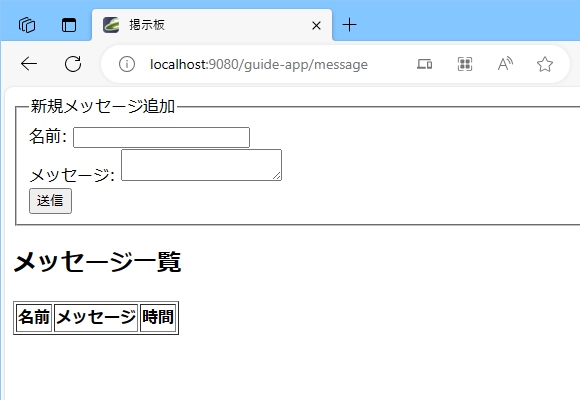
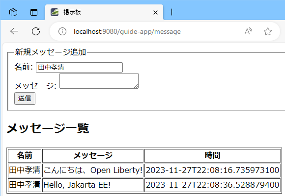
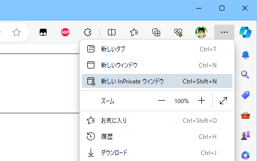
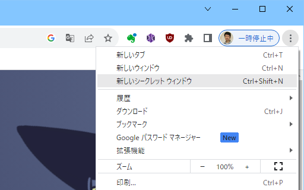
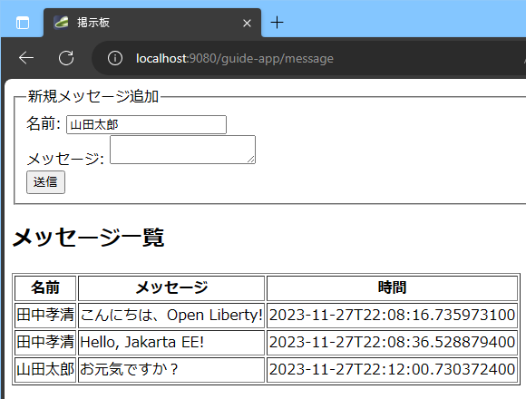

## Jakarta EEの基本: ServletとJSP

### Servletとは

Servletは，Java EE/Jakarta EE仕様の一部として提供されるAPIで，主にWebアプリケーションのバックエンドとして利用されます。クライアント（通常はWebブラウザ）からのリクエストに応じて動的なコンテンツを生成し，レスポンスとして返す役割を果たします。

ServletはHTTPリクエストとレスポンスを直接扱うことができる機能を提供しています。昨今では，この階層を意識することなく，Webアプリケーションを簡便に作成できる多くのフレームワークが提供されています。ですが，それらのフレームワークの中にも，しばしば内部ではServlet APIが使用されています（Spring Boot/Spring MVCなどが代表例です）。

実際の業務アプリケーションの構築にあたっては，フレームワークに隠蔽されて，Servletの機能をつかう機会は少なくなってるかもしれません。それでも，初学者が「HTTP通信を利用したWebアプリケーションでは内部でなにがおこなわれているか」を学習するにあたっては，現在でも有用な手段でしょう（またフレームワークでトラブルがあった場合も，内部で使用されているServletの知識があると，解決に役立つことが多々あります）。

### Servletを実装してみよう

この章では，ServletとJSPについて実際に開発を行いながら学習します。

Liberty Starterで新しく作成したプロジェクト`guide-servlet`でサンプルのコードを作成します。以下の条件でプロジェクトを作成しました。

- **Group** ：`com.demo`のまま
- **Artifact** ：`guide-servlet`
- **Build Tool** ：Maven
- **Java SE Version** ：17
- **Java EE/Jakarta EE Version** ：10.0
- **MicroProfile Version** ：None

`guide-servlet`で利用しているLibertyの構成ファイルでは，Jakarta EE 10のAPIを提供するFeatureが全て有効になっています。Libertyは，利用する機能，Featureだけを有効にすることで実行環境を軽量にたもてるという特長を持っています。より快適に開発を行うために，必要なAPIだけを有効にします。

`src/main/liberty/config`ディレクトリにある`server.xml`を開きます。

`<featureManager>`の設定では，Jakarta EE 10の全てのAPIを使用できるようにする`jakartaee-10.0`のFeatureが有効にされています。

``` xml
<!-- Enable features -->
<featureManager>
    <feature>jakartaee-10.0</feature>
    
</featureManager>
```

これを以下のように書き換えて保存します。ServletとJSP，SSL接続するためのTransport Securityだけが有効になります。

``` xml
<!-- Enable features -->
<featureManager>
    <feature>servlet-6.0</feature>
    <feature>pages-3.1</feature>
    <feature>transportSecurity-1.0</feature>
</featureManager>
```

これでLibertyの使用するメモリが少なくなり，起動時間もわずかに短くなります。

`guide-servlet`にServletを実装します。

`src/main/java/com/demo`フォルダーに`HelloServlet.java`というファイルを作成します。VS Codeのエクスプローラーで`java/com/demo/rest`の`demo`の部分を右クリックし「新しいファイル...」をクリックしてファイル名を入力します。

作成したファイルに以下の内容を記述して保存します。Servletは，`HttpServlet`クラスを継承（extends）したクラスとして作成します。`@WebServlet`｀をつけることで，実行環境にServletと認識されて，実行対象となります。

``` java
package com.demo;

import java.io.IOException;
import java.io.PrintWriter;
import java.util.Locale;

import jakarta.servlet.ServletException;
import jakarta.servlet.annotation.WebServlet;
import jakarta.servlet.http.HttpServlet;
import jakarta.servlet.http.HttpServletRequest;
import jakarta.servlet.http.HttpServletResponse;

@WebServlet("/hello")
public class HelloServlet extends HttpServlet {
    @Override
    public void doGet(HttpServletRequest req, HttpServletResponse resp)
        throws ServletException, IOException
    {
        // リクエストの指定する言語を取得
        Locale locale = req.getLocale();
        String greeting = switch(locale.getLanguage()) {
            case "fr" -> "Bonjour, ";
            case "ja" -> "こんにちは、";
            case "zh" -> "你好，";
            default -> "Hello, ";
        };
        // レスポンスのヘッダを設定
        resp.setHeader("Vary", "Accept-Language");
        resp.setLocale(locale);
        // レスポンスをHTMLに指定してPrintWriterを取得
        resp.setContentType("text/html; charset=UTF-8");
        PrintWriter writer = resp.getWriter();
        // レスポンスを出力
        writer.print(
            """
            <!DOCTYPE html>
            <html>
            <head><title>Hello Servlet</title></head>
            <body>%sOpen Liberty!</body>
            </html>
            """.formatted(greeting));
    }
}
```


「LIBERTY DASHBOARD」から「Stert」でLibertyを起動し，正常に起動したら，ブラウザで[http://localhost:9080/guide-servlet/hello](http://localhost:9080/guide-servlet/hello)にアクセスしてみましょう。

ほとんどの環境で以下のように表示されたかと思います。


コマンドプロンプトから`curl`コマンドを実行して，ヘッダをつけてLiberty上のServletにアクセスしてみます。

``` terminal
$ curl -H "Accept-Language: fr"  http://localhost:9080/guide-servlet/hello
<!DOCTYPE html>
<html>
<head><title>Hello Servlet</title></head>
<body>Bonjour, Open Liberty!</body>
</html>

$ curl -H "Accept-Language: zh-TW"  http://localhost:9080/guide-servlet/hello
<!DOCTYPE html>
<html>
<head><title>Hello Servlet</title></head>
<body>你好，Open Liberty!</body>
</html>
```

指定する言語によって，異なる挨拶が返ってきていることが確認できるかと思います。

> [!TIP]
>`curl`コマンドでHTTPSで接続しようとすると，Libertyが自己署名証明書を使用しているため，証明書の検証に失敗して接続できません。
>
>``` terminal
>$ curl https://localhost:9443/guide-servlet/hello
>curl: (60) SSL certificate problem: self signed certificate
>More details here: https://curl.se/docs/sslcerts.html
>
>curl failed to verify the legitimacy of the server and therefore could not
>establish a secure connection to it. To learn more about this situation and
>how to fix it, please visit the web page mentioned above.
>```
>
>検証失敗を無視して接続するためには`--insecure`オプションを指定します。
>
>``` terminal
>$ curl --insecure https://localhost:9443/guide-servlet/hello
><!DOCTYPE html>
><html>
><head><title>Hello Servlet</title></head>
><body>こんにちは、Open Liberty!</body>
></html>
>```


#### HTTPリクエストとレスポンス

上記のServletをブラウザで表示したときに，裏でなにが起こっていたのかを確認します。

多くのブラウザでは，上記のServletを表示している画面で`F12`キーをおすと，開発者ツールが起動します。たとえばWindowsのEdgeブラウザでは，以下のようなメッセージが表示された後，「DevToolを開く」をクリックすると開発者ツールが利用できます。


開発者ツールの利用方法は使用しているブラウザによって異なるため，ここでは詳細には説明しません。開発者ツールを利用すると，下記の画面のようにサーバーとブラウザの通信内容を詳細に観察することができます。


また，`curl`コマンドに`-v`オプションをつけて実行しても，詳細な通信内容を表示することができます。

``` terminal
$ curl -v -H "Accept-Language: en-US" http://localhost:9080/guide-servlet/hello
*   Trying 127.0.0.1:9080...
* Connected to localhost (127.0.0.1) port 9080 (#0)
> GET /guide-servlet/hello HTTP/1.1
> Host: localhost:9080
> User-Agent: curl/8.1.2
> Accept: */*
> Accept-Language: en-US
> 
< HTTP/1.1 200 OK
< Vary: Accept-Language
< Content-Type: text/html; charset=UTF-8
< Content-Language: en-US
< Transfer-Encoding: chunked
< Date: Sun, 26 Nov 2023 23:27:04 GMT
< 
<!DOCTYPE html>
<html>
<head><title>Hello Servlet</title></head>
<body>Hello, Open Liberty!</body>
</html>
* Connection #0 to host localhost left intact
```

> [!NOTE]
>ヘッダーの`Vary:`は，クライアントが送信したどのヘッダーの情報をもとにレスポンスを変化させたかを通知します。
>
>この値は，結果をキャッシュする仕組みで利用されます。ここでは`Accept-Language`ヘッダーが同じ内容のリクエストに対してはレスポンスは同じとみなしてキャッシュを再利用してもよく，このヘッダーが異なるリクエストに対しては再利用してはいけない，ということを示しています。

先ほどのServletが実行された際に，クライアントであるブラウザからサーバーへは，以下のようなリクエストが送信されています。

```
GET /guide-servlet/hello HTTP/1.1
Accept: text/html,application/xhtml+xml,application/xml;q=0.9,image/webp,image/apng,*/*;q=0.8,application/signed-exchange;v=b3;q=0.7
Accept-Encoding: gzip, deflate, br
Accept-Language: ja,en;q=0.9,en-GB;q=0.8,en-US;q=0.7
Cache-Control: max-age=0
Connection: keep-alive
Cookie: JSESSIONID=0000nDDVQqpo3c0u79LD11wR-8i:845f014d-75a1-40d8-8a0c-0285824f7233
Host: localhost:9080
Sec-Fetch-Dest: document
Sec-Fetch-Mode: navigate
Sec-Fetch-Site: none
Sec-Fetch-User: ?1
Upgrade-Insecure-Requests: 1
User-Agent: Mozilla/5.0 (Windows NT 10.0; Win64; x64) AppleWebKit/537.36 (KHTML, like Gecko) Chrome/119.0.0.0 Safari/537.36 Edg/119.0.0.0
sec-ch-ua: "Microsoft Edge";v="119", "Chromium";v="119", "Not?A_Brand";v="24"
sec-ch-ua-mobile: ?0
sec-ch-ua-platform: "Windows"

```

HTTPのリクエスト・メッセージは以下のような構造になっています。

- **リクエストライン**
    - メッセージの1行目です。スタートラインとも呼ばれます。
    - リクエストのメソッド（`GET`や`POST`など），ターゲット（上記の例では`/guide-servlet/hello`）と，HTTPバージョンから構成されています。
- **ヘッダー**
    - `ヘッダー名: 内容`の形式で，情報が行ごとに並んでいます。
    - リクエストのコンテキストやサーバーへの追加指示を提供します。
- **空行**
    - ヘッダーとボディの間にある空の行。
- **ボディ**（オプショナル）
    - `POST`や`PUT`リクエストで使用されます。

サーバーからブラウザへは，以下のようなレスポンスが送信されています（ここではchunked encodingによる転送時の追加文字は削除しています）。

```
HTTP/1.1 200 OK
Vary: Accept-Language
Content-Language: ja
Content-Type: text/html; charset=UTF-8
Transfer-Encoding: chunked
Date: Thu, 23 Nov 2023 05:47:06 GMT

<!DOCTYPE html>
<html>
<head><title>Hello Servlet</title></head>
<body>こんにちは、Open Liberty!</body>
</html>
```

レスポンス・メッセージは，同様に以下のような構造になっています。

- **ステータストライン**
    - メッセージの1行目です。スタートラインとも呼ばれます。
    - HTTPバージョン，ステータスコード（リクエストに対する結果を示す3桁の数値コード），ステータステキストから構成されています。
- **ヘッダー**
    - `ヘッダー名: 内容`の形式で，情報が行ごとに並んでいます。
    - レスポンスに関するメタデータや，クライアントへの指示を提供します。
- **空行**
    - ヘッダーとボディの間にある空の行。
- **ボディ**
    - リクエストに対する実際のデータまたは内容。
    - HTML文書，画像，JSONデータなど，リクエストに応じた形式でデータが含まれます。

Servlet APIは，このリクエストのメッセージを受信し解析し，レスポンスのメッセージを生成して送信するための多くの機能を提供しています。

#### URLとServletのマッピング

ServletやJSPなどのWebアプリケーションはWARファイルにパッケージされて，サーバーで実行されます。Webアプリケーションをサーバーに登録する際には，アプリケーションを呼び出すコンテキスト・ルート（Context Root）を指定します。

今回使用している`guide-servlet`は，サーバーの構成ファイル`server.xml`で以下のように登録されています。

``` xml
<webApplication contextRoot="/guide-servlet" location="guide-servlet.war" />
```

コンテキストルートはURLの構造において，ドメイン名に続く最初のパスセグメントとして利用されます。Servletを呼び出したときのURL，`http://localhost:9080/guide-servlet/hello`のパスセグメントは`/guide-servlet/hello`です。このうち`/guide-servlet`がWebアプリケーションを指定するコンテキスト・ルートとして使用されます。アプリケーション内のパスは`/hello`になります。

Webアプリケーション内のパスのマッピングは，Javaコード内の`@WebServlet`アノテーションで指定されています。これにより，`/hello`のパスでこのServletが呼び出されるようにマップされます。このように，特定のパスを明記したマッピングを完全一致といいます。

``` java
@WebServlet("/hello")
```

`@WebServlet`アノテーションに複数の情報を記述する場合は，マッピング情報は`urlPatterns`で記述します。

``` java
@WebServlet(urlPatterns = "/hello", loadOnStartup = 100)
```

マッピングには`/*`で終わる文字列を指定できます。その場合はパス一致として扱われ，そのディレクトリ以下の全ての呼出しにマッチし，指定されたServletが呼び出されます。このマッピングを前方一致といいます。

``` java
@WebServlet("/admin/*")
```

また`*.`で始まる文字列で拡張子の指定も可能です。以下のような指定では，`.do`でおわる任意のパスセグメントとマッチし，Servletが呼び出されます。このマッピングを拡張子ルールといいます。

``` java
@WebServlet("*.do")
```

リクエストされたパスが複数のマッピング設定に一致した場合，以下の順位で上のものほど優先されます。

- 完全一致
- 拡張子ルール一致
- 前方一致（複数にマッチした場合，より長いマッピングが使用される）
- 拡張子JSPなど，実行環境で設定されているルール

いずれにも該当しないパスが要求された場合，`webapp`フォルダーの中のコンテンツから一致するものが検索され，見つかればそのファイルがそのまま送信されます。

> [!NOTE]
>マッピングの例外が，`WEB-INF`と`META-INF`です。これらのフォルダーの中のコンテンツは，リクエストとのマッチ対象になりません。これらのフォルダーの中身が外部からのURLの指定で呼び出されることはありません。
>
>`WEB-INF`は，Webアプリケーションの構成情報やServletを構成するJavaのクラスファイル，そこから呼び出されるライブラリなどが格納されます。
>
>`META-INF`は，Javaのアーカイブに共通の設定ファイルやメタ情報が格納されます。


#### GETリクエストとPOSTリクエスト

HTTPリクエストにおけるメソッドにはいくつもの種類がありますが，Servlet仕様で対応しているメソッドとしては，以下のようなものがあります。

- **GET**
    - もっとも多用されるメソッドです。ブラウザにURLを入力してページを表示したり，`<a href="〜">`によるリンクをたどったりしたときに使用されます。
    - リソースを取得するために使用されます。サーバー側のデータを変更せず，読み取り専用の操作に最適です。
    - データ操作CRUDのReadに該当します。
- **POST**
    - データをサーバーに送信するために使用されます（例: フォームデータの送信）。
    - 新しいリソースを作成するために使用されることが多いです。
    - データ操作CRUDのCreate/Updateに該当します。
- **PUT**
    - 既存のリソースを更新または置き換えるために使用されます。
    - データ操作CRUDのUpdateに該当します。
- **DELETE**
    - 指定されたリソースを削除するために使用されます。
    - データ操作CRUDのDeleteに該当します。
- **HEAD**
    - GETと同様ですが，レスポンスにはボディが含まれません。
    - リソースのメタデータ（例: ヘッダー情報）のみを取得するために使用されます。
- **OPTION**
    - 対象のリソースで利用可能な通信オプションを調べるために使用されます。
- **TRACE**
    - クライアントからサーバーへのリクエストメッセージをサーバーに「エコー」させることによって，そのリクエストがネットワーク上でどのように処理されているかをトレースします。

一般的にWebアプリケーションで使用されるのはGETとPOSTメソッドです。

> [!NOTE]
>HTTPのメソッドで重要な概念として冪等性と安全性があります。
>
>**冪等性（Idempotency）** とは，同じリクエストを一度だけ実行しても二度以上実行しても，その結果が初回と同じであることを保証します。つまり，リクエストの繰り返しが追加の副作用を引き起こさないことを意味します。
>
>GET，HEAD，PUT，DELETEは冪等なメソッドです。たとえば，同じリソースに対するDELETEリクエストを何度実行しても，最初の成功したリクエスト以降は何も変化しません。
>
>POSTは冪等ではありません。同じPOSTリクエストを繰り返すと，新しいリソースが何度も作成される可能性があります。
>
>**安全性（Safety）** とは，サーバー上のリソースの状態を変更しないことを保証します。これらのメソッドは，データの取得や読み取りに使用され，データの作成，更新，削除などの書き込み操作を行いません。
>
>GET，HEADなどは安全なメソッドです。これらは情報の取得のみを目的としており，サーバー側のリソースの状態を変更しません。
>
>POST，PUT，DELETEなどは安全ではありません。これらはリソースの状態を変更するために使用されます。
>
>ブラウザやHTTPリクエストを中継，キャッシュする中間プログラムは，これらのメソッドの特性に応じた動作をします。たとえば，ブラウザでGETで表示したページでリロードを実行すると，何の警告もなく再度画面が表示されます（GETメソッドは安全なので，繰り返し要求を送ってもサーバーの状態を変更する心配がないからです）。ですが，ブラウザでPOSTで表示したページでリロードを試みると，安全ではないリクエストを再度実行してもいいのか，確認の画面が表示されます。
>
>Webアプリケーションを実装するさいには，これらのHTTPメソッドに応じたアプリケーションの挙動の原則を守ることが重要です。
>
>ただ，あくまで原則です。GETでサーバー側の状態を一切変更していけない，というわけではありません。安全な変更ならば構いません。たとえば，何回アクセスしたかを表示するアクセスカウンターなどは，表示するたびに数字が増えますが，何回でも安全にリクエストを送信することができますので，GETでリクエストを処理しても構いません。

`HttpServlet`クラスには，これらの7つのHTTPメソッドを処理するためのメソッドが定義されており，実際のServletではこれらのメソッドをオーバーライド（Override）して，処理内容を記述します。`GET`メソッドのリクエストを処理するのは`doGet`，`POST`メソッドを処理するのは`doPost`，というようなメソッドが定義されています。

メソッドのシグネーチャー（引数と戻り値，throwするException）は以下のようになっています。リクエストの情報を取得するための`HttpServletRequest`のインスタンス，レスポンスを返すための`HttpServletResponse`のインスタンスが引数として渡されてきます。

``` java
protected void doGet(HttpServletRequest req, HttpServletResponse resp)
    throws ServletException, IOException
```

処理を実行するメソッドについて，Servletの定義の中でオーバーライドします。

``` java
@Override
public void doGet(HttpServletRequest req, HttpServletResponse resp)
    throws ServletException, IOException {
    // 処理内容
}
```

対応しないメソッドについてはオーバーライドする必要はありません。オーバーライドしていないメソッドをもつリクエストが送信された場合は，`405 Method Not Allowed`のステータスコード・メッセージのレスポンスが返されます。

#### HttpServletRequest：リクエストの処理

##### HttpServletRequestから得られる情報

Servletに実行時に引数として渡される`HttpServletRequest`には，多くのGetterメソッドが定義されていて，リクエストに関するさまざまな情報を得られます。

サンプルのServletを作成して確認してみましょう。プロジェクトの`src/main/java/com/demo`フォルダーに`SnoopServlet.java`というファイルを作成し，以下の内容を記述して保存します。

``` java
package com.demo;

import java.io.IOException;
import java.io.PrintWriter;
import java.util.Enumeration;
import java.util.Locale;

import jakarta.servlet.ServletException;
import jakarta.servlet.annotation.WebServlet;
import jakarta.servlet.http.HttpServlet;
import jakarta.servlet.http.HttpServletRequest;
import jakarta.servlet.http.HttpServletResponse;

@WebServlet("/snoop/*")
public class SnoopServlet extends HttpServlet {
    @Override
    public void doGet(HttpServletRequest req, HttpServletResponse resp) 
        throws IOException, ServletException
    {
        execute(req, resp);
    }
    @Override
    public void doPost(HttpServletRequest req, HttpServletResponse resp)
        throws IOException, ServletException
    {
        execute(req, resp);
    }
    private void execute(HttpServletRequest req, HttpServletResponse resp)
        throws IOException, ServletException
    {
        resp.setContentType("text/plain; charset=UTF-8");
        PrintWriter writer = resp.getWriter();
        // リクエスト・ラインに関する情報
        writer.println("Request Method      : " + req.getMethod());
        writer.println("Request URI         : " + req.getRequestURI());
        writer.println("Request Protocol    : " + req.getProtocol());
        writer.println("Context Path        : " + req.getContextPath());
        writer.println("Servlet Path        : " + req.getServletPath());
        writer.println("Path Info           : " + req.getPathInfo());
        writer.println("Path Translated     : " + req.getPathTranslated());
        writer.println("Query String        : " + req.getQueryString());
    }
}
```

このサーブレットでは，リクエストラインから得られる情報をサーバーが解釈した結果を`HttpServletRequest`から取得して表示しています。`curl`コマンドなどからも呼び出しやすいように，応答のContent-typeは`text/plain`にしてあります。URLのマッピングは`@WebServlet("/snoop/*")`と前方一致で設定されていますので`/snoop`で始まる任意のパスに一致します。

コマンドラインから，以下のようなURLで呼び出して，Path Infoなどがどのように変化するか確認してください。

- `curl http://localhost:9080/guide-servlet/snoop`
- `curl http://localhost:9080/guide-servlet/snoop/`
- `curl http://localhost:9080/guide-servlet/snoop/test`

また，以下のような呼び出しでQuery Stringがかわります。

- `curl "http://localhost:9080/guide-servlet/snoop?foo=bar&hoge=fuga"`

このSnoopServletについて，さらに追加の情報を取得するように拡張したものがこちらになります。

``` java
package com.demo;

import java.io.IOException;
import java.io.PrintWriter;
import java.util.Enumeration;
import java.util.Locale;

import jakarta.servlet.ServletException;
import jakarta.servlet.annotation.WebServlet;
import jakarta.servlet.http.HttpServlet;
import jakarta.servlet.http.HttpServletRequest;
import jakarta.servlet.http.HttpServletResponse;

@WebServlet("/snoop/*")
public class SnoopServlet extends HttpServlet {
    @Override
    public void doGet(HttpServletRequest req, HttpServletResponse resp) 
        throws IOException, ServletException
    {
        execute(req, resp);
    }
    @Override
    public void doPost(HttpServletRequest req, HttpServletResponse resp) 
        throws IOException, ServletException 
    {
        execute(req, resp);
    }
    private void execute(HttpServletRequest req, HttpServletResponse resp) 
        throws IOException, ServletException 
    {
        resp.setContentType("text/plain; charset=UTF-8");
        PrintWriter writer = resp.getWriter();
        // リクエスト・ラインに関する情報
        writer.println("Request Method      : " + req.getMethod());
        writer.println("Request URI         : " + req.getRequestURI());
        writer.println("Request Protocol    : " + req.getProtocol());
        writer.println("Context Path        : " + req.getContextPath());
        writer.println("Servlet Path        : " + req.getServletPath());
        writer.println("Path Info           : " + req.getPathInfo());
        writer.println("Path Translated     : " + req.getPathTranslated());
        writer.println("Query String        : " + req.getQueryString());
        // ヘッダーから得られる情報
        writer.println("Content Length      : " + req.getContentLength());
        writer.println("Content Type        : " + req.getContentType());
        writer.println("Character Encoding  : " + req.getCharacterEncoding());
        writer.println("Locale              : " + req.getLocale());
        writer.print("Locales             : ");
        Enumeration<Locale> e = req.getLocales();
        while (e.hasMoreElements()) {
            writer.print(e.nextElement() + " ");
        }
        writer.println();
        // ネットワーク接続についての情報
        writer.println("Local Name          : " + req.getLocalName());
        writer.println("Local Port          : " + req.getLocalPort());
        writer.println("Server Name         : " + req.getServerName());
        writer.println("Server Port         : " + req.getServerPort());
        writer.println("Remote Address      : " + req.getRemoteAddr());
        writer.println("Remote Host         : " + req.getRemoteHost());
        writer.println("Remote Port         : " + req.getRemotePort());
        writer.println("Request ID          : " + req.getRequestId());
        writer.println("Secure Connection   : " + req.isSecure());
        // 認証についての情報
        writer.println("Authorization Scheme: " + req.getAuthType());
        writer.println("Remote User         : " + req.getRemoteUser());
    }
}
```

> [!NOTE]
>呼び出しているメソッドの正確な意味については，Javadocを参照してください。
>
>- HttpServletRequest (Jakarta Servlet API documentation)
>    - [https://jakarta.ee/specifications/servlet/6.0/apidocs/jakarta.servlet/jakarta/servlet/http/httpservletrequest](https://jakarta.ee/specifications/servlet/6.0/apidocs/jakarta.servlet/jakarta/servlet/http/httpservletrequest)

##### リクエスト・ヘッダの取得

`HttpServletRequest`からは，ヘッダーについての情報を直接取得することもできます。

たとえば`User-Agent`というヘッダーを`HttpServletRequest`のインスタンス`req`から取得するには，以下のようなコードを利用します。

``` java
String userAgent = req.getHeader("User-Agent");
```

受け取ったヘッダーの名前の一覧は，`getHeaderNames()`で取得できます。

これをつかって，受け取ったヘッダーを全て列挙するServletを作ってみましょう。

プロジェクトの`src/main/java/com/demo`フォルダーに`HederServlet.java`というファイルを作成し，以下の内容を記述して保存します。

``` java
package com.demo;

import java.io.IOException;
import java.io.PrintWriter;
import java.util.Enumeration;

import jakarta.servlet.ServletException;
import jakarta.servlet.annotation.WebServlet;
import jakarta.servlet.http.HttpServlet;
import jakarta.servlet.http.HttpServletRequest;
import jakarta.servlet.http.HttpServletResponse;

@WebServlet("/headers")
public class HederServlet  extends HttpServlet {
    @Override
    public void doGet(HttpServletRequest req, HttpServletResponse resp) 
        throws IOException, ServletException 
    {
        execute(req, resp);
    }
    @Override
    public void doPost(HttpServletRequest req, HttpServletResponse resp)
        throws IOException, ServletException 
    {
        execute(req, resp);
    }
    private void execute(HttpServletRequest req, HttpServletResponse resp)
        throws IOException, ServletException 
    {
        resp.setContentType("text/plain; charset=UTF-8");
        PrintWriter writer = resp.getWriter();
        Enumeration<String> names = req.getHeaderNames();
        while (names.hasMoreElements()) {
            String name = names.nextElement();
            String value = req.getHeader(name);
            writer.println(name + ": " + value);
        }
    }
}
```

`HttpServletRequest`のヘッダー関連のメソッドには以下のようなものがあります。

|メソッド定義|説明|
|------------|----|
|`String getHeader​(String name)`|指定された名前のヘッダーを取得します。同名のヘッダーが複数存在していれば最初の値を返します。存在していなければ`null`が返ります。|
|`Enumeration<String> getHeaders​(String name)`|HTTP仕様では，同じ名前の複数のヘッダーの存在が許されています。このメソッドはそれらの全てを含んだ`Enumeration`を返します。|
|`int getIntHeader​(String name)`|指定された名前のヘッダーを数値として解釈して値を返します。存在していなければ-1が返ります。|
|`long getDateHeader​(String name)`|指定された名前のヘッダーを日付として解釈してUNIX Epoch値を返します。存在していなければ-1が返ります。|
|`Enumeration<String> getHeaderNames()`|リクエストに含まれているヘッダー名の一覧をEnumerationで取得します。|

##### パラメーターの読み取り

HTMLフォームを使用したWebアプリケーションなどでは，パラメーターを追加したリクエストがサーバーに送信されます。

``` html
<form action="/submit-login" method="post">
    <div>
        <label for="username">Username:</label>
        <input type="text" id="username" name="username">
    </div>
    <div>
        <label for="password">Password:</label>
        <input type="password" id="password" name="password">
    </div>
    <div>
        <input type="submit" value="Login">
    </div>
</form>
```

この`<form>`を「Login」ボタンでサブミットすると，`username`と`password`の二つのパラメーターがサーバーに送信されます。

- GETリクエストでは，パラメーターはURLのクエリ文字列に含めて送信されます。
    - 例： `https://example.com/submit-login?username=john&password=abc12345`
- POSTリクエストでは，パラメーターは`application/x-www-form-urlencoded`形式に変換されてリクエストメッセージのボディで送信されます。

`HttpServletRequest`のインスタンス`req`からパラメーターを取得するには`getParameter`メソッドを使用します。

``` java
String username = req.getParameter("username");
String password = req.getParameter("password");
```

GETのクエリ文字列やPOSTのボディをパースして，パラメーターを個別の文字列として取り出すことができます。ただ，デフォルトでは文字コードはISO-8859-1としてパースされます。パラメーターに非ASCII文字が含まれているときには，パラメーターを取得する前に，エンコーディングを指定する必要があります。

``` java
req.setCharacterEncoding("UTF-8");
String content = req.getParameter("content");
```

また，パラメーター内の文字列は利用者が任意に設定が可能です。その内容は安全ではないので，適切な検証が常に必要です。とくに，DBに発行するSQL，画面に表示する内容，OS上で実行するコマンドなどを，取得したパラメーター文字列から直接作成することは避けましょう。きちんとした検証や加工をしてからでないと，脆弱性の原因となります。

##### 属性（attribute）の読み書き

`HttpServletRequest`には，属性（attribute）の保存が可能です。

`HttpServletRequest`の属性は，Webアプリケーション開発において，リクエスト処理の間にデータを保存し，異なるコンポーネント間で共有するために使用されます。サーブレットやJSPなどのWebコンポーネント間で情報を伝達するのに便利な手段です。

後述するように，ServletとJSPの処理を連携させることができます。ビジネスロジックの処理をServletで実行し，結果をJSPで表示する，というような使い方が一般的です。このとき，ServletからJSPに情報を連携する手段として，`HttpServletRequest`の属性がよく使用されます。

また，このガイドブックでは割愛していますが，Servletの前処理としてフィルターを割り込ませることが可能です。認証をおこなうフィルターを実装して，そこでユーザーの認証情報を属性に設定し，その後の処理をおこなうServletでこの属性に基づいてアクセス制御を行うなどの使い方もできます。

`HttpServletRequest`のインスタンス`req`に属性を保存するには`setAttribute(String name, Object value)`メソッドを使用します。

``` java
req.setAttribute("com.demo.message", message);
```

属性を読み出すには，`getAttribute(String name)`メソッドを使用します。

``` java
Massage message = (Message)req.getAttribute("com.demo.message");
```

保存した属性が有効なのは，リクエストの処理が開始されてから処理が完了し，レスポンスを返すまでです。リクエストの処理が終了すると，内容は失われます。

#### HttpSession：複数のリクエストにまたがるセッション

`HttpSession`は，Webアプリケーションにおけるセッション管理を行うためのメカニズムです。クライアント（通常はWebブラウザ）ごとにセッションを作成し，そのセッションを通じてユーザーのステート情報を保持することができます。

HTTPは，ステートレスなプロトコルです。サーバーとブラウザの通信は，ページの表示など一定の処理を行うごとに切断されます。ページ遷移などして，続きの処理を実施するときに，あらためて通信を開始します。サーバーは，複数のクライアントから送られる多くのリクエストのうち，どのリクエストが同じユーザーからのリクエストかを識別して，それらを一つのセッションとしてあつかう方法を提供します。

`HttpSession`は，`HttpServletRequest`のインスタンスから`getSession()`メソッドで取得します。

``` java
HttpSession session = req.getSession();
```

> [!NOTE]
>`getSession()`メソッドには，引数なしのものと，`boolean`の引数を取るものがあります。
>
>引数を取るものは，現在のセッションに既存の`HttpSession`のインスタンスが存在しないときに，新規に作成するかを指示します。以下のように実行すると，既存のインスタンスがあるときにのみ`HttpSession`が返され，存在しなければ`null`が返ります。
>
>``` java
>HttpSession session = req.getSession(false);
>```
>
>引数なしのメソッドは，`getSession(true)`と同じ意味です。既存の`HttpSession`が存在しなければ新規のインスタンスが生成されて返されます。


##### 属性（attribute）の読み書き

`HttpSession`には属性（attribute）を保存できます。保存する属性は，`java.io.Serializable`を実装した直列化可能なクラスである必要があります。

``` java
// データの保存
session.setAttribute("user", userObject);
```

`HttpSession`に保存した属性は，リクエストをまたがって，同じユーザーからの同一セッション内で参照することができます。

``` java
// データの取得
User user = (User)session.getAttribute("user");
```

不要になった属性は，削除することができます。

``` java
session.removeAttribute("user");
```

`HttpSession`によって，Webアプリケーションの開発者は，ログイン状態の管理やユーザー固有の設定情報の保存などが可能になります。

##### HttpSessionのスコープ

`HttpSession`の有効期限は，`invalidate()`メソッドが実行されるまでか，タイムアウト時間が経過するまでです。

タイムアウト時間は，アプリケーション中で`setMaxInactiveInterval(int interval)`メソッドで指定することが可能です。単位は秒です。

``` java
// タイムアウト時間を5分に設定
session.setMaxInactiveInterval(300);
```

デフォルトのタイムアウト時間は，Libertyの構成ファイル`server.xml`で設定できます。`httpSession`要素の`invalidationTimeout`属性で指定します。

``` xml
<!-- デフォルトのタイムアウト時間を5分に設定 -->
<httpSession invalidationTimeout="5m" />
```

`HttpSession`の有効範囲は，Webアプリケーションです。同じアプリケーションサーバーで複数のWebアプリケーションが実装されている場合でも，アプリケーションをまたいでセッション内容を共有することはできません。

##### 分散環境でのHttpSession

Libertyでは，`HttpSession`内のオブジェクトをDBなどの外部ストレージに永続化し，複数のサーバーで共有する仕組みを提供しています。

この機能を利用し，おなじWebアプリケーションを複数のサーバーで分散実行することで，システムの可用性は大きく向上します。一つのサーバープロセスが異常終了したとしても，他のサーバーで`HttpSession`の内容を引きつぎ，Webアプリケーションの操作を継続できるからです（`HttpSession`を引き継げないと，他のサーバーで処理を継続しようとしてもセッションを最初から作り直すことになるので，一般的にはログイン画面からやり直しになってしまいます）。

また運用の自由度も増します。必要なときに自由にサーバーを再起動したり，負荷に応じてサーバーの台数を増減する，ということも，アプリケーション利用者に影響を与えることなく，可能になります。

Libertyでは，セッションを永続化する仕組みとして以下の二つのFeatureを提供しています。

- `sessionDatabase-1.0`
    - DB（Db2，Oracle DB，PostgreSQLなどのRDBMS）を使用してセッションの永続化を行う
    - `<dataSource>`を構成し，`<httpSessionDatabase>`で永続化の構成を行う
- `sessionCache-1.0`
    - JCacheに対応したソフトウェアを使用してセッションの永続化を行う
    - `<cacheManager`を構成し，`<httpSessionCache>`で永続化の構成を行う

後半の章で，`sessionDatabase-1.0`を使用した構成例について解説します。

> [!NOTE]
>**セッションの追跡メカニズム**
>
>アプリケーションサーバーがクライアントからのセッションを追跡するためには，一般的にCookieが使用されます。通常は、`HttpSession`のインスタンスが作成されたときにセッションIDをふくんだ文字列がクライアントのCookieに設定されます。以降は，クライアントから送信されるCookieに含まれるセッションIDをもとにトラッキングが行われます。
>
>CookieにセッションIDを保存するための名前は，Servlet仕様で`JSESSIONID`と決められています。この文字列は，特別な事情がない限り，変更しない方が安全です。
>
>LibertyがCookieに保存する文字列は，以下のような構造をしています。
>
>```
>Set-Cookie: JSESSIONID=0000T7CLaNuryESXrWkaIyWGr_a:68798fcf-430a-41e9-9c9e-05bf1b608abf; Path=/; HttpOnly
>```
>
>- `0000`：バージョン番号
>	- アプリケーションサーバーがメモリにキャッシュしているセッションのバージョン番号です。他のサーバーで処理が行われた時には，この数値が増えるようになっています。キャッシュのバージョン番号とつきあわせて，キャッシュが古くなっていることが検出されると，DBなどから最新のセッションが読み込まれます。
>- `T7CLaNuryESXrWkaIyWGr_a`：セッションID
>	- アプリケーションから見えているセッションID
>- `68798fcf-430a-41e9-9c9e-05bf1b608abf`：セッションの処理をしたサーバーのCloneID
>	- WebSphere Pluginなどで負荷分散を行っている場合，このIDをもとに，なるべく前回と同じサーバーに処理を割り振る（アフィニティ）ために使用されます。毎回異なるサーバーへリクエストが転送されると，メモリ上のキャッシュが効率的に利用できないからです。
>
>このように，セッションIDが変化しなくても，Libertyは状況に合わせて`JSESSIONID`を適宜，書き換えています。セッションIDを取得する必要がある場合は，Cookieから直接読み込むのではなく，APIを利用してください。


##### HttpSessionとパフォーマンス

`HttpSession`の使用方法はアプリケーションサーバーのパフォーマンスに直結します。

サイズの大きなオブジェクトをセッションに保存すると，直接的にJavaのヒープメモリを圧迫します。一般的にアプリケーションサーバーで使用されるオブジェクトは短命で，すぐにGCの対象になります。ですが，セッションに格納されたオブジェクトは長期にわたってヒープにとどまります。サーバーのJavaヒープが枯渇してOutOfMemoryErrorが発生した状況で問題判別を行うと，セッションに格納されたオブジェクトが原因となっていることがよくあります。

また，分散実行されている環境ではセッションをネットワークを介して送受信する負荷も発生します。サーバーが障害などで停止した時に備えて，セッションの内容は常に最新のものがデータベースなどにシリアライズされて送信されています。

一般に，セッションオブジェクトに保存するデータのサイズは（シリアライズした状態で）数キロバイト程度にとどめるのが安全です。数メガバイト以上のデータを格納する場合は，事前の負荷テストやヒープサイズの設計などを綿密に行ってください。

#### HttpServletResponse：レスポンスの処理

`HttpServletResponse`は，HTTPのレスポンス・メッセージを組み立てるための多くのメソッドを提供しています。

- ステータスライン
    - `setStatus​(int sc)`，`sendError​(int sc, String msg)`，`sendRedirect​(String location)`など
- ヘッダー
    - `setHeader​(String name, String value)`，`addHeader​(String name, String value)`，`addCookie​(Cookie cookie)`など
- ボディ
    - `setContentType​(String type)`，`getWriter()`，`getOutputStream()`など

##### ボディの生成

デフォルトの，通常の応答（ステータスコード200）を返す場合は，ボディの送信とそのコンテンツタイプの設定が必須です。

コンテンツタイプの設定は，送信するコンテンツの種類に応じたMIMEタイプの指定が必要です。指定は`Content-type`ヘッダーに反映され，ブラウザなどのクライアントが，受け取ったデータをどのように扱えばよいのかの決定に使用されます。

Webアプリケーションで使用される主なMIMEタイプとしては，以下のようなものがあります。

- テキスト・データ
    - `text/html`
        - HTML（HyperText Markup Language）ドキュメントに使用されます。
        - ブラウザはHTMLタグを解釈し，ウェブページを適切に表示します。
    - `text/plain`
        - プレーンテキスト（フォーマットなしのテキスト）を表します。
        - ブラウザは特別なフォーマットやマークアップを処理せず，そのまま表示します。
    - `text/javascript`
        - JavaScriptファイルに使用されます。
        - JavaScriptはブラウザで実行され，動的なウェブページを作成するためのプログラミング言語です。
    - `text/css`
        - CSS（Cascading Style Sheets）ファイルに使用されます。
        - ウェブページのスタイル（色，フォント，レイアウトなど）を指定するために使用されます。
- 画像データ
    - `image/jpeg`，`image/png`，`image/svg+xml`など
        - ブラウザでは画像として表示されます。
- 音声・動画データ
    - `audio/mpeg`，`video/mp4`，`video/webm`など
        - 音声や動画を送信する際に使用されます。
- その他のデータ
    - `application/pdf`
        - PDF（Portable Document Format）ファイルに使用されます。
    - `application/xml`
        - XML（eXtensible Markup Language）ドキュメントに使用されます。
        - データを構造化して保存・転送するための柔軟なマークアップ言語です。
    - `application/json`
        - JSON（JavaScript Object Notation）フォーマットのデータに使用されます。
        - 軽量なデータ交換フォーマットとして，Web APIや設定ファイルなどで広く利用されています。
    - `application/xhtml+xml`
        - XHTML（eXtensible HyperText Markup Language）は，HTMLをより厳密なXMLベースの構文に基づいて再定義したものです。
    - `application/octet-stream`
        - 特定のサブタイプがないか明確でないバイナリデータに使用されます。
        - 通常ブラウザは，ファイルを直接処理するのではなくダウンロードしてディスクに保存するための処理を行います。

Servletからコンテンツタイプを設定するためには，`setContentType​(String type)`メソッドを使用します。

``` java
resp.setContentType​("application/xml");
```

テキスト・データを送信するためには，文字列で出力を行うJavaの`PrintWriter`を取得して送信します。`PrintWriter`を取得する前には，コンテンツタイプの`charset`か，`setCharacterEncoding​(String charset)`メソッドで文字コードを指定する必要があります。指定しない場合のデフォルトはISO-8859-1で，日本語などは表示できませんので，必ず指定してください。

``` java
resp.setContentType​("text/html; charset=UTF-8");
PrintWriter writer = resp.getWriter();
```

または，

``` java
resp.setContentType​("text/html");
resp.setCharacterEncoding​("UTF-8");
PrintWriter writer = resp.getWriter();
```

その他のデータを送信するためには，バイト列として出力を行うJavaの`OutputStream`を取得して送信します。

``` java
resp.setContentType​("image/jpeg");
OutputStream out = resp.getOutputStream();
```

> [!NOTE]
>一般にHTTPでは，一つの通信コネクションで，複数のリクエスト・レスポンスがやりとりされます。
>
>レスポンスメッセージの中で，ヘッダーの終わりは空行で判断できます。ではボディーの終わりはどうやって判断するのでしょう？
>
>HTTP仕様では二つの方法が用意されています。
>
>- あらかじめContent-lengthヘッダーでボディーのバイト数を通知しておく
>- chunked転送エンコーディングを使用して，ボディの終了を通知する
>
>Servletで前者の方法を使用するには，`HttpServletResponse`のインスタンスの`setContentLength​(int len)`メソッドを使用してボディの長さを指定します。ただし，Servletの実行環境は，指定した長さで出力を打ち切ってくれたりはしません。きっちり指定した長さと同じサイズのデータを`PrintWriter`や`OutputStream`に送信するのは，アプリケーション開発者の責任です。
>
>`setContentLength​(int len)`を使用しないと，Servletの実行環境はchunked転送エンコーディングを使用してレスポンスメッセージのボディを送信します。
>
>chunked転送エンコーディングでは，送信するデータをいくつかの「チャンク」に分割して送信します。各チャンクには，先頭に16進数の数値でチャンクのサイズが記述されています。長さ0のチャンクの送信が，ボディの送信の終了を意味します。
>
>chunked転送エンコーディングは，送信する前にデータの全体のサイズが不明でもかまわないため，一般にWebアプリケーション開発者がコンテンツの長さを意識する必要はありません。


##### ヘッダの制御

`HttpServletResponse`のヘッダー関連のメソッドには以下のようなものがあります。

|メソッド定義|説明|
|-------------|----|
|`void addHeader​(String name, String value)`|ヘッダーを設定します。同名のヘッダーが既に存在していた場合，両方が有効になります。|
|`void setHeader​(String name, String value)`|ヘッダーを設定します。同名のヘッダーが既に存在していた場合，新しい`value`で置き換えられます。|
|`void addDateHeader​(String name, long date)`|日付のヘッダーを設定します。同名のヘッダーが既に存在していた場合，両方が有効になります。|
|`void setDateHeader​(String name, long date)`|日付のヘッダーを設定します。同名のヘッダーが既に存在していた場合，新しい`date`で置き換えられます。|
|`void addIntHeader​(String name, int value)`|整数のヘッダーを設定します。同名のヘッダーが既に存在していた場合，両方が有効になります。|
|`void setIntHeader​(String name, int value)`|整数のヘッダーを設定します。同名のヘッダーが既に存在していた場合，新しい`value`で置き換えられます。|
|`void setLocale​(Locale loc)`|`Content-Language`ヘッダーを設定します。|

ヘッダーの設定を安全に行うには，`getWriter()`や`getOutputStream()`で取得した出力先にデータを送信する前である必要があります。出力後に設定しようとすると，`IllegalStateException`で失敗する可能性があります。

> [!TIP]
>`Content-Language`ヘッダーには注意が必要です。
>
>Libertyでは，アプリケーションが`setLocale​(Locale loc)`を呼び出さなかったときのデフォルトの言語は，アプリケーションサーバーを起動した環境の言語になります。日本語をあつかうアプリケーションを，英語をデフォルトの言語に設定したOSで起動すると，意図せず`Content-Language: en`のヘッダーがレスポンスに付加されることになります。
>
>この場合，日本語の画面にもかかわらず，ブラウザの英語から日本語の翻訳機能が有効になるなどの不具合が出ることがあります。
>
>これを解決するには，Libertyの構成ファイル`server.xml`で以下のように構成を行い，レスポンスから`Content-Language`ヘッダーを削除します。
>
> ``` xml
><httpEndpoint id="defaultHttpEndpoint" host="*" httpPort="9080" httpsPort="9443">
>    <headers remove="Content-Language" />
></httpEndpoint>
>```


##### ステータスラインの制御

通常のWebアプリケーションでは，ステータスコード200，正常応答以外を返すことはほとんどありません。が，何らかの理由でそのほかのステータスコードを返したいときに，使用するメソッドが`HttpServletResponse`では提供されています。

`setStatus​(int sc)`は，正常応答である200番台，300番台のステータスコードを返す目的で使用されます。このメソッドを実行しても，それまで設定したヘッダーの操作などは有効です。また，このメソッド実行後も，ヘッダの操作やボディの出力をおこなうことができます。

`sendError (int sc, String  msg)`および`sendError (int sc)`は，エラーの発生を意味する400番台，500番台のステータスコードを返す目的で使用されます。このメソッドを実行すると，それまで実行したコンテンツタイプの設定やヘッダーの設定は無効になる可能性があります。通常のボディの出力もできなくなります。サーバーで用意されたエラー画面や，アプリケーションの`web.xml`ファイルで定義されたカスタム・エラーページが出力されます。

ステータスコード302（Found）を返すための専用のメソッド`sendRedirect​(String location)`も提供されています。302応答では，`Location:`ヘッダーでリダイレクト先のURLを指定する必要があるのですが，このメソッドを実行すると，応答が302に設定されると同時に自答的に引数のURLがヘッダーに設定されます。この応答を受け取ったブラウザは，画面を表示するために，あらためて`Location:`ヘッダーで指定されたURLにアクセスします。

これらの全てのメソッドは，安全に使用するには，`getWriter()`や`getOutputStream()`で取得した出力先にデータを送信する前に実行する必要があります。出力後に実行しようとすると，`IllegalStateException`で失敗する可能性があります。

> [!TIP]
>**Cookieの送受信**
>
>Cookieはクライアント（通常はWebブラウザ）に小さなデータ片を保存するために使用され，主にセッション管理，パーソナライゼーション，トラッキングなどの目的で使用されます。
>
>レスポンス・メッセージに，Cookieを追加してクライアントに保存させるには，以下のようなコードを記述します。
>
>``` java
>// 指定された名前と値を持つCookieのインスタンスを作成する
>Cookie cookie = new Cookie("username", "user123");
>// Cookieにさまざまな属性をセットする
>cookie.setMaxAge(60 * 60 * 24 * 7); // 1週間の有効期限
>cookie.setPath("/"); // アプリケーション全体で有効
>cookie.setSecure(true); // HTTPS経由でのみ送信される
>cookie.setHttpOnly(true); // JavaScriptからのアクセスを防ぐ
>// HttpServletResponseにCookieを追加する
>resp.addCookie(cookie);
>```
>
>リクエスト・メッセージに，指定されたCookieが存在するかをを調べるには，以下のようなコードを記述します。
>
>``` java
>String username = "";
>// HttpServletRequestからCookieの一覧を取得する
>Cookie[] cookies = req.getCookies();
>if (cookies != null) {
>    for (Cookie cookie : cookies) {
>        if ("username".equals(cookie.getName())) {
>            // 目的のCookieがみつかった
>            username = cookie.getValue();
>            break;
>        }
>    }
>}
>```


#### Servletとマルチスレッド，スコープ

Libertyや，その他のアプリケーションサーバーでは，多くのユーザーからのリクエストをマルチスレッドで並行して処理します。

サーバーではServletのインスタンスを一つだけ生成し，複数のリクエストで共用します。そのため，Servletのインスタンス変数に保存した内容は，他のユーザーのクエストと共有されます。リクエストに固有の情報をインスタンス変数に保存すると，情報が他のリクエストに漏洩する危険がありますので，注意してください。

リクエストに固有の情報は，サーブレットのメソッドで定義されたローカル変数に保存するか，`HttpServletRequest`の属性（attribute）として保存します。この属性のスコープを **リクエスト・スコープ** といいます。リクエスト・スコープは，リクエストの処理を開始してから，レスポンスを返すまで有効です。

同じように，ユーザーのセッションに固有の情報は，`HttpSession`の属性として保存します。この属性のスコープを **セッション・スコープ** といいます。セッション・スコープは，セッションが開始してから無効化されるまで，あるいはタイムアウトするまで有効です。

Webアプリケーション全体で共有する情報は，Servlet中から`getServletContext()`を実行して取得した`ServletContext`の属性として保存します。この属性のスコープを **アプリケーション・スコープ** といいます。アプリケーション・スコープは，アプリケーションが起動してから終了するまで有効です。また，サーバー内でだけ有効です。アプリケーションが複数のサーバーで分散実行されているときは，サーバーを超えて情報を共有することはできません。

これらのスコープは，アプリケーションが実行されているスレッドと密接に関わっています。そのため，ユーザーが独自に開始した別スレッドにこれらのインスタンスを渡しても，その属性を正しく読み取ったり，メソッドを正常に実行することはできません。別スレッドで非同期処理を行うためには，Servletの非同期サーブレットの仕組みを利用したり，Concurrency Utility for Java/Jakarta EE仕様で提供される機能を利用したりするようにしてください。


#### Servletの初期化メソッド

Servletのインスタンスがサーバー上で作成され，実際にサービスを開始する前に，実行環境によってServletの初期化メソッドの呼び出しが行われます。

Servletの初期化が必要な場合は，コンストラクターで行うのではなく，初期化メソッドで実装してください。コンストラクターの実行時には，まだServletから機能を呼び出す前提となる各種のコンテキストの設定が完了していない可能性があるからです。

初期化メソッドは二種類あります。引数として`ServletConfig`が渡されるものと，

``` java
@Override
public void init​(ServletConfig config) throws ServletException {
```

引数がないものです。

``` java
@Override
public void init​() throws ServletException {
```

必要に応じてどちらか一つをOverrideします。

過去のServlet仕様では，Servletの実装には，Javaコードの作成と`web.xml`ファイルによる構成の両方が必要でした。`ServletConfig`は，主に`web.xml`で設定された内容を受け取るために使用されていました。ですが，最近のServlet仕様では，Servletの実装には（アノテーションを活用することで）Javaコードの作成のみですむようになっています。そのため，`ServletConfig`を引数に取った初期化メソッドは使用頻度が減ってきています。

初期化メソッドは，最初のリクエストが来る前に一度だけ呼び出されます。初期化メソッドの処理が完了するまで，Servletの処理は開始されません。初期化メソッドにあまりに長い時間がかかる処理を記述すると，最初のリクエストが遅延しますので，注意してください。

また，初期化メソッドで`ServletException`がthrowされると，Servletは無効化されます。

> [!TIP]
>最初のリクエストが来る前，サーバー起動時にサーブレットの初期化を行う方法があります。
>
>まず，Libertyの構成ファイル`server.xml`で以下のように構成を行います。通常は最初のリクエストが来るまでWebアプリケーションの起動は遅延されますが，この設定をすることで，起動時に初期化が行われるようになります。
>
>``` xml
><webContainer deferServletLoad="false" />
>```
>
>あわせて，初期化を行いたいServletの方にも，`@WebServlet`アノテーションに`loadOnStartup`の設定を追加します。`loadOnStartup`を設定されたServletが複数ある場合，数値が小さい順にServletの初期化が行われます。
>
>``` java
>@WebServlet(urlPatterns = "/hello", loadOnStartup = 100)
>```

#### その他のServletの機能

紙面の都合で説明を割愛したその他の主なServletの機能として，以下のようなものがあります。

- Servletフィルター
- 各種のイベントリスナー
- 非同期Servlet
- 認証機構との連携とアクセス制御
- モジュラー化とコードによるServlet/フィルター/リスナーの追加
- 互換性維持のためサポートされている`web.xml`による各種構成


### JSPとは

JSP（Java Server Pages/Jakarta Server Pages）は，Servletと同様に，動的なウェブページを作成するための技術です。

Servletは，基本的にJavaのソースコードとして実装します。出力するHTMLは，Javaのコードの中に文字列として埋めこんでいました。短いHTMLでしたらいいですが，長いHTMLを出力しようとすると，非常に見づらいコードになってしまいます（特にJava 15より前のJavaは，テキストブロックの機能が利用できず，コード中で改行を含んだ長い文字列を扱うのが苦手でした）。

JSPは，逆にHTMLファイルとして実装します。そのなかに動的に変化する部分をJavaのコード片や特殊なタグを使用して埋めこんでいきます。HTMLを編集するオーサリングツールの成果物を取り込んで利用するのも容易なため，HTML画面を作成する場合にはJSPが多用されます。

ServletとJSPは，組み合わせて利用する手段が多く提供されています。リクエストを処理し，サーバーのロジックを実装する部分をServletでJavaで記述し，表示のための画面をJSPで作成する，という役割分担がよく行われます。

JSPは，内部で動的にServletのJavaソースコードに変換され，Classファイルにコンパイルされ，Servletとして実行されています。

> [!TIP]
>実際にどのようなJavaコードに変換されているかを調べたい場合には，Libertyの構成ファイル`server.xml`で以下のように構成を行います。これにより，動的に生成されたJavaソースコードのファイルが，コンパイル後も削除されずに残ります。
>
>``` xml
><jspEngine keepGenerated="true" />
>```
>
>生成される場所は，`target/liberty/wlp/usr`の，更に相当奥のディレクトリで，動的に生成されるため環境によって異なります。`find`コマンドやWindowsのエクスプロラーで`*.java`を検索して場所を調べてください。
>
>``` terminal
>$ find . -name '*.java'
>```


#### JSPのなかにJavaのコードを埋めこむ

Javaのコードを埋めこんだJSPを作成してみましょう。

プロジェクトの`src/main`フォルダーに`webapp`というフォルダーを新規作成します。この`src/main/webapp`に`context.jsp`というファイルを作成し，以下の内容を記述して保存します。

``` jsp
<!DOCTYPE html>
<%@ page contentType="text/html;charset=UTF-8" pageEncoding="UTF-8"
    import="java.util.Enumeration" %>
<html>
<head><title>ServletContext Attributes</title></head>
<body>
<h1>ServletContext Attributes</h1>
<%  Enumeration<String> names = application.getAttributeNames(); %>
<dl>
<%  while (names.hasMoreElements()) {
        String name = names.nextElement(); %>
            <dt><%= name %></dt>
            <dd><%= application.getAttribute(name) %></dd>
        </tr>
<%  }   %>
</dl>
</body>
</html>
```

「LIBERTY DASHBOARD」から「Stert」でLibertyを起動し，正常に起動したら，ブラウザで[http://localhost:9080/guide-servlet/context.jsp](http://localhost:9080/guide-servlet/context.jsp)にアクセスしてみましょう。`ServletContext`設定された属性（attribute）の一覧が表示されます。

##### ディレクティブ（Directive）

JSPでは，`<%@`と`%>`で囲まれるディレクティブ（指示文）を使用してページの構成や動作を制御します。これらのディレクティブは、JSPがServletに変換される際に、コンパイラに対して特定の命令を与えるために使用されます。

`page`ディレクティブは、JSPページに関する情報を設定します。主な属性としては以下のようなものがあります。

- `contentType`
    - ページのMIMEタイプと文字エンコーディングを指定します。
    - 日本語環境では`text/html;charset=UTF-8`のようなcharsetの指定付きの設定が必須です。
- `pageEncoding`
    - JSP自体がどのような文字コードで記述されているかを指定します。
    - トラブルを避けるためには，UTF-8でファイルを作成して，`UTF-8`を設定しましょう。
- `import`
    - 使用するJavaクラスをインポートします。
    - デフォルトでは`java.lang.*`，`jakarta.servlet.*`，`jakarta.servlet.jsp.*`，および`jakarta.servlet.http.*`がインポートされています。これ以外のクラスを使用する場合は，この要素に記述します。
    - 複数のクラスを`,`で区切って書くことができます。また，`import`属性はディレクティブ中に2回以上記述してもかまいません。
- `session`
    - ページ中で`HttpSession`を使用するかを指定します。
    - デフォルトは`true`です。有効にした場合，セッションはJSP中で`session`の名前で参照できます。

##### スクリプトレット（Scriptlet）

スクリプトレットは，JSPファイル内に直接Javaコードを書くための方法です。

スクリプトレットは`<%`と`%>`のタグで囲まれたコードブロックで構成されます。このコードは、Servletに変換された際にサービスメソッド内に挿入されます。

``` jsp
<%  Enumeration<String> names = application.getAttributeNames(); %>
```

ブロック開始や，終了を記述することもできます。`if`による条件分岐が可能ですし，`for`，`while`などのループを記述すると，その部分が繰り返し表示されます。

``` jsp
<%  while (names.hasMoreElements()) {
        String name = names.nextElement(); %>

<!-- 繰り返し実行される内容 -->

<%  }   %>
```

ただ，ループや条件分岐をスクリプトレットで記述すると読みにくいJSPコードになってしまいます。可能であれば，後述のJSTLの機能を使用しましょう。

スクリプトレット等で使用できる変数が，あらかじめ用意されています。まず，Servletで利用される各種のオブジェクトです。

|変数名|型|
|-------|--|
|`request`|jakarta.servlet.http.HttpServletRequest|
|`response`|jakarta.servlet.http.HttpServletResponse|
|`session`|jakarta.servlet.http.HttpSession|
|`application`|jakarta.servlet.ServletContext|
|`config`|jakarta.servlet.ServletConfig|

また，JSP固有のオブジェクトもいくつか利用可能です。`pageContext`はJSPページ内で有効なコンテキストです。属性の保存やJSPの操作などができます。`out`はJSP内で出力に使用する`JspWriter`を提供します。`JspWriter`は，Servletで使用する`PrintWriter`と同様のメソッドを提供しますが，出力するメソッドに`throws IOException`が定義されていない，という違いがあります。

|変数名|型|
|-------|--|
|`pageContext`|jakarta.servlet.jsp.PageContext|
|`out`|jakarta.servlet.jsp.JspWriter|
|`page`|java.lang.Object|

##### 式（Expression）

JSP式は，Javaコードの値を直接出力するために使用されます。

JSP式は`<%=`と`%>`のタグでJavaの式を囲んで記述します。内部に記述されたJavaの式の値が評価され，結果を文字列に変換した上で，その場所に出力されます。

``` jsp
<%= application.getAttribute(name) %>
```

##### 宣言（Declarations）

宣言は，JSPページで使用するためのメソッドやインスタンス変数を定義するために使用されます。

JSP式は`<%!`と`%>`のタグでJavaの式を囲んで記述します。定義したインスタンス変数は，JSPにアクセスする全てのユーザーのリクエスト間で共有されるので注意してください。

``` jsp
<%!
int count = 0;
public int getCount() {
    return ++count;
}
%>
```

> [!TIP]
>JSP中には何種類かの方法でコメントを記述することができます。
>
>まず，HTMLのコメントを記述できます。この形式のコメントはブラウザの画面上では見えませんが，クライアントには送信されているので，利用者がソースを見ると内容が見えてしまいます。
>
>``` jsp
><!-- HTMLコメント -->
>```
>
>また，HTMLコメント中でスクリプトレットなどを記述すると，その内容は実行されてしまします。
>
>``` jsp
><!-- <% count += 1; %> このJavaコードは実行される -->
>```
>
>次にJSPのコメント。`<%--`と`--%>`のタグで囲んで記述します。この形式のコメントの中身は，クライアントにも送信されません。
>
>``` jsp
><%-- JSPコメント --%>
>```
>
>また，JSPコメント中でスクリプトレットなどを記述しても，その内容は実行されません。
>
>``` jsp
><%-- <% count += 1; %> このJavaコードは実行されない --%>
>```
>
>また，スクリプトレット中には，通常のJavaのコメントを記述することができます。
>
>``` jsp
><%  count += 1; /* Javaのコメント */
>    // Javaの1行コメント
>    if (count >= 10) {
>        count = 0;
>    }
>%>
>```

#### JSPとServletの連携

JSPとServletを組み合わせたアプリケーションを作成してみましょう。

プロジェクトの`src/main/java/com/demo`フォルダーに`MessageServlet.java`というファイルを作成し，以下の内容を記述して保存します。

``` java
package com.demo;

import java.io.IOException;
import java.time.LocalDateTime;
import java.util.ArrayList;
import java.util.List;

import jakarta.servlet.RequestDispatcher;
import jakarta.servlet.ServletException;
import jakarta.servlet.annotation.WebServlet;
import jakarta.servlet.http.HttpServlet;
import jakarta.servlet.http.HttpServletRequest;
import jakarta.servlet.http.HttpServletResponse;
import jakarta.servlet.http.HttpSession;

@WebServlet("/message")
public class MessageServlet extends HttpServlet {
    // 掲示板のメッセージ
    public static class Message {
        // インスタンス変数
        private String name; // 投稿者の名前
        private String content; // メッセージ内容
        private LocalDateTime timestamp; // 投稿日時
        // インスタンス変数はコンストラクターでだけ設定可能
        public Message(String name, String content) {
            this.name = name;
            this.content = content;
            this.timestamp = LocalDateTime.now();
        }
        // アクセスメソッドはgetterだけでsetterは定義しない
        public String getName() {
            return name;
        }
        public String getContent() {
            return content;
        }
        public LocalDateTime getTimestamp() {
            return timestamp;
        }
    }
    // メッセージの一覧をインスタンス変数で保持（全てのリクエストで共有される）
    private List<Message> messages = new ArrayList<>();

    @Override
    public void doGet(HttpServletRequest req, HttpServletResponse resp) 
        throws IOException, ServletException 
    {
        execute(req, resp);
    }
    @Override
    public void doPost(HttpServletRequest req, HttpServletResponse resp)
        throws IOException, ServletException 
    {
        execute(req, resp);
    }
    private void execute(HttpServletRequest req, HttpServletResponse resp)
        throws IOException, ServletException 
    {
        // パラメーターを取得
        req.setCharacterEncoding("UTF-8");
        String name = req.getParameter("name");
        String content = req.getParameter("content");
        // パラメーターが存在していれば，メッセージを追加
        if (name != null && content != null) {
            messages.add(new Message(name, content));
            // ユーザー名は再入力しなくていいようにHttpSessionに保存しておく
            HttpSession session = req.getSession();
            session.setAttribute("name", name);
        }
        // リクエスト・スコープの属性にmessageListをセット
        req.setAttribute("messageList", messages);
        // 表示をJSPファイルにforwardして委譲
        RequestDispatcher disp = req.getRequestDispatcher("/WEB-INF/messages.jsp");
        disp.forward(req, resp);
    }
}
```

プロジェクトの`src/main/webapp`フォルダーに`WEB-INF`というフォルダーを新規作成します。このフォルダー`src/main/webapp/WEB-INF`に`messages.jsp`というファイルを作成し，以下の内容を記述して保存します。

``` jsp
<!DOCTYPE html>
<%@ page contentType="text/html;charset=UTF-8" pageEncoding="UTF-8" %>
<%@ taglib prefix="c" uri="http://java.sun.com/jsp/jstl/core" %>
<html>
<head><title>掲示板</title></head>
<body>

<!-- 新規メッセージ追加フォーム -->
<form action="./message" method="post">
    <fieldset>
        <legend>新規メッセージ追加</legend>
        名前: <input type="text" name="name" value="${name}" required><br>
        メッセージ: <textarea name="content" required></textarea><br>
        <input type="submit" value="送信">
    </fieldset>
</form>

<!-- メッセージ一覧表示 -->
<h2>メッセージ一覧</h2>
<table border="1">
    <thead>
        <tr>
            <th>名前</th>
            <th>メッセージ</th>
            <th>時間</th>
        </tr>
    </thead>
    <tbody>
        <c:forEach var="message" items="${messageList}">
        <tr>
            <td>${message.name}</td>
            <td>${message.content}</td>
            <td>${message.timestamp}</td>
        </tr>
        </c:forEach>
    </tbody>
</table>

</body>
</html>
```

`WEB-INF`というフォルダーにおいたJSPファイルは，クライアントからのリクエストで直接呼び出すことができません。後述するRequestDispatcherによるディスパッチでのみ利用できるようになります。Servletでの事前処理が必須のJSPファイルは，`WEB-INF`の下に置くというテクニックがよく使用されます。

「LIBERTY DASHBOARD」から「Stert」でLibertyを起動し，正常に起動したら，ブラウザで[http://localhost:9080/guide-servlet/message](http://localhost:9080/guide-servlet/message)にアクセスしてみましょう。以下のような画面が表示されたら成功です。



「名前」に名前を入れ，「メッセージ」に適当な文章を押して，「送信」を押してください。メッセージが一覧に表示されます。また，二回目以降は「名前」に自動的に同じ名前が入力されています。



ブラウザでメニューから「新しいInPrivateウィンドウ」や「新しいシークレットウィンドウ」などを開いて，別のセッションを開始してください。





同じURL，[http://localhost:9080/guide-servlet/message](http://localhost:9080/guide-servlet/message)にアクセスすると，先ほどのウィンドウで入力したメッセージが見えています。別の名前でメッセージを追加することもできます。




#### RequestDispatcher：リクエストのディスパッチ

`RequestDispatcher`は，Servlet APIで提供されている機能で，リクエストをサーバー内の別のリソース（サーブレット，JSP，HTMLファイルなど）に転送するために使用されます。Webアプリケーション内のコンポーネントで役割分担を行い，処理を委譲したり，他のサーブレットやJSPからの出力を現在のレスポンスに含める場合に使用されます。

Servletでロジック処理を実行し，JSPで画面表示を行うためにも`RequestDispatcher`によるディスパッチが行われます。

`RequestDispatcher`のインスタンスは，`HttpServletRequest`のインスタンスから`getRequestDispatcher(String path)`メソッドで取得します。指定する`path`は，アプリケーション内のパス（コンテキスト・ルートを含まないパス）になります。`RequestDispatcher`で指定するパスは，通常はリクエストの対象にならない`WEB-INF`や`META-INF`の下のリソースも指定できます。

``` java
RequestDispatcher dispatcher = req.getRequestDispatcher("path/to/resource");
```

処理を，ディスパッチ先に`forward`します。

``` java
dispatcher.forward(req, resp);
```

あるいは，ディスパッチ先の出力を`include`します。

``` java
dispatcher.include(req, resp);
```

`forward`を使用すると，制御は完全に新しいリソースに移り，呼び出し元のServletには戻りません。`forward`の実行前にレスポンスへの書き込みはするべきではありません。もし書き込まれた内容があった場合は，自動的にクリアされます。また，`forward`メソッドの実行後にも，レスポンスへの書き込みなどはできません。

`include`では，現在のServletの処理が続行され、インクルードされたリソースの出力が現在のレスポンスに追加されます。既存のレスポンスコンテンツは保持されますし，`include`メソッドの実行後にも，レスポンスへの書き込みを継続することができます。

Servletからの出力をJSPに委譲する際には，`forward`が使用されます。Servlet内では，レスポンスへの操作は原則として行いません。

ServletからJSPに情報を伝達するには，リクエストスコープを利用します。つまり`HttpServletRequest`の属性（attribute）に必要な情報をセットします。

``` java
// リクエスト・スコープの属性にmessageListをセット
req.setAttribute("messageList", messages);
```

#### EL式（Expression Language式）

EL式は，JSP（やJSF，JavaServer Faces）で使用される技術で，さまざまなスコープで提供されるデータに簡単にアクセスし表示するために利用されます。

EL式は，`${式}`の形で使用します。式の中では，リクエスト・スコープ，セッション・スコープ，アプリケーション・スコープの属性が変数として使用できます。

たとえば，Servletの中でセッションの属性に保存した以下の値は，

``` java
session.setAttribute("name", name);
```

JSP中で`${name}`で値を参照できます。

``` jsp
名前: <input type="text" name="name" value="${name}" required><br>
```

また，プロパティへのアクセスも`.名前`で簡単にできます。

`message`にクラス`Message`のインスタンスが代入されている状態で，`${message.name}`のように記述すると，アクセスメソッドが自動的に呼び出され，`message.getName()`の実行結果が表示されます。

``` jsp
<td>${message.name}</td>
<td>${message.content}</td>
<td>${message.timestamp}</td>
```

EL式は，これ以外にも多くの記述文法があり，豊富な表現が可能です。EL式の仕様は，JSPとは独立した別の仕様として策定されているほど，多彩な機能があります。

JSP中では，`$`および`#`がEL式として扱われるため，これらの文字を記述する際には，`\$`および`\#`の用にエスケープする必要があります。


#### JSTL（Java/Jakarta Standard Tag Library）

JSP中では，自身で追加のタグを実装し，ロジックや表示を細かく制御することができます。このような追加のタグをTag Libraryといいます。

JSPでは，標準でいくつかのTag Libertyが用意されており，定義するだけで使用することができます。このデフォルトで提供されているTag LiberaryをJSTLといいます。

JSTLでは，いくつかのTag Libertyのコレクションが提供されていますが，もっともよく使用されるのはCore Tag Libraryです。このコレクションでは，変数に値を設定する`<c:set>`，条件判断を行う`<c:if>`，コレクションや配列をループ処理する`<c:forEach>`などが利用できます。

Core Tag Libraryを使用するには，JSPの冒頭に，以下のような定義を追加します。

``` jsp
<%@ taglib prefix="c" uri="http://java.sun.com/jsp/jstl/core" %>
```

`<c:forEach>`では，たとえば`var`で指定した変数に，`begin`から`end`までの数値を順に代入してループさせる，というような使い方ができます。

以下の例では，100から110までの数値が出力されます。

``` jsp
<c:forEach var="i" begin="100" end="110">
    ${i}
</c:forEach>
```

また，`items`にEL式でイテレート可能なコレクション（`Iteratable`インターフェースを実装した`Collection`）や配列をあたえると，その要素を順次，変数に代入してループすることができます。

``` java
private List<Message> messages = new ArrayList<>();
    ...
req.setAttribute("messageList", messages);
```

``` jsp
<c:forEach var="message" items="${messageList}">
<tr>
    <td>${message.name}</td>
    <td>${message.content}</td>
    <td>${message.timestamp}</td>
</tr>
</c:forEach>
```

#### その他のJSPの機能

紙面の都合で説明を割愛したその他の主なJSPの機能として，以下のようなものがあります。

- `<jsp:useBean>`，`<jsp:forward>`などのJSPタグ
- page，tagilb以外のJSPディレクティブ：include，attribute，variable
- カスタムTag Libraryの実装
- JSTLのCore以外のライブラリ
- XML文章として記述されたJSP Document

