## 開発環境のセットアップ: JDK，Visual Studio Code，Open Liberty

この章では，実際にOpen Libertyを使用してJakarta EEアプリケーションを構築していきます。

従来は，WebSphere上で動くアプリケーションを開発するためには，Eclipse IDEを利用することが事実上，必須となっていました。ですが，昨今ではVisual Studio Code（VS Code）やIntelliJなども，人気のJava開発環境としてユーザーが増えてきています。

現在のLibertyは，Mavenプロジェクトによる開発，テスト環境の構築ができるようになっており，多くのJava開発環境で開発をおこなうことができるようになっています。また，Eclipse IDE / VScode / IDEA IntelliJに開発者ツールであるLiberty Toolsが無償で提供されており，設定ファイルの構文チェックや，Libertyテスト環境の起動などがIDEからできるようになっています。

このガイドブックでは，VS Codeを使用して実際にLibertyで開発する方法を記述します。以下のソフトウェアを使用します。

- Java SE 17以降に対応したJDK
- VS Code
    - Extension Pack for Java拡張機能
    - Liberty Tools拡張機能


### JDKのセットアップ

JDKとは，「Java Development Kit」の略称で，Javaプログラミング言語でアプリケーションを開発するために必要なソフトウェア開発キットです。JDKには，以下の主要なコンポーネントが含まれています：

- Javaコンパイラ (javac)：JavaソースコードをJavaバイトコードに変換します。
- Java仮想マシン (JVM)：Javaバイトコードを実行するプラットフォームです。
- Javaランタイム環境 (JRE)：JVM，ライブラリ，その他のコンポーネントを含み，Javaアプリケーションの実行に必要です。
- 標準クラスライブラリ：Javaの標準APIを提供し，開発者が一般的なプログラミングタスクを容易に行えるようにします。

JDKの導入が済んでいればこの章は飛ばしてしまって問題ありません。Windowsならコマンドプロンプト，macOSならターミナルを開いて，以下のように実行してください。

```
java -version
```

バージョン17以降のJava実行環境が正常に起動できれば，環境のセットアップは完了しています。

2023年現在，OpneJDKのディストリビューションは多くのベンダーや組織から提供されています。Oracle以外のOpenJDKについては，無償で利用できます。

|配布元|OpenJDKディストリビューション|配布サイト|
|-----|-------------------------|--------|
|Oracle|Oracle Java SE|https://www.oracle.com/java/technologies/downloads/|
|Adoptium|Eclipse Temurin|https://adoptium.net/temurin/releases/|
|IBM|IBM Semeru Runtimes|https://developer.ibm.com/languages/java/semeru-runtimes/downloads/|
|Microsoft|Microsoft Build of OpenJDK|https://learn.microsoft.com/ja-jp/java/openjdk/download|
|Amazon|Amazon Corretto|https://downloads.corretto.aws/#/overview|

ここでは，Adoptiumで配布されているEclipse Temurinを導入します。

配布サイトにアクセスして，「Operating System」「Architecture」を使用している環境に合わせて選択し，「Package Type」をJDK，「Version」をLTSとついている最新のものに変更します。

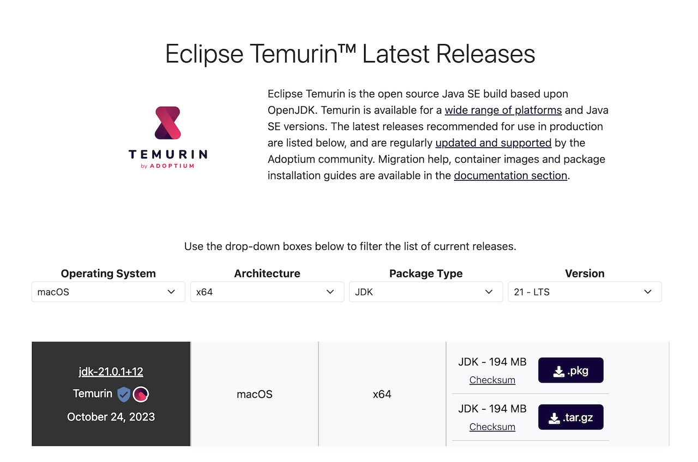

Windowsであれば`.msi`，macOSであれば`.pkg`の拡張子のものをダウンロードします。

ダウンロードしたファイルを実行してインストーラーを起動します。

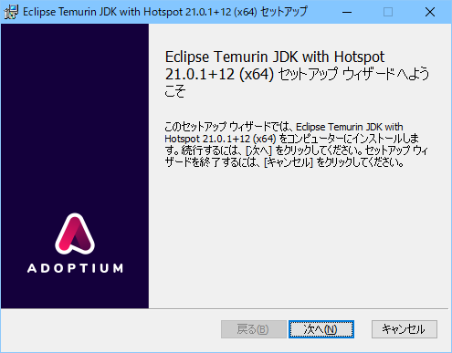

Windowsでは，環境変数`JAVA_HOME`を設定するようようにします。

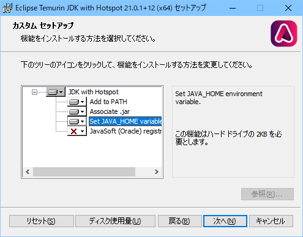

導入を実行します。


macOSでは，手動で環境変数`JAVA_HOME`の設定が必要です。シェルとしてbashを使用していればホームディレクトリの`.bashrc`に，zshを使用していれば`.zshrc`に以下の一行を追加してください。数字の`21`の部分は，ダウンロードしたときに選んだ「Version」に合わせてください。

``` bash
export JAVA_HOME=`/usr/libexec/java_home -v 21`
```


### Visual Studio Codeのセットアップ

Visual Studio Code（VS Code）は，マイクロソフトによって開発された無料のソースコードエディタです。以下のような特徴があります。

- 多言語サポート：VS Codeは，Javaだけでなく，JavaScript，TypeScript，Python，PHP，C++，C#など，多くのプログラミング言語に対応しています
- 拡張性：ユーザーはマーケットプレイスから数千の拡張機能をインストールすることで，機能をカスタマイズできます。これにはテーマ，言語のサポート，デバッグツールなどが含まれます。
- 統合された開発環境（IDE）の機能：デバッグ，Git統合，シンタックスハイライト，インテリセンス（コード補完），スニペット，コードリファクタリングなど，IDEの主要な機能を提供します。
- クロスプラットフォーム：Windows，macOS，Linuxで動作します。
- カスタマイズと設定：ユーザーはエディタの外観，動作，キーバインドを独自に設定することができます。
- コミュニティとサポート：アクティブなコミュニティに支えられており，オンラインのドキュメント，フォーラム，チュートリアルが充実しています。

VS Codeをダウンロードサイト（[https://code.visualstudio.com/download](https://code.visualstudio.com/download)）からダウンロードして導入します。導入にあたっては，とくにデフォルトから変える必要がある部分はありません。


#### Visual Studio Codeの日本語化

最初に起動した段階では，VS CodeはUIが英語で起動してきます。

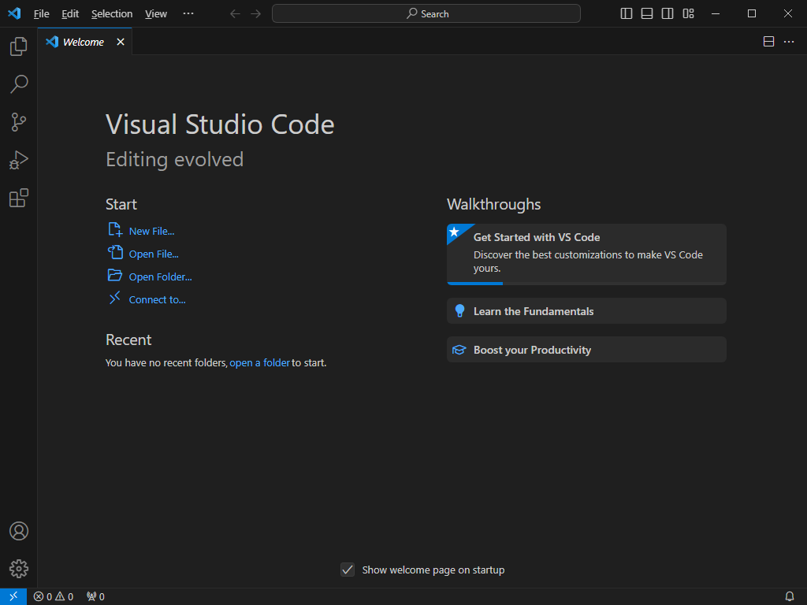

VS Codeは，拡張機能の「Japanese Language Pack for Visual Studio Code」を導入することで，操作画面を日本語化することができます。

① 画面左のアクティビティ・バーで「Extensions」をクリックし  
② 検索欄から`japanese`で検索して  
③ 検索結果から「Japanese Language Pack」を選択します  
④ 画面右側に表示された詳細を確認し，発行者がMicrosoftである事を確認してから  
⑤ 青い「Install」をクリックします

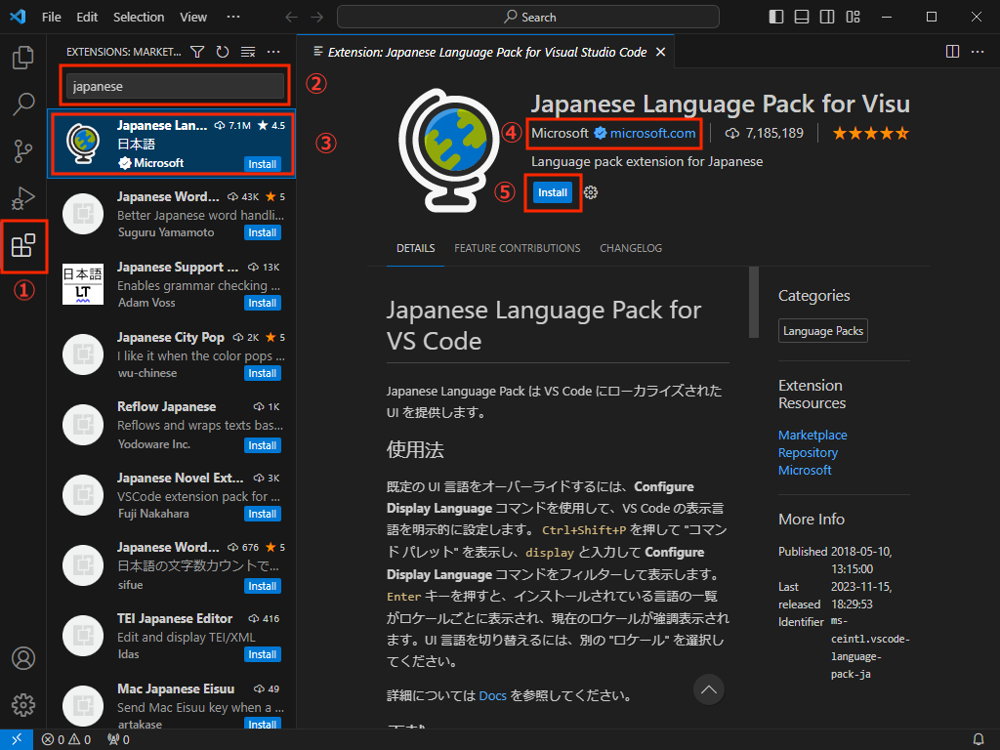

導入が完了して，画面右下に「Change Language and Restrart」がでたら，クリックします。

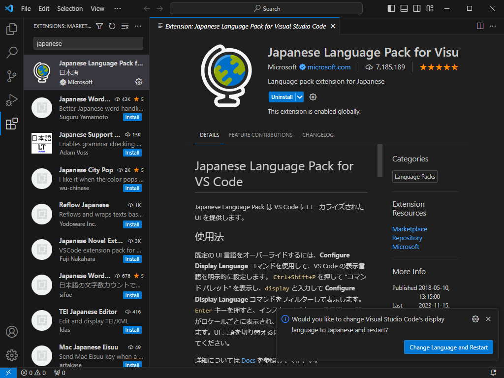

再起動すると，日本語化されたVS Codeが利用できるようになります。

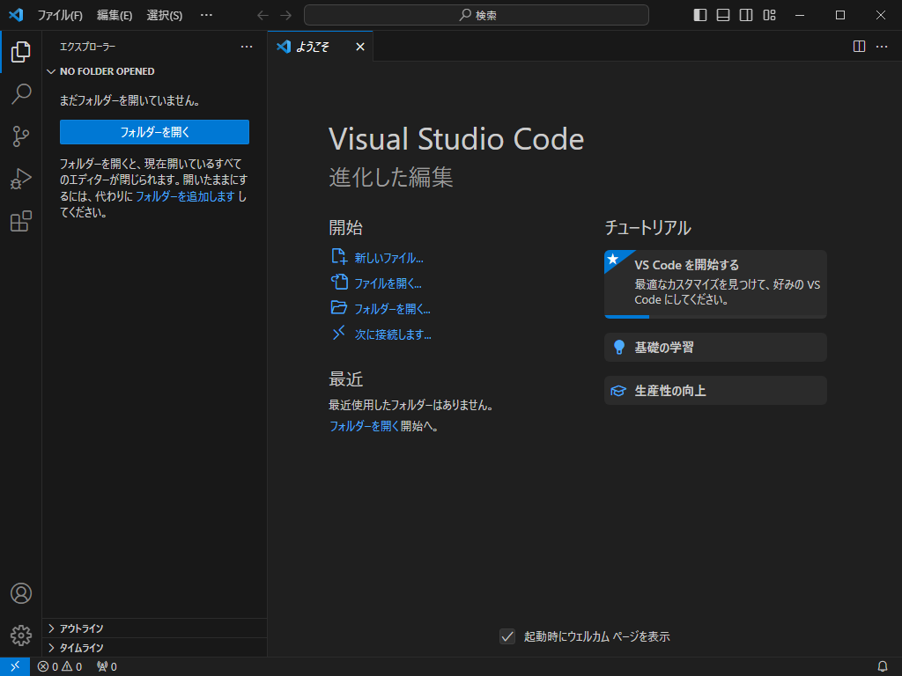

このガイドブックでは，日本語化した環境の画面を掲載しています。


#### 起動するターミナルの確認

VS Codeから起動されるターミナルを確認します。メニューの「表示」「ターミナル」を選択します。

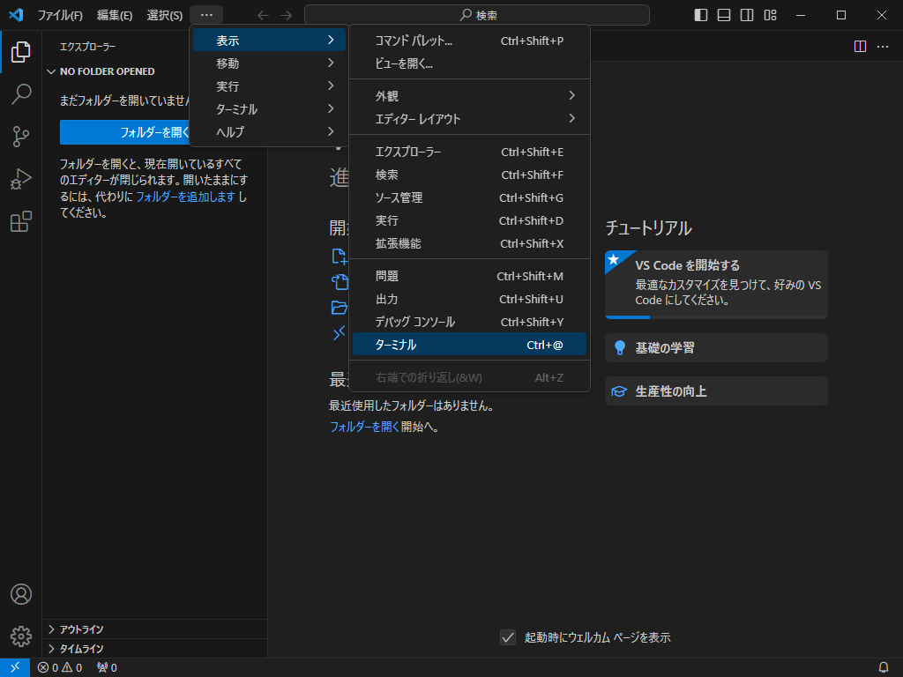

起動されたターミナルの種類を確認します。

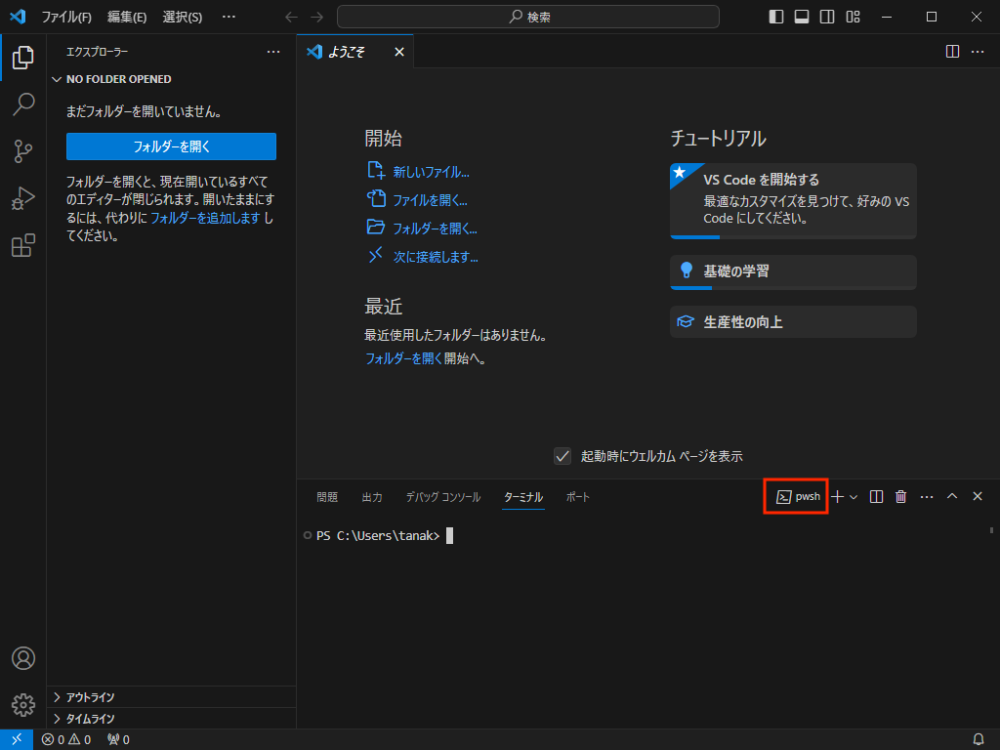

maxOS環境では，zshやbashになっているでしょう。Windows環境でcmdやpwsh，PowerShellなどであれば問題ありません。

Windows環境でUbuntuなどのwsl（Windows Subsystem for Linux）になっていると，Javaの実行環境やファイルパーミッションなどの関連で，このあとの手順が正常に実行できないことがあります。できればPowerShellなどに変更しておいてください。

ターミナル名の右の＋の横の下むきの∨をクリックし，「規定のプロファイルの選択」を選択します。

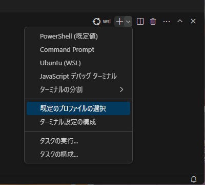

画面上部に，利用可能なプロファイルの一覧が表示されますので，PowerShellかCommand Promptを選択してください。

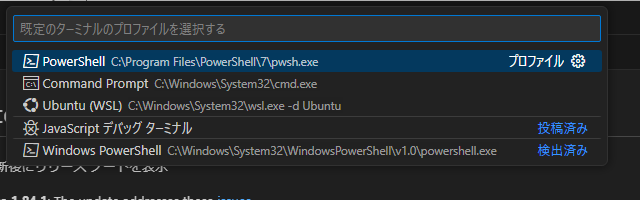

#### Extension Pack for Java拡張機能のセットアップ

VS CodeにJavaの開発のための拡張機能を導入します。

① 画面左のアクティビティ・バーで「拡張」をクリックし  
② 検索欄から`java`で検索して  
③ 検索結果から「Extension Pack for Java」を選択します  
④ 画面右側に表示された詳細を確認し，発行者がMicrosoftである事を確認してから  
⑤ 青い「インストール」をクリックします

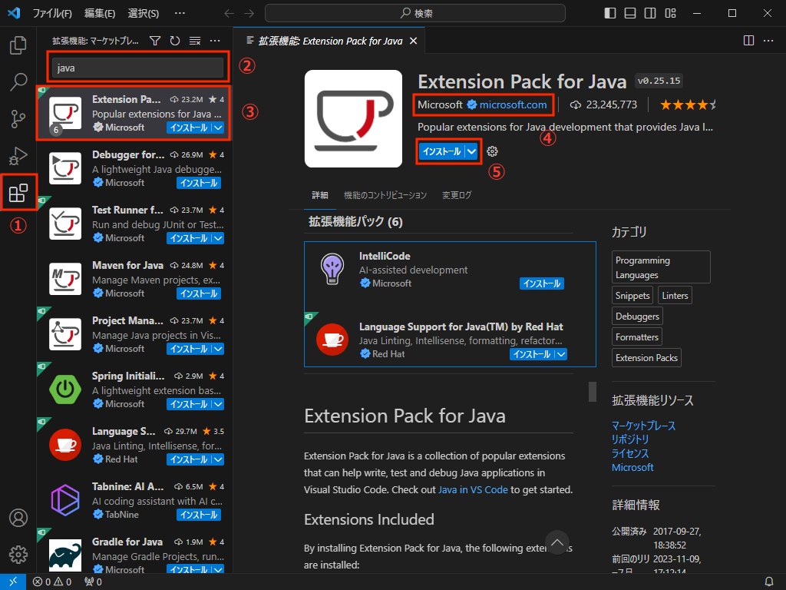


#### Liberty Tools拡張機能のセットアップ

VS CodeにLibertyの開発のための拡張機能を導入します。

① 画面左のアクティビティ・バーで「拡張」をクリックし  
② 検索欄から`liberty`で検索して  
③ 検索結果から「Liberty Tools」を選択します  
④ 画面右側に表示された詳細を確認し，発行者がOpen Libertyである事を確認してから  
⑤ 青い「インストール」をクリックします

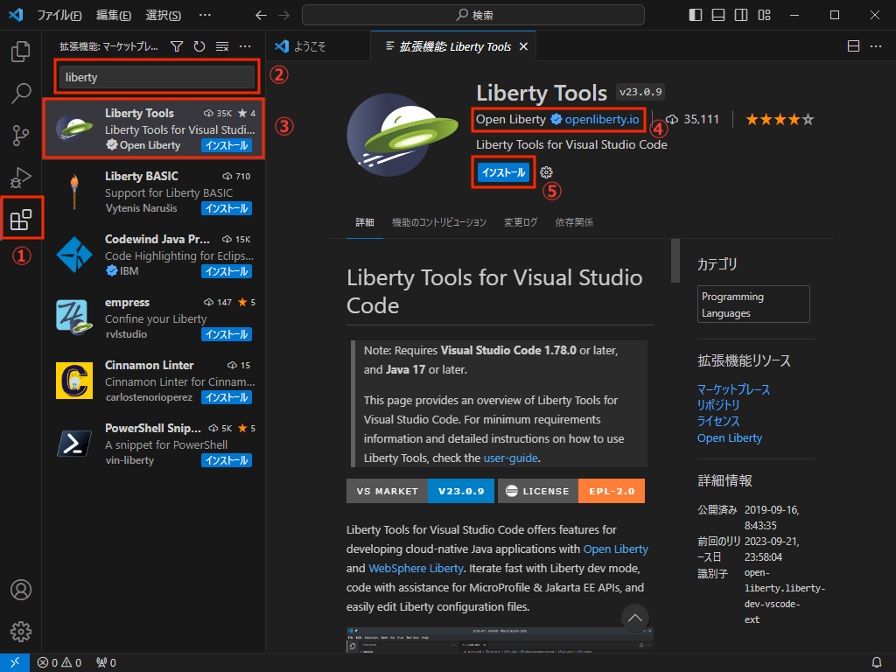


### Open Libertyのセットアップ

従来型のWASからLibertyで，開発者にとって最も大きな変更点は，事前のアプリケーションサーバーのセットアップが不要になったことです。Libertyの導入も構成も，アプリケーションのビルド作業の中で自動的におこなわれます。なので，開発環境に事前にLibertyをセットアップする必要はありません。次の章に進んでください。

